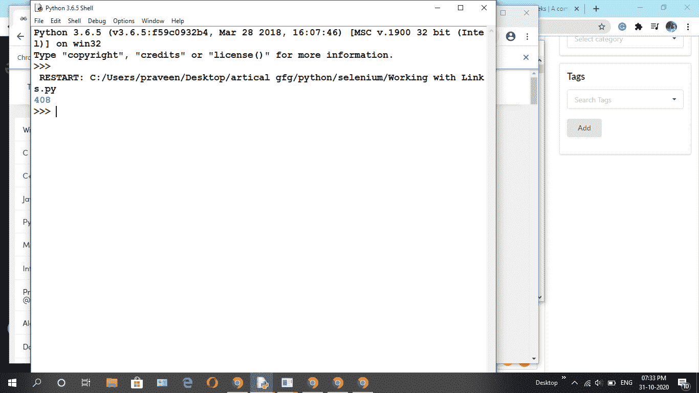

# 使用 Python 中的硒计算网页中的链接总数

> 原文:[https://www . geesforgeks . org/count-网页链接总数-使用 python 中的硒/](https://www.geeksforgeeks.org/count-total-number-of-links-in-webpage-using-selenium-in-python/)

Selenium 是通过程序控制网络浏览器和执行浏览器自动化的强大工具。它适用于所有浏览器，适用于所有主要操作系统，其脚本是用各种语言编写的，如 Python、Java、C#等，我们将使用 Python。

**安装**

**1.1 Python 中的 Selenium 绑定**
Selenium Python 绑定提供了一个方便的 API 来访问像 Firefox、Chrome 等 Selenium Web Driver。

```
Pip install Selenium 

```

**1.2 网络驱动程序**
Selenium 需要一个网络驱动程序来与所选的浏览器交互。Web 驱动程序是一个与 web 浏览器交互的包。它通过通用的有线协议与网络浏览器或远程网络服务器进行交互。您可以签出并安装您选择的网络驱动程序。

```
Chrome:    https://sites.google.com/a/chromium.org/chromedriver/downloads
Firefox: https://github.com/mozilla/geckodriver/releases
Safari:    https://webkit.org/blog/6900/webdriver-support-in-safari-10/
```

**分步方法:**

*   导入所需模块

## 蟒蛇 3

```
# import modules 
from selenium import webdriver 
from selenium.webdriver.common.by import By 
import time
```

*   取任意 [**网址**](https://www.geeksforgeeks.org/) 。

## 蟒蛇 3

```
# assign web page url 
driver.get("https://www.geeksforgeeks.org/")
```

*   使用**通过。TAG_NAME** 在网页中查找网页链接。

**实施:**

## 蟒蛇 3

```
#import module
from selenium import webdriver
from selenium.webdriver.common.by import By

driver = webdriver.Chrome()

# url
driver.get('https://www.geeksforgeeks.org/')

# find web links
link = driver.find_elements(By.TAG_NAME, 'a')

# using len function count how many links
print(len(link))
```

**输出:**

