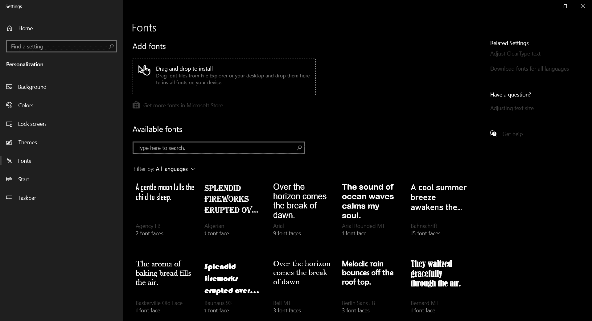

# 使用 Python-PIL 创建证书

> 原文:[https://www . geesforgeks . org/create-certificates-use-python-pil/](https://www.geeksforgeeks.org/create-certificates-using-python-pil/)

**先决条件:** [蟒蛇:枕头(PIL 的一把叉子)](https://www.geeksforgeeks.org/python-pillow-a-fork-of-pil/)

好吧，如果你曾经做过一些事情，比如为任何活动的参与者创建证书，那么你知道这是一个多么乏味的过程。让我们使用 Python 自动实现这一点。我们将使用 Python 的枕头模块。要安装它，只需在您的终端中键入以下内容

```
pip install Pillow
```

您还需要将证书设计为图像格式(最好是 png)。您可以使用类似 Microsoft Office Publisher 的工具来创建证书并将它们导出为 png。留点额外的空间输入名字。下面是我们将使用的模板证书。

**模板证书:**


这样，我们的证书模板就准备好了。现在，我们需要找到一种合适的字体在上面写名字。您需要字体文件的路径。如果你使用的是 Windows 10，那么只需在 Windows 搜索中搜索**字体**，就会显示出字体设置的结果。往那边走，你会看到类似下面屏幕的东西。



现在，从这里选择你喜欢的字体并点击它。您将看到该字体的路径。记下路径的某处。您将需要它在您的代码中。

下面是实现。

```
# imports
from PIL import Image, ImageDraw, ImageFont

def coupons(names: list, certificate: str, font_path: str):

    for name in names:

        # adjust the position according to 
        # your sample
        text_y_position = 900 

        # opens the image
        img = Image.open(certificate, mode ='r')

        # gets the image width
        image_width = img.width

        # gets the image height
        image_height = img.height 

        # creates a drawing canvas overlay 
        # on top of the image
        draw = ImageDraw.Draw(img)

        # gets the font object from the 
        # font file (TTF)
        font = ImageFont.truetype(
            font_path,
            200 # change this according to your needs
        )

        # fetches the text width for 
        # calculations later on
        text_width, _ = draw.textsize(name, font = font)

        draw.text(
            (
                # this calculation is done 
                # to centre the image
                (image_width - text_width) / 2,
                text_y_position
            ),
            name,
            font = font        )

        # saves the image in png format
        img.save("{}.png".format(name)) 

# Driver Code
if __name__ == "__main__":

    # some example of names
    NAMES = ['Frank Muller',
             'Mathew Frankfurt',
             'Cristopher Greman',
             'Natelie Wemberg',
             'John Ken']

    # path to font
    FONT = "/path / to / font / ITCEDSCR.ttf"

    # path to sample certificate
    CERTIFICATE = "path / to / Certificate.png"

    coupons(NAMES, CERTIFICATE, FONT)
```

**输出:**


将名称添加到*名称*列表中。然后根据您的系统更改字体路径和证书模板路径。然后运行上面的代码，所有的证书都应该准备好了。这是一个非常有效的解决方案，可以自动化为大量参与者创建证书的过程。这对活动组织者非常有效。