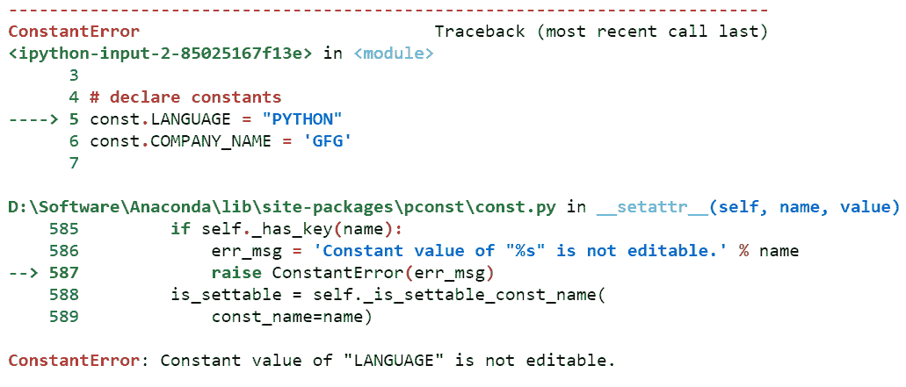
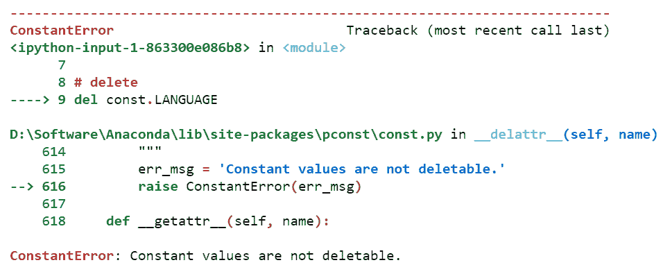

# 使用 Pconst 库在 Python 中创建常量变量

> 原文:[https://www . geesforgeks . org/create-constant-variable-in-python-using-pconst-library/](https://www.geeksforgeeks.org/create-constant-variable-in-python-using-pconst-library/)

常量变量名字本身说明它是常量。我们必须在声明时定义一个常量变量。在那之后，我们将不能改变常量变量的值。在某些情况下，常量变量非常有用。

像 c++、Java 这样的语言允许创建常量变量、函数和对象。但是在 python 中创建常量变量是不允许的。Python 中没有常量变量的预定义类型。但是我们可以为此使用 **pconst** 库。

**安装:**

```py
pip install pconst
```

下面是一些描述如何在 python 中使用常量的例子

**例 1:**

您可以将常量设置为 const 模块的属性。

## 蟒蛇 3

```py
# import module
from pconst import const

# declare constants
const.LANGUAGE = "PYTHON"
const.COMPANY_NAME = 'GFG'

# display
print(const.LANGUAGE)
print(const.COMPANY_NAME)
```

**输出:**


**例 2:**

如果尝试更新常数值，将会引发 ConstantError。

## 蟒蛇 3

```py
# import module
from pconst import const

# declare constants
const.LANGUAGE = "PYTHON"
const.COMPANY_NAME = 'GFG'

# update
const.LANGUAGE="C++"
```

**输出:**



**例 3:**

不允许 del 运算符。

## 蟒蛇 3

```py
# import module
from pconst import const

# declare constants
const.LANGUAGE = "PYTHON"
const.COMPANY_NAME = 'GFG'

# delete
del const.LANGUAGE
```

**输出:**



**例 4:**

您也可以将 dict 和 list 值设置为 const 模块，并且它们将不可编辑(如果 dict 或 list 值包含 dict 或 list，则将递归应用。).

## 蟒蛇 3

```py
# import module
from pconst import const

# define dictionary
const.COMPANY_DATA = {
    'Name': "GFG",
    'Language': ["C", "C++", 
                 "Python"]}

# display
print('Name:', const.COMPANY_DATA['Name'])
print('Language:', const.COMPANY_DATA['Language'])
```

**输出:**

