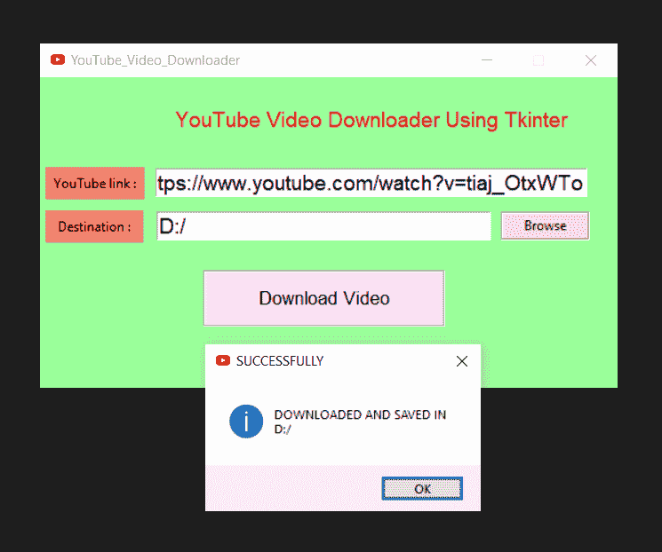

# 使用 Python 创建下载 Youtube 视频的图形用户界面

> 原文:[https://www . geesforgeks . org/create-GUI-for-download-YouTube-video-use-python/](https://www.geeksforgeeks.org/create-gui-for-downloading-youtube-video-using-python/)

**先决条件:**[Python GUI–tkinter](https://www.geeksforgeeks.org/python-gui-tkinter/)

YouTube 是一个非常受欢迎的视频分享网站。从 YouTube 下载视频/播放列表是一项乏味的任务。通过下载器下载视频或试图从随机网站下载视频会增加舔你个人数据的风险。使用 Python Tkinter 包，这个任务非常简单-高效-安全。很少有束码会为你下载视频。为此，有两个 Python 库–[**【Tkinter】**](https://www.geeksforgeeks.org/python-gui-tkinter/)**和 **pytube** 。** 

### **所需模块:**

*   ****pytube :** pytube 是一个轻量级、简单易用、无依赖的 Python 库，用于从 web.pytube 下载视频，不是自动配置的库。使用前需要安装。当你有 pip 时，pytube 的安装很容易。在终端或命令提示符下，键入以下命令安装 pytube。
    **如果你在 Mac OS X 或 Linux 上，以下两个命令中的一个很可能对你有用:****

> **pip 安装 pytube
> git 克隆 git://github . com/nficano/pytube . git pytube | CD pytube | python setup . py 安装**

*   ****如果你在 Window 的****

```
pip install pytube3
```

*   **[**Tkinter**](https://www.geeksforgeeks.org/python-gui-tkinter/)**:**Tkinter 是一个绑定到 Tk GUI 工具包的 Python。它是 Tk 图形用户界面工具包的标准 Python 界面，或者简单地说，Tkit 被用作 Python 图形用户界面。Tkinter 是原生库，不需要从外部安装，只需要在使用的时候导入即可。**

**下面是实现。**

## **蟒蛇 3**

```
# Importing necessary packages
import tkinter as tk
from tkinter import *
from pytube import YouTube
from tkinter import messagebox, filedialog

# Defining CreateWidgets() function
# to create necessary tkinter widgets
def Widgets():

    head_label = Label(root, text="YouTube Video Downloader Using Tkinter",
                       padx=15,
                       pady=15,
                       font="SegoeUI 14",
                       bg="palegreen1",
                       fg="red")
    head_label.grid(row=1,
                    column=1,
                    pady=10,
                    padx=5,
                    columnspan=3)

    link_label = Label(root,
                       text="YouTube link :",
                       bg="salmon",
                       pady=5,
                       padx=5)
    link_label.grid(row=2,
                    column=0,
                    pady=5,
                    padx=5)

    root.linkText = Entry(root,
                          width=35,
                          textvariable=video_Link,
                          font="Arial 14")
    root.linkText.grid(row=2,
                       column=1,
                       pady=5,
                       padx=5,
                       columnspan=2)

    destination_label = Label(root,
                              text="Destination :",
                              bg="salmon",
                              pady=5,
                              padx=9)
    destination_label.grid(row=3,
                           column=0,
                           pady=5,
                           padx=5)

    root.destinationText = Entry(root,
                                 width=27,
                                 textvariable=download_Path,
                                 font="Arial 14")
    root.destinationText.grid(row=3,
                              column=1,
                              pady=5,
                              padx=5)

    browse_B = Button(root,
                      text="Browse",
                      command=Browse,
                      width=10,
                      bg="bisque",
                      relief=GROOVE)
    browse_B.grid(row=3,
                  column=2,
                  pady=1,
                  padx=1)

    Download_B = Button(root,
                        text="Download Video",
                        command=Download,
                        width=20,
                        bg="thistle1",
                        pady=10,
                        padx=15,
                        relief=GROOVE,
                        font="Georgia, 13")
    Download_B.grid(row=4,
                    column=1,
                    pady=20,
                    padx=20)

# Defining Browse() to select a
# destination folder to save the video

def Browse():
    # Presenting user with a pop-up for
    # directory selection. initialdir
    # argument is optional Retrieving the
    # user-input destination directory and
    # storing it in downloadDirectory
    download_Directory = filedialog.askdirectory(
        initialdir="YOUR DIRECTORY PATH", title="Save Video")

    # Displaying the directory in the directory
    # textbox
    download_Path.set(download_Directory)

# Defining Download() to download the video

def Download():

    # getting user-input Youtube Link
    Youtube_link = video_Link.get()

    # select the optimal location for
    # saving file's
    download_Folder = download_Path.get()

    # Creating object of YouTube()
    getVideo = YouTube(Youtube_link)

    # Getting all the available streams of the
    # youtube video and selecting the first
    # from the
    videoStream = getVideo.streams.first()

    # Downloading the video to destination
    # directory
    videoStream.download(download_Folder)

    # Displaying the message
    messagebox.showinfo("SUCCESSFULLY",
                        "DOWNLOADED AND SAVED IN\n"
                        + download_Folder)

# Creating object of tk class
root = tk.Tk()

# Setting the title, background color
# and size of the tkinter window and
# disabling the resizing property
root.geometry("520x280")
root.resizable(False, False)
root.title("YouTube Video Downloader")
root.config(background="PaleGreen1")

# Creating the tkinter Variables
video_Link = StringVar()
download_Path = StringVar()

# Calling the Widgets() function
Widgets()

# Defining infinite loop to run
# application
root.mainloop()
```

****输出:****

****