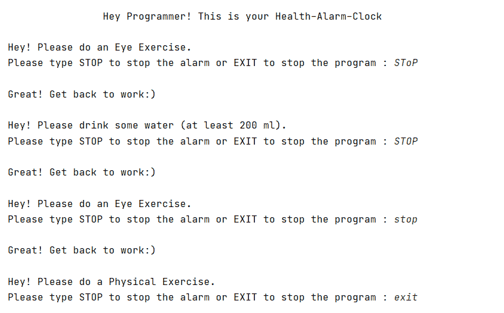
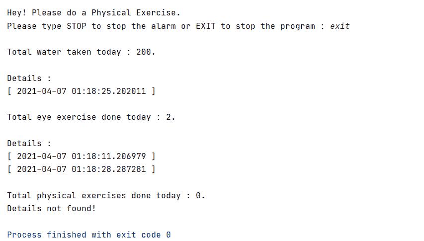

# 使用 Python 为程序员创建健康时钟

> 原文:[https://www . geeksforgeeks . org/create-health-clock-for-programmer-use-python/](https://www.geeksforgeeks.org/create-health-clock-for-programmers-using-python/)

在这篇文章中，我们将创建一个 Python 脚本来照顾一个人的健康，尤其是一个程序员。它会提醒用户在不同的指定时间间隔喝水、做眼保健操、做体育锻炼。它还会记录锻炼的时间、喝水量、锻炼次数和喝水量。在节目的最后，整个统计数据将会和时间戳一起显示。

**进场:**

*   我们将从 **pygame 模块**导入混音器播放我们的声音，从**时间模块**导入时间设置时间间隔，从**时间模块**导入睡眠，将节目冻结一个相应的时间间隔。
*   我们将定义两个函数- **getdate()** 在调用函数时返回当前日期和时间，以及 **musicloop()** 播放给定文件。
*   之后，我们将用当前时间初始化水、眼保健操和体育锻炼变量。我们这样做是为了能够以相同的期望时间间隔播放声音。
*   现在，我们将运行一个无限 while 循环，该循环将包含三个 **if** 条件(一个条件对应一个条件，即水、眼保健操和体育锻炼)。
*   在每一个**如果**的条件下，我们都会做同样的事情，即调用 musicloop()函数播放音乐，要求用户做相应的事情来停止音乐，并在文件中记录(运动完成的)时间，以便最终显示出来。
*   我们还将增加练习次数和饮水量，以便在课程结束时打印出来。
*   最后，我们使用文件处理来显示上述所有数据。

下面是实现。

## 蟒蛇 3

```py
# import required modules
from pygame import mixer
from time import time
from time import sleep

def getdate():

    # To get the current date and time 
    # at time of entry
    import datetime
    return (str(datetime.datetime.now()))

def musicloop(stopper):
    mixer.init()
    mixer.music.load("music.mp3")

    # playing the music provided i.e. music.mp3
    mixer.music.play()  
    while True:
        x = input(
            "Please type STOP to stop the alarm or EXIT to stop the program : ")

        # music termination condition.
        if (x.upper() == stopper):
            print("\nGreat! Get back to work:)\n")
            mixer.music.stop()
            return True
            break

        # program termination condition.
        elif (x.upper() == "EXIT"):
            return False

# variables initialized with 0 for counting total 
# number of exercises and water drank in a day
total_water = 0
total_physical_exercises = 0
total_eye_exercises = 0

if __name__ == '__main__':
    print("\n\t\t\t\tHey Programmer! This is your Health-Alarm-Clock\n")
    time_phy = time()
    time_drink = time()
    time_eyes = time()

    eyes_delay = 10  
    drink_delay = 20  
    phy_delay = 35  

    while(True):

        # Drink water condition.
        if (time() - time_drink > drink_delay):
            print("Hey! Please drink some water (at least 200 ml).")

            # Checking the user input so that music 
            # can be stopped.
            if(musicloop("STOP")):
                pass
            else:
                break

            # reinitializing the variable
            time_drink = time()

            # incrementing the value
            total_water += 200

            # opening the file and putting the data 
            # into that file
            f = open("drank.txt", "at")
            f.write("[ " + getdate() + " ] \n")
            f.close()

        # Eye exercise condition.
        if (time() - time_eyes > eyes_delay):

            print("Hey! Please do an Eye Exercise.")

            if (musicloop("STOP")):
                pass
            else:
                break

            time_eyes = time()
            total_eye_exercises += 1
            f = open("eye.txt", "at")
            f.write("[ " + getdate() + " ] \n")
            f.close()

        # Eye exercise condition.
        if (time() - time_phy > phy_delay):
            print("Hey! Please do a Physical Exercise.")

            if (musicloop("STOP")):
                pass
            else:
                break

            time_phy = time()
            total_physical_exercises += 1
            f = open("phy_exer.txt", "at")
            f.write("[ " + getdate() + " ] \n")
            f.close()

    print()
    print(f"Total water taken today : {total_water}.")

    try:
        f = open("drank.txt", "rt")
        print("\nDetails :")
        print(f.read())
        f.close()
    except:
        print("Details not found!")

    print(f"Total eye exercise done today : {total_eye_exercises}.")

    try:
        f = open("eye.txt", "rt")
        print("\nDetails :")
        print(f.read())
        f.close()
    except:
        print("Details not found!")

    print(f"Total physical exercises done today : {total_physical_exercises}.")

    try:
        f = open("phy_exer.txt", "rt")
        print("\nDetails :")
        print(f.read())
        f.close()
    except:
        print("Details not found!")

    sleep(5)
```

**输出:**

 

**视频演示:**

<video class="wp-video-shortcode" id="video-588254-1" width="640" height="360" preload="metadata" controls=""><source type="video/mp4" src="https://media.geeksforgeeks.org/wp-content/uploads/20210413001923/Output.mp4?_=1">[https://media.geeksforgeeks.org/wp-content/uploads/20210413001923/Output.mp4](https://media.geeksforgeeks.org/wp-content/uploads/20210413001923/Output.mp4)</video>