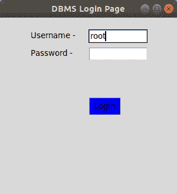

# 使用 Tkinter

用 Python 创建 MySQL 数据库登录页面

> 原文:[https://www . geesforgeks . org/create-MySQL-database-log in-page-in-python-using-tkinter/](https://www.geeksforgeeks.org/create-mysql-database-login-page-in-python-using-tkinter/)

**先决条件:**[Python GUI–Tkinter](https://www.geeksforgeeks.org/python-gui-tkinter/)、[Python MySQL–Select Query](https://www.geeksforgeeks.org/python-mysql-select-query/)
[**Tkinter**](https://www.geeksforgeeks.org/python-gui-tkinter/)是 Python 库之一，其中包含了很多用于开发图形用户界面页面和窗口的功能。登录页面对于任何类型的移动或网络应用程序的开发都很重要。该页面对于用户身份验证非常重要。
我们将使用 *mysql.connector* 库在 Python 项目和 mysql 工作台之间建立连接。Db 是使用 mysql.connector.connect 类创建的对象，该类存储有关数据库的所有信息，如数据库名称、密码和表名。

在下面的例子中，

*   tk.label 和 tk.button 用于在 GUI 屏幕上创建标签和按钮。每个按钮都包含一个命令，其中包含一个在点击按钮时要执行的功能。
*   创建函数 *logintodb* 来登录 MySQL 数据库。保存查询包括点击提交按钮时要执行的查询。
*   x 和 Y 是在 Tkinter 窗口上调整对象的参数。
*   Root.mainloop()包含在最后，表示窗口中只包含其中的组件。

下面是实现:

## 蟒蛇 3

```py
import tkinter as tk
import mysql.connector
from tkinter import *

def submitact():

    user = Username.get()
    passw = password.get()

    print(f"The name entered by you is {user} {passw}")

    logintodb(user, passw)

def logintodb(user, passw):

    # If password is enetered by the
    # user
    if passw:
        db = mysql.connector.connect(host ="localhost",
                                     user = user,
                                     password = passw,
                                     db ="College")
        cursor = db.cursor()

    # If no password is enetered by the
    # user
    else:
        db = mysql.connector.connect(host ="localhost",
                                     user = user,
                                     db ="College")
        cursor = db.cursor()

    # A Table in the database
    savequery = "select * from STUDENT"

    try:
        cursor.execute(savequery)
        myresult = cursor.fetchall()

        # Printing the result of the
        # query
        for x in myresult:
            print(x)
        print("Query Excecuted successfully")

    except:
        db.rollback()
        print("Error occured")

root = tk.Tk()
root.geometry("300x300")
root.title("DBMS Login Page")

# Defining the first row
lblfrstrow = tk.Label(root, text ="Username -", )
lblfrstrow.place(x = 50, y = 20)

Username = tk.Entry(root, width = 35)
Username.place(x = 150, y = 20, width = 100)

lblsecrow = tk.Label(root, text ="Password -")
lblsecrow.place(x = 50, y = 50)

password = tk.Entry(root, width = 35)
password.place(x = 150, y = 50, width = 100)

submitbtn = tk.Button(root, text ="Login",
                      bg ='blue', command = submitact)
submitbtn.place(x = 150, y = 135, width = 55)

root.mainloop()
```

**输出:**



