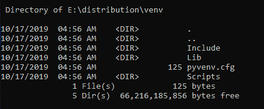

# 使用 venv | Python 创建虚拟环境

> 原文:[https://www . geesforgeks . org/create-virtual-environment-use-venv-python/](https://www.geeksforgeeks.org/create-virtual-environment-using-venv-python/)

虚拟环境是一种工具，它通过为不同的项目创建独立的 python 虚拟环境来帮助将它们所需的依赖关系分开。这是大多数 Python 开发人员使用的最重要的工具之一。

## 虚拟环境的需求

想象一下这样一个场景:一个 web 应用程序托管在一个云托管服务提供商的 python 开发环境中。网络应用程序的配置带有安装最新版本的 Flask 网络框架的选项。假设，web app 是在本地系统上用旧版本的框架创建的，一旦上传到网站上，就会出现版本冲突，因为使用的一些模块在 Flask 的最新版本中被折旧了
。

## 虚拟环境的使用

上述场景可以使用虚拟环境来解决。Python 开发环境可以通过使用一些虚拟环境来分离。这里的虚拟环境是一个独立的 Python 安装，允许管理依赖关系并在独立的 Python 项目上工作，而不会影响其他项目。

创建虚拟环境时，它会创建一个独立于全局 Python 或其他虚拟环境的文件夹，并将 Python 和一个站点包文件夹复制到其中。对于旧版 Python，虚拟机需要安装名为`virtualenv`的第三方工具。它已经被集成到模块`venv`下的更新版本的 Python3 中。要了解更多关于 virtualenv [的信息，请点击此处](https://www.geeksforgeeks.org/python-virtual-environment/)。

## 实施 venv

首先，检查 pip 是否具有与系统上相同版本的解释器，以及 python 环境当前驻留的位置:
要检查 Python 当前驻留的位置，请在终端中键入以下命令。

```
where python

where pip

```

**输出:**

> c:\ user \ geeks forgeeks \ AppData \ Local \ Programs \ Python \ Python 37 \ Python . exe
> 
> c:\ user \ geeks forgeeks \ AppData \ Local \ Programs \ Python \ Python 37 \ Scripts \ pip . exe

要创建 virtualenv，请使用以下命令:

```
python -m venv ./venv

```

运行此命令后，将创建一个名为 venv 的目录。这个目录包含了使用 Python 项目所需的包的所有必要的可执行文件。这里将安装 Python 包。

要列出文件夹中的文件，请在终端中键入以下命令:

```
 dir ./venv

```

**输出:**


`pip`命令仍然指向全局环境。我们需要显式激活创建的虚拟环境，以配置当前 shell 会话使用 virtualenv 文件夹中的 pip 命令，并且不要在全局环境中安装软件包:
要激活 venv，首先将目录更改为 venv\Scripts。

```
cd venv\Scripts

```

更改目录后，键入以下命令。

```
$ Source venv_name\Scripts> activate

```

一旦虚拟环境被激活，您的虚拟环境的名称将出现在终端的左侧。这将让您知道虚拟环境当前处于活动状态。在下图中，名为虚拟环境的 venv 处于活动状态。


Python 解释器也将从虚拟环境而不是全局环境运行该版本。我们可以通过以下命令来验证 Python 环境当前驻留的位置:

```
where python

```

**输出:**

```
E:\distribution\venv\Scripts\python.exe
C:\Users\GeeksforGeeks\AppData\Local\Programs\Python\Python37\python.exe

```

虚拟环境是一个几乎干净的 Python 环境。运行`pip list`查看已安装软件包的列表:
**输出:**


现在，您可以在这个虚拟环境中安装与项目相关的依赖项。例如，如果您将 Django 1.9 用于一个项目，您可以像安装其他软件包一样安装它。

```
(venv_name)$ pip install Django==1.9

```

完成工作后，可以通过以下命令停用虚拟环境:

```
(venv_name)$ deactivate

```


现在，您将回到系统的默认 Python 安装。