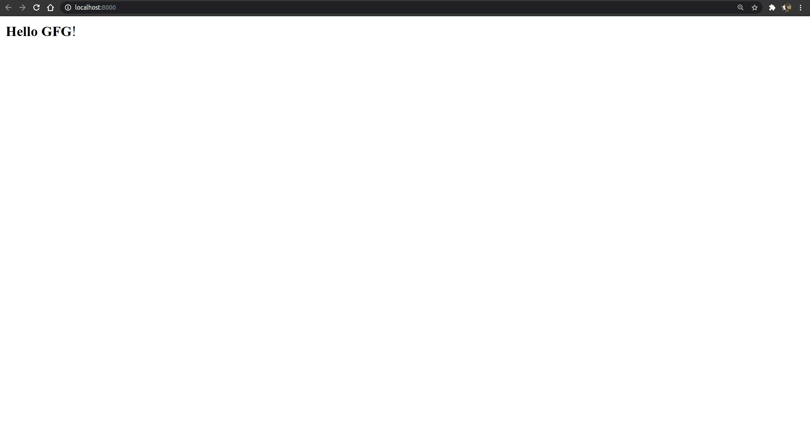

# 使用瓶子框架 Python 创建第一个网络应用程序

> 原文:[https://www . geesforgeks . org/creating-first-web-application-use-bottle-framework-python/](https://www.geeksforgeeks.org/creating-first-web-application-using-bottle-framework-python/)

python 中有很多框架允许你创建一个像瓶子、瓶子、django 这样的网页。在本文中，您将学习如何使用 bottle web 框架创建一个简单的应用程序。瓶子是一个快速、简单、轻量级的 Python WSGI 微网络框架。它是作为单个文件模块分发的，除了 Python 标准库之外没有其他依赖项。

*   **路由:**请求到函数调用的映射，支持干净和动态的网址。
*   **模板:** Fast 和 pythonic 内置模板引擎，支持 mako、jinja2 和猎豹模板。
*   **实用程序:**方便访问表单数据、文件上传、cookies、头文件等 HTTP 相关元数据。
*   **服务器:**内置 HTTP 开发服务器，支持 paste、fapws3、bjoern、gae、cherrypy 或任何其他支持 WSGI 的 HTTP 服务器。

为了使用瓶子创建应用程序，我们必须先安装它

```
pip install bottle
```

**例 1:**

创建名为 app.py 的文件

## 蟒蛇 3

```
from bottle import route, run

@route('/')
def index():
    return f'<b>Hello GFG</b>!'

run(host='localhost', port=8000,debug=True)
```

要运行此应用程序，请打开命令提示符并运行

```
python app.py
```

**输出–**



你也可以在你的网络应用程序中添加变量，你可能会考虑它会如何帮助你，它会帮助你动态地构建一个网址。让我们用一个例子来解决这个问题。

**例 2:**

创建名为 app.py 的文件

## 蟒蛇 3

```
from bottle import route, run, template

@route('/hello/<name>')
def index(name):
    return template('<h2>Hello {{name}}</h2>!', name=name)

run(host='localhost', port=8080)
```

**输出–**

