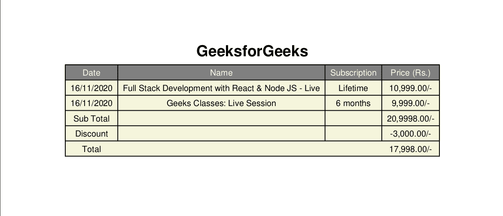

# 使用 Python 创建付款收据

> 原文:[https://www . geeksforgeeks . org/creating-payment-receives-use-python/](https://www.geeksforgeeks.org/creating-payment-receipts-using-python/)

创建付款收据是一项非常常见的任务，无论是电子商务网站还是任何本地商店。

在这里，我们将看到如何使用 python 创建我们自己的交易收据。我们将使用**报告实验室**来生成 pdf。一般来说，它是一个内置的包，但有时可能也不存在。如果不存在，只需在您的终端中键入以下内容

### **安装:**

```
pip install reportlab
```

### **进场:**

*   导入模块。
*   我们需要列表形式的数据。外部索引的第 0 个索引是标头。
*   我们用指定的纸张大小创建一个简单的文档模板(这里是 A4)
*   然后从内置样式表中获取一个示例样式表，并相应地添加样式。
*   创建样式对象后，将数据和样式表输入 pdf 对象并构建它。

**下面是实现:**

## 蟒蛇 3

```
# imports module
from reportlab.platypus import SimpleDocTemplate, Table, Paragraph, TableStyle
from reportlab.lib import colors
from reportlab.lib.pagesizes import A4
from reportlab.lib.styles import getSampleStyleSheet

# data which we are going to display as tables
DATA = [
    [ "Date" , "Name", "Subscription", "Price (Rs.)" ],
    [
        "16/11/2020",
        "Full Stack Development with React & Node JS - Live",
        "Lifetime",
        "10,999.00/-",
    ],
    [ "16/11/2020", "Geeks Classes: Live Session", "6 months", "9,999.00/-"],
    [ "Sub Total", "", "", "20,9998.00/-"],
    [ "Discount", "", "", "-3,000.00/-"],
    [ "Total", "", "", "17,998.00/-"],
]

# creating a Base Document Template of page size A4
pdf = SimpleDocTemplate( "receipt.pdf" , pagesize = A4 )

# standard stylesheet defined within reportlab itself
styles = getSampleStyleSheet()

# fetching the style of Top level heading (Heading1)
title_style = styles[ "Heading1" ]

# 0: left, 1: center, 2: right
title_style.alignment = 1

# creating the paragraph with
# the heading text and passing the styles of it
title = Paragraph( "GeeksforGeeks" , title_style )

# creates a Table Style object and in it,
# defines the styles row wise
# the tuples which look like coordinates
# are nothing but rows and columns
style = TableStyle(
    [
        ( "BOX" , ( 0, 0 ), ( -1, -1 ), 1 , colors.black ),
        ( "GRID" , ( 0, 0 ), ( 4 , 4 ), 1 , colors.black ),
        ( "BACKGROUND" , ( 0, 0 ), ( 3, 0 ), colors.gray ),
        ( "TEXTCOLOR" , ( 0, 0 ), ( -1, 0 ), colors.whitesmoke ),
        ( "ALIGN" , ( 0, 0 ), ( -1, -1 ), "CENTER" ),
        ( "BACKGROUND" , ( 0 , 1 ) , ( -1 , -1 ), colors.beige ),
    ]
)

# creates a table object and passes the style to it
table = Table( DATA , style = style )

# final step which builds the
# actual pdf putting together all the elements
pdf.build([ title , table ])
```

**输出:**



receipt.pdf