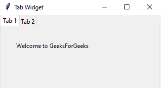
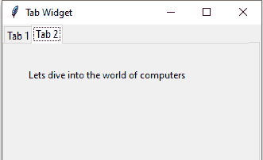

# 使用 Python-Tkinter 创建选项卡式小部件

> 原文:[https://www . geeksforgeeks . org/creating-tab-widget-with-python-tkinter/](https://www.geeksforgeeks.org/creating-tabbed-widget-with-python-tkinter/)

Python 提供了一系列图形用户界面框架，可用于开发 Python 中基于图形用户界面的应用程序。最广泛使用的 Python 接口是 Tk 接口或 [tkinter](https://www.geeksforgeeks.org/python-gui-tkinter/) (在 Python 3.x 中被重新命名)。与 Python 提供的其他界面相比，Tkinter 模块提供了广泛的小部件，可用于更快、更容易地开发 GUI 应用程序。tkinter.ttk 模块是对现有 tk 模块的改进。Ttk 模块配备了 18 个小部件，其中 12 个存在于 Tkit 模块中，如按钮、检查按钮、面板窗口、单选按钮、条目、框架、标签、标签框架、菜单按钮、缩放、滚动条和旋转框。新添加的小部件有组合框、笔记本、大小手柄、进度条、分隔符和树形视图。本文使用 ttk 模块的 Notebook 小部件来创建一个选项卡式小部件。ttk。笔记本小部件管理一组窗口，并一次显示一个。每个子窗口都与一个选项卡相关联。用户可以一次选择一个选项卡来查看窗口的内容。
创建 tkinter 选项卡式小部件的步骤:

1.  **Import tkinter module**

    ```
    import tkinter as tk
    from tkinter import *
    ```

    **注意:**Python 2 . x 中模块的名称为‘Tkinter’，Python 3.x 中为‘Tkinter’。这里使用的是 Python 3.x。

2.  **导入包含笔记本小部件**

    ```
    from tkinter import ttk
    ```

    的 tkinter ttk 模块
3.  **Create the parent window (root).**

    ```
    root = tk.Tk()

    ```

    **语法:**

    ```
    Tk()
    ```

    **说明:**
    用于创建父窗口。Tk 类在没有任何参数的情况下被实例化(这里)。

4.  **Add title to the parent window (root).**

    ```
    root.title("Tab Widget")
    ```

    **语法:**

    ```
    title(name)
    ```

    **参数:**
    **名称:**用于将所需名称传递给父窗口(根)。

5.  **Creating Tab Control**

    ```
    tabControl = ttk.Notebook(root)
    ```

    **语法:**

    ```
    Notebook(master=None, **options)
    ```

    **参数:**

    *   **主:**父窗口(根)。
    *   **选项:**Notebook()方法接受的选项是高度、填充和宽度。该程序中不使用选项。
6.  **Creating the tabs**

    ```
    tab1 = ttk.Frame(tabControl)
    tab2 = ttk.Frame(tabControl)
    ```

    **语法:**

    ```
    Frame(master=None, **options)
    ```

    **参数:**

    *   **主控件:**选项卡控件是选项卡的父小部件。
    *   **选项:**Frame()方法接受的选项有 class_、光标、填充、浮雕、样式、takefocus、高度和宽度。该程序中不使用选项。

    **解释:**
    Frame 小部件就像一个容器，用于将其他小部件组合在一起。这里，框架小部件用于将选项卡小部件组合在一起。

7.  **Adding the tab**

    ```
    tabControl.add(tab1, text='Tab 1')
    tabControl.add(tab2, text='Tab 2')
    ```

    **语法:**

    ```
    add(child, **options)
    ```

    **参数:**

    *   **child:** tab1 和 tab2 是 tabControl 的子小部件。
    *   **选项:**add()方法支持的选项有粘性、状态、填充、文本、图像、复合、下划线。

    **说明:**
    add()方法出现在 tk.ttk.Notebook 类中。它用于向笔记本小部件添加新选项卡。

8.  **Packing the tab control to make the tabs visible**

    ```
    tabControl.pack(expand=1, fill="both")
    ```

    **语法:**

    ```
    pack(**options)
    ```

    **参数:**

    *   **展开:**展开选项确保当父小部件展开时，具有非零展开值的小部件之间的空间均匀分布。
    *   **填充:**填充选项确保小部件占用分配给它的空间。现在 fill="both "指定小部件占用 X 轴和 Y 轴的空间，fill="X "指定小部件占用 X 轴的空间，fill="Y "指定小部件占用 Y 轴的空间。

    **说明:**
    pack()方法用于在将小部件放入父小部件之前，将小部件组织成块。这可以使用各种选项来完成，如填充、扩展和侧边。

9.  **Creating Label widget as a child of the parent window (root)**

    > ttk。标签(标签 1，文本=“欢迎来到极客博客”)。网格(列=0，行=0，padx=30，pady=30)
    > ttk。标签(tab2，text=“让我们潜入计算机世界”)。网格(列=0，行=0，padx=30，pady=30)

    **语法:**

    ```
    Label(master, **options)
    ```

    **参数:**

    *   **主标签:**标签充当标签小部件的父标签。
    *   **选项:**Label()方法支持的选项有锚点、bg、位图、bd、光标、字体、fg、高度、宽度、图像、对齐、浮雕、padx、pady、textvariable、下划线和 wraplength。

    **说明:**
    标签小部件用于在屏幕上显示文本或图像。屏幕上显示的文本可以使用标签小部件中的各种选项进一步格式化。

    **语法:**

    ```
    grid(**options)
    ```

    **参数:**

    *   **选项:**grid()方法支持的选项有 column、columnspan、row、rowspan、padx、pady、ipadx、ipady、sticky。

    **解释:**
    grid()方法用于将父小部件拆分为行和列，更具体地说是一个 2D 表。它可以用来指定小部件在父小部件中的位置。这里 grid()方法指定了 Label 小部件 ie 的位置。基本上是文本在父窗口中的位置。

10.  **Run the application**

    ```
    root.mainloop() 
    ```

    **语法:** mainloop()
    **解释:**
    main loop()的作用类似于一个无限循环，用于运行应用程序。

    **完整程序如下:**

    ```
    import tkinter as tk                    
    from tkinter import ttk

    root = tk.Tk()
    root.title("Tab Widget")
    tabControl = ttk.Notebook(root)

    tab1 = ttk.Frame(tabControl)
    tab2 = ttk.Frame(tabControl)

    tabControl.add(tab1, text ='Tab 1')
    tabControl.add(tab2, text ='Tab 2')
    tabControl.pack(expand = 1, fill ="both")

    ttk.Label(tab1, 
              text ="Welcome to \
              GeeksForGeeks").grid(column = 0, 
                                   row = 0,
                                   padx = 30,
                                   pady = 30)  
    ttk.Label(tab2,
              text ="Lets dive into the\
              world of computers").grid(column = 0,
                                        row = 0, 
                                        padx = 30,
                                        pady = 30)

    root.mainloop()  
    ```

    **输出**
    

    