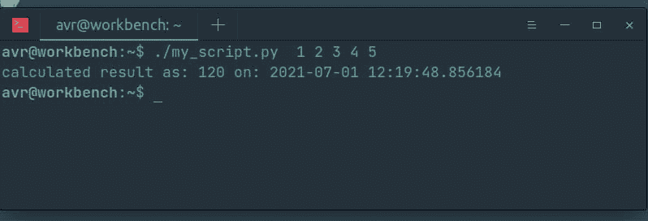
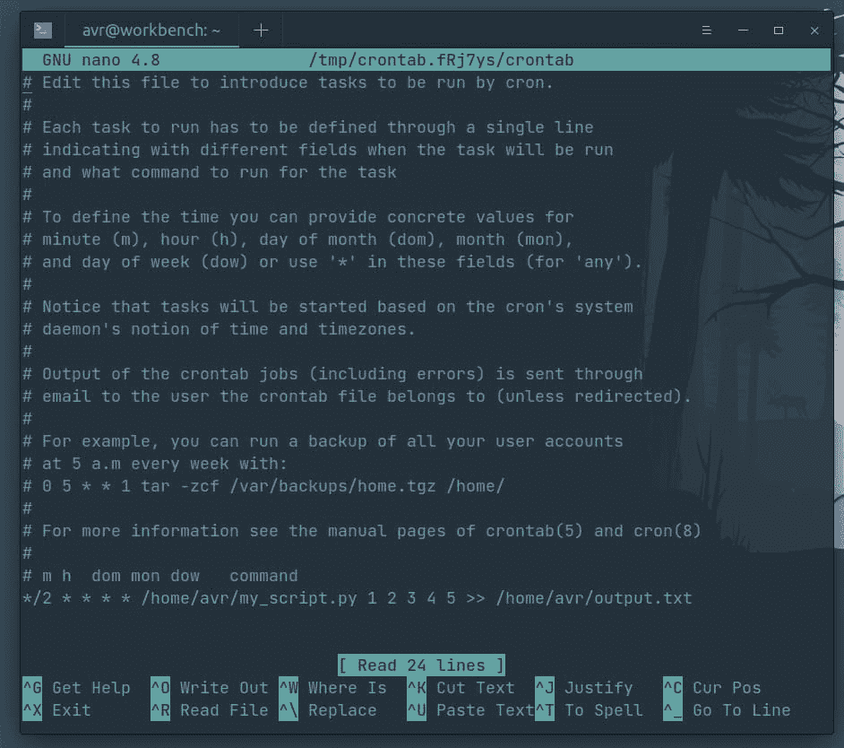

# Crontab–运行带参数的 Python 脚本

> 原文:[https://www . geesforgeks . org/crontab-running-a-python-script-with-parameters/](https://www.geeksforgeeks.org/crontab-running-a-python-script-with-parameters/)

使用 crontab 调度 python 脚本是使用 python 自动化任务的基础。我们将看到如何调度 python 脚本以及传递必要的参数。

Cron 作业实用程序是 Unix 中基于时间的作业调度程序。它允许用户在给定的时间和日期运行文件。crontab 是您希望定期运行的命令列表，也是用于管理该列表的命令的名称。

#### 创建 Python 脚本进行演示:

首先，让我们创建一个简单的脚本，计划每 2 分钟运行一次。下面是一个简单的脚本，它计算传递的所有参数的乘积，并将它们与脚本运行的时间一起打印到 STDOUT。

## 计算机编程语言

```
#! /usr/bin/python3

import sys
from datetime import datetime

def main(args):
    ans = 1
    for arg in args[1:]:
        ans *= int(arg)
    print("calculated result as: {} on: {} ".format(ans,
                                                    datetime.now()))

if __name__ == '__main__':
    main(sys.argv)
```

**注意:** #！/usr/bin/pyt 3**(指定脚本解释器的路径)如果您希望使脚本可执行，则是必需的。**

**假设我们已经在主目录下将这个脚本保存为 my_script.py，我们可以通过在终端中输入以下命令来使它可执行:**

```
$ sudo chmod +x my_script.py
```

**我们可以测试我们的脚本是否正常工作。**

```
./my_script.py 1 2 3 4 5
calculated result as: 120 on: 2021-07-01 12:19:48.856184
```

****

****crontab 调度表达式有以下几部分:****

****

**Crontab 还接受特殊字符来创建更复杂的时间表:**

<figure class="table">

| **字符** | **表示** |
| --- | --- |
| 逗号 | 要分隔多个值 |
| 连字号 | 指示值的范围 |
| 星号 | 指示所有可能的值 |
| 斜杠 | 表示每一个 |

</figure>

**为了调度要执行的脚本，我们需要在 crontab 文件中输入 crontab 调度表达式。为此，只需在终端中输入以下内容:**

```
crontab -e
```

**系统可能会提示您选择一个编辑器，选择 nano，并在打开的 crontab 文件末尾添加以下行:**

> ***/2 * * * */home/$(USER)/my _ script . py 1 2 3 4 5 > >/home/$(USER)/output . txt**

****

**其中 **$(USER)** 可以用你的用户名代替。保存更改并退出。这将安排我们的 Python 脚本每 2 分钟运行一次，以 **1 2 3 4 5** 作为命令行参数，并将输出写入**/home/$(USER)/output . txt**。**