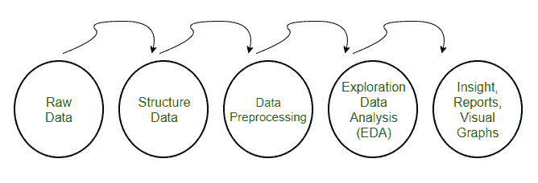

# ML | Python 中的数据预处理

> 原文:[https://www . geesforgeks . org/data-预处理-机器学习-python/](https://www.geeksforgeeks.org/data-preprocessing-machine-learning-python/)

预处理指的是在将数据输入到算法之前应用于数据的转换。数据预处理是一种用于将原始数据转换为干净数据集的技术。换句话说，无论何时从不同来源收集数据，都是以原始格式收集的，这对于分析是不可行的。



**需要数据预处理**

*   为了从机器学习项目中的应用模型中获得更好的结果，数据的格式必须采用适当的方式。一些指定的机器学习模型需要指定格式的信息，例如，随机森林算法不支持空值，因此要执行随机森林算法，必须从原始数据集管理空值。
*   另一个方面是，数据集的格式应该使一个数据集中执行多个机器学习和深度学习算法，并从中选择最佳算法。

**本文包含 3 种不同的机器学习数据预处理技术。**

> *每种技术都使用皮马印度糖尿病数据集。*
> *这是一个二元分类问题，所有的属性都是数值，并且有不同的尺度。*
> *这是可以从预处理中受益的数据集的一个很好的例子。*
> *你可以在* [*UCI 机器学习资源库*](https://archive.ics.uci.edu/ml/datasets/Pima+Indians+Diabetes) *网页上找到这个数据集。*
> ***请注意，该程序可能不会在 Geeksforgeeks IDE 上运行，但它可以在您的本地 python 解释器上轻松运行，前提是您已经安装了所需的库。***

**1。重新缩放数据**

*   当我们的数据由不同尺度的属性组成时，许多机器学习算法可以受益于将属性重新缩放到具有相同的尺度。
*   这对于机器学习算法的核心如梯度下降中使用的优化算法是有用的。
*   它对于对回归和神经网络等输入进行加权的算法以及使用 K-近邻等距离度量的算法也很有用。
*   我们可以使用 scikit 重新缩放您的数据-使用[最小最大缩放器](http://scikit-learn.org/stable/modules/generated/sklearn.preprocessing.MinMaxScaler.html)类学习。

**代码:重新缩放数据的 Python 代码(0 到 1 之间)**

## 计算机编程语言

```py
# importing libraries
import pandas
import scipy
import numpy
from sklearn.preprocessing import MinMaxScaler

# data set link
url = "https://archive.ics.uci.edu/ml/machine-learning-databases/pima-indians-diabetes/pima-indians-diabetes.data"
# data parameters
names = ['preg', 'plas', 'pres', 'skin', 'test', 'mass', 'pedi', 'age', 'class']

# preparating of dataframe using the data at given link and defined columns list
dataframe = pandas.read_csv(url, names = names)
array = dataframe.values

# separate array into input and output components
X = array[:,0:8]
Y = array[:,8]

# initialising the MinMaxScaler
scaler = MinMaxScaler(feature_range=(0, 1))
# learning the statistical parameters for each of the data and transforming
rescaledX = scaler.fit_transform(X)

# summarize transformed data
numpy.set_printoptions(precision=3)
print(rescaledX[0:5,:])
```

重新缩放后，请注意所有值都在 0 到 1 之间。

**输出:**

```py
[[ 0.353  0.744  0.59   0.354  0.0    0.501  0.234  0.483]
 [ 0.059  0.427  0.541  0.293  0.0    0.396  0.117  0.167]
 [ 0.471  0.92   0.525  0\.     0.0    0.347  0.254  0.183]
 [ 0.059  0.447  0.541  0.232  0.111  0.419  0.038  0.0  ]
 [ 0.0    0.688  0.328  0.354  0.199  0.642  0.944  0.2  ]]
```

**2。二进制化数据(使二进制化)**

*   我们可以使用二进制阈值来转换数据。所有高于阈值的值都标记为 1，所有等于或低于阈值的值都标记为 0。
*   这被称为二值化数据或阈值化数据。当你有概率想要得到清晰的值时，它会很有用。当功能工程和您想要添加新的功能来指示一些有意义的事情时，它也很有用。
*   我们可以使用 scikit-learn 在 Python 中用[二进制化器](http://scikit-learn.org/stable/modules/generated/sklearn.preprocessing.Binarizer.html)类创建新的二进制属性。

**代码:二值化的 Python 代码**

## 计算机编程语言

```py
# import libraries
from sklearn.preprocessing import Binarizer
import pandas
import numpy

# data set link
url = "https://archive.ics.uci.edu/ml/machine-learning-databases/pima-indians-diabetes/pima-indians-diabetes.data"
# data parameters
names = ['preg', 'plas', 'pres', 'skin', 'test', 'mass', 'pedi', 'age', 'class']

# preparating of dataframe using the data at given link and defined columns list
dataframe = pandas.read_csv(url, names = names)
array = dataframe.values

# separate array into input and output components
X = array[:, 0:8]
Y = array[:, 8]
binarizer = Binarizer(threshold = 0.0).fit(X)
binaryX = binarizer.transform(X)

# summarize transformed data
numpy.set_printoptions(precision = 3)
print(binaryX[0:5,:])
```

我们可以看到，所有等于或小于 0 的值都标记为 0，所有高于 0 的值都标记为 1。

**输出:**

```py
[[ 1\.  1\.  1\.  1\.  0\.  1\.  1\.  1.]
 [ 1\.  1\.  1\.  1\.  0\.  1\.  1\.  1.]
 [ 1\.  1\.  1\.  0\.  0\.  1\.  1\.  1.]
 [ 1\.  1\.  1\.  1\.  1\.  1\.  1\.  1.]
 [ 0\.  1\.  1\.  1\.  1\.  1\.  1\.  1.]]
```

**3。标准化数据**

*   标准化是一种有用的技术，可以将具有高斯分布和不同均值和标准差的属性转换为均值为 0、标准差为 1 的标准高斯分布。
*   我们可以使用 scikit 标准化数据-学习[标准缩放器](http://scikit-learn.org/stable/modules/generated/sklearn.preprocessing.StandardScaler.html)类。

**代码:将数据标准化的 Python 代码(0 均值，1 stdev)**

## 计算机编程语言

```py
# importing libraries
from sklearn.preprocessing import StandardScaler
import pandas
import numpy

# data set link
url = "https://archive.ics.uci.edu/ml/machine-learning-databases/pima-indians-diabetes/pima-indians-diabetes.data"
# data parameters
names = ['preg', 'plas', 'pres', 'skin', 'test', 'mass', 'pedi', 'age', 'class']

# preparating of dataframe using the data at given link and defined columns list
dataframe = pandas.read_csv(url, names = names)
array = dataframe.values

# separate array into input and output components
X = array[:, 0:8]
Y = array[:, 8]
scaler = StandardScaler().fit(X)
rescaledX = scaler.transform(X)

# summarize transformed data
numpy.set_printoptions(precision = 3)
print(rescaledX[0:5,:])
```

每个属性的值现在的平均值为 0，标准偏差为 1。

**输出:**

```py
[[ 0.64   0.848  0.15   0.907 -0.693  0.204  0.468  1.426]
 [-0.845 -1.123 -0.161  0.531 -0.693 -0.684 -0.365 -0.191]
 [ 1.234  1.944 -0.264 -1.288 -0.693 -1.103  0.604 -0.106]
 [-0.845 -0.998 -0.161  0.155  0.123 -0.494 -0.921 -1.042]
 [-1.142  0.504 -1.505  0.907  0.766  1.41   5.485 -0.02 ]]
```

**参考文献:**

*   [https://www . analyticsvidhya . com/blog/2016/07/实用-指南-数据-预处理-python-scikit-learn/](https://www.analyticsvidhya.com/blog/2016/07/practical-guide-data-preprocessing-python-scikit-learn/)
*   [https://www . xenonstack . com/blog/data-预处理-数据-机器学习中的扯皮-深度学习](https://www.xenonstack.com/blog/data-preprocessing-data-wrangling-in-machine-learning-deep-learning)