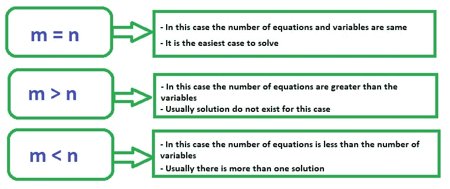
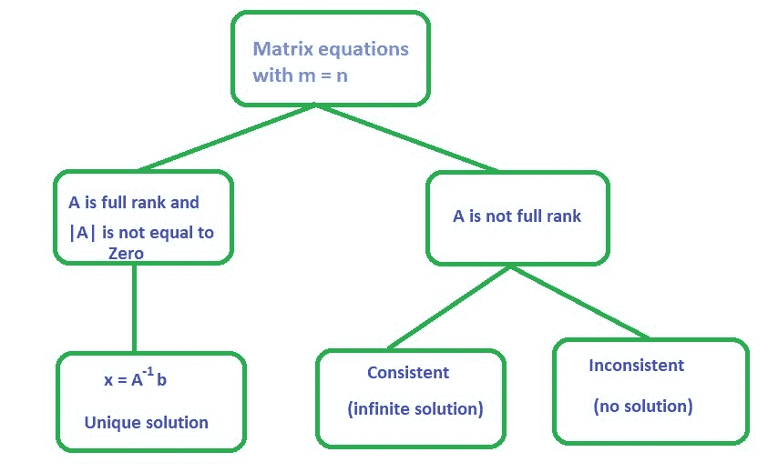

# 数据科学|求解线性方程

> 原文:[https://www . geesforgeks . org/data-science-求解-线性方程组/](https://www.geeksforgeeks.org/data-science-solving-linear-equations/)

你可以通过[数据科学导论:技能要求](https://www.geeksforgeeks.org/introduction-data-science-skills-required/)文章对什么是**数据科学**有一些基本的了解。

线性代数是数据科学的一个非常基础的部分。当谈到数据科学时，数据表示成为数据科学的一个重要方面。数据通常以矩阵形式表示。从数据科学的角度来看，第二件重要的事情是，如果这些数据包含几个感兴趣的变量，那么人们有兴趣知道其中有多少是非常重要的。如果这些变量之间有关系，那么如何才能发现这些关系。线性代数工具允许我们理解这些数据。因此，数据科学爱好者在理解复杂的机器学习算法之前，需要对这个概念有一个很好的理解。

**矩阵和线性代数**
有很多种方式来表示数据，矩阵为你提供了一种方便的方式来组织这些数据。

*   矩阵可以用来以紧凑的形式表示具有多个属性的样本
*   矩阵也可以用来以简洁的方式表示线性方程
*   线性代数提供了理解和操作矩阵的工具，以便从数据中获得有用的知识

**属性之间线性关系的识别**
我们使用零空间和零性的概念来识别属性之间的线性关系。在继续下一步之前，检查[矩阵的零空间和零属性](https://www.geeksforgeeks.org/null-space-and-nullity-of-a-matrix/)。

**预赛**

```py
Generalized linear equations are represented as below:

m and n are the number of equations and variables respectively
b is the general RHS commonly used

```

一般有三种情况需要了解:


我们将独立考虑这三种情况。

**全行秩和全列秩**
为矩阵 A(m×n)

| 全行排名 | 全列排名 |
| --- | --- |
| 当矩阵的所有行线性独立时 | 当矩阵的所有列线性独立时 |
| 数据采样不呈现线性关系——样本是独立的 | 属性是线性独立的 |

**注:**一般来说，无论矩阵的大小如何，行秩总是等于列秩，这是确定的。这意味着对于任何大小的矩阵，如果我们有一定数量的独立行，我们就会有那么多数量的独立列。
一般情况下如果我们有一个矩阵 ***m x n*** 和 ***m*** 小于 ***n*** 那么这个矩阵的最大秩只能是 **m** 。所以，最大等级总是两个数字 ***m*** 和 **n** 中的较小者。

**例 1: m = n**

**例 1.1:**

```py
Consider the given matrix equation:
 (1)   

|A| is not equal to zero
rank(A) = 2 = no. of columns

This implies that A is full rank

Therefore, the solution for the given example is     

```

**Python 中求矩阵秩和逆、解矩阵方程的程序:**

```py
# First, import
# matrix_rank from numpy.linalg
from numpy.linalg import matrix_rank, inv, solve

# A 2 x 2 matrix
A = [[1, 3],  
     [2, 4]]
b = [7, 10]

# Rank of matrix A
print("Rank of the matrix is:", matrix_rank(A))

# Inverse of matrix A
print("\nInverse of A:\n", inv(A))

# Matrix equation solution
print("Solution of linear equations:", solve(A, b))
```

**输出:**

```py
Rank of the matrix is: 2

Inverse of A:
 [[-2\.   1.5]
 [ 1\.  -0.5]]

Solution of linear equation: [ 1\.  2.]

```

可以参考 [Numpy |线性代数](https://www.geeksforgeeks.org/numpy-linear-algebra/)一文，了解矩阵的各种运算，以及 Python 中解线性方程的方法。
T3】例 1.2:

```py
Consider the given matrix equation:
 (2)   
|A| is not equal to zero
rank(A) = 1
nullity = 1
Checking consistency

Row (2) = 2 Row (1)

The equations are consistent with only one linearly independent equation
The solution set for (, ) is infinite because we have only
one linearly independent equation and two variables    

```

**解释:**在上面的例子中，我们只有一个线性独立的方程，即。所以，如果我们拿，那么我们就有了；如果我们拿，那么我们就有。以类似的方式，我们可以得到这个方程的许多解。我们可以取的任意值(我们对有无限的选择)，对应的的每个值我们会得到一个。因此，我们可以说这个方程有无穷多个解。

**例 1.3:**

```py
Consider the given matrix equation:
 (3)   
|A| is not equal to zero
rank(A) = 1
nullity = 1
Checking consistency

2 Row (1) = 

Therefore, the equations are inconsistent
We cannot find the solution to ()

```

**案例 2: m > n**

*   在这种情况下，变量或属性的数量少于方程的数量。
*   这里，不是所有的方程都能满足。
*   所以，它有时被称为无解的情况。
*   但是，我们可以试着从优化的角度来看这个案例，找出一个合适的解决方案。

**优化视角**

```py
- Rather than finding a solution to , we can find an  such that () 
  is minimized
- Here,  is a vector
- There will be as many error terms as the number of equations
- Denote  = e (m x 1); there are m errors , i = 1:m
- We can minimize all the errors collectively by minimizing 
- This is the same as minimizing 

```

于是，优化问题就变成了
![min[(Ax-b)^{T}(Ax-b)]](img/ed5efdb78d50522a26d0d8185f31d118.png "Rendered by QuickLaTeX.com")
= ![min[(b^{T}-x^{T}A^{T})(Ax-b)]](img/7a093fd07200331913202a31893a7225.png "Rendered by QuickLaTeX.com")
= ![min[(x^{T}A^{T}Ax2b^{T}Ax+b^{T}b)=f(x)]](img/e226dd9c45f037124c67e998a4091099.png "Rendered by QuickLaTeX.com")

这里我们可以注意到，优化问题是 *x* 的函数。当我们解决这个优化问题时，它会给出 *x* 的解。我们可以通过将相对于 *x* 微分并将微分设置为零来获得这个优化问题的解。

–现在，对 f(x)求微分并将微分设置为零会产生


–假设所有列都是线性独立的


**注:**虽然这个解 x 可能不满足所有方程，但它将确保方程中的误差被共同最小化。

**例 2.1:**

```py
Consider the given matrix equation:
 (4)   
m = 3, n = 2
Using the optimization concept

Therefore, the solution for the given linear equation is 
Substituting in the equation shows

```

**例 2.2:**

```py
Consider the given matrix equation:
 (5)   
m = 3, n = 2
Using the optimization concept

Therefore, the solution for the given linear equation is 
Substituting in the equation shows

```

所以，在情况 2 中需要注意的重要一点是，如果我们有比变量更多的方程，那么我们总是可以使用最小二乘解。有一点要记住，如果 A 的列是线性独立的，是存在的。

**案例 3: m < n**

*   这种情况下处理的属性或变量比方程多*   在这里，我们可以获得属性的多个解*   这是一个无限解的情况*   We will see how we can choose one solution from the set of infinite possible solution

    **在这种情况下，我们也有一个优化的视角。知道什么是拉格朗日函数[这里](https://www.encyclopediaofmath.org/index.php/Lagrange_function)是**。
    -下面是优化问题

    min(  )
    这样，
    
    –我们可以定义一个拉格朗日函数
    ![  min[ f(x, \lambda) = \frac{1}{2}x^{T}x + \lambda^{T}(Ax-b)] ](img/0f3fdbbb40fcee287021da8a0445a76c.png "Rendered by QuickLaTeX.com")

    –求拉格朗日相对于 x 的微分，并将其设置为零，那么我们将得到，
    
    
    Pre–乘以 A
    
    从上面我们可以得到
    假设所有的行都是线性独立的
    

    **例 3.1:**

    ```py
    Consider the given matrix equation:
     (6)   
    m = 2, n = 3
    Using the optimization concept,

    The solution for given sample is () = (-0.2, -0.4, 1)
    You can easily verify that 

    ```

    **概括**

    *   上述情况涵盖了求解线性方程时可能遇到的所有可能情况。*   我们用来推广上述所有情况的解的概念叫做矩阵的[摩尔-彭罗斯伪逆](https://www.geeksforgeeks.org/moore-penrose-pseudoinverse-mathematics/)。*   奇异值分解可用于计算伪逆或广义逆()。