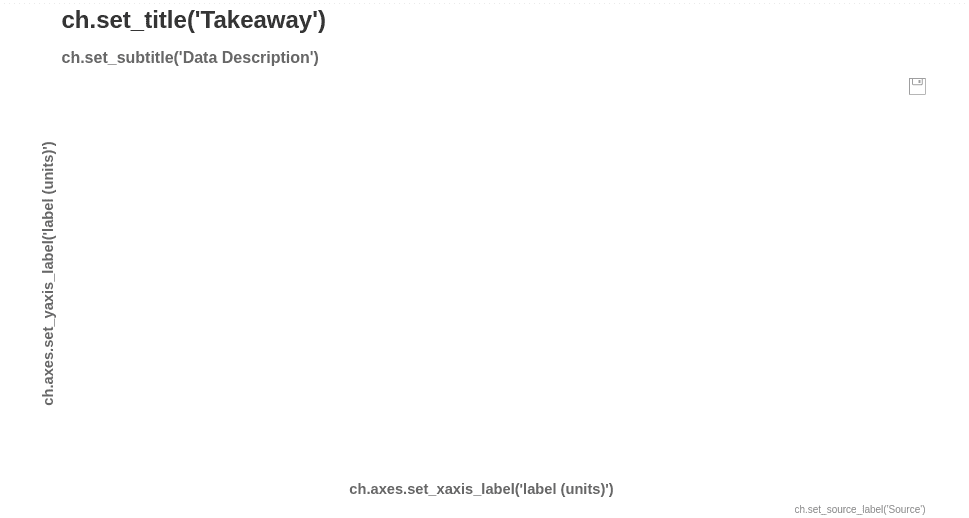
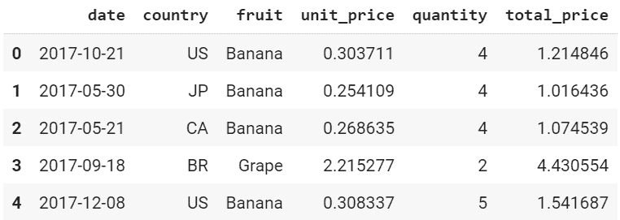

# 图表化数据可视化

> 原文:[https://www . geesforgeks . org/data-visualization-with-chartify/](https://www.geeksforgeeks.org/data-visualisation-with-chartify/)

Chartify 是来自 Spotify 的开源数据可视化库，可以让数据分析师轻松创建图表和图形。Chartify 是建立在 Bokeh 之上的，Bokeh 是一个非常流行的数据可视化库。本文对该技术进行了简要介绍。

### 需要的模块

安装最新版本的 Chartify 和 Pandas。要安装这些模块，请在终端中键入以下命令。

```
pip install chartify
pip install pandas

```

在这种情况下，数据清理和操作需要熊猫。让我们将这些导入到我们的 Python 代码中。建议使用 Jupyter 笔记本或 Google Colab 进行任何类型的数据可视化或分析。

## 蟒蛇 3

```
import chartify
import pandas as pd
```

Chartify 让任何人都可以非常容易地启动。下面的代码有助于设置一个简单的图表并将其显示在笔记本中。

## 蟒蛇 3

```
ch = chartify.Chart()
ch.show()
```

**输出:**



然而，这只是一个没有数据的空图表。让我们试着用数据填充这个图表，看看这个可视化工具是如何活跃起来的。Chartify 自带数据集示例，您可以从中学习。因此，我们将加载示例数据并显示它。

## 蟒蛇 3

```
data = chartify.examples.example_data()
data.head()
```



data.head()

如果我们分析这个数据集，我们可以得出结论，它是时间序列数据。按照惯例，时间(或日期)显示在 X 轴上。因此，让我们将 X 轴的类型设置为日期时间*。*

## 蟒蛇 3

```
ch = chartify.Chart(x_axis_type='datetime')
```