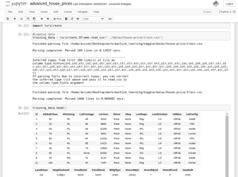
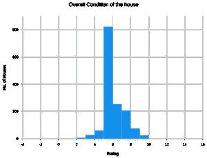
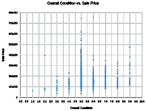
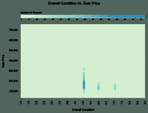
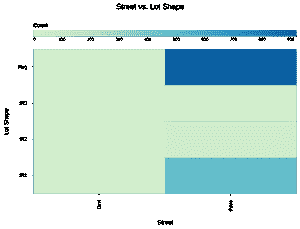
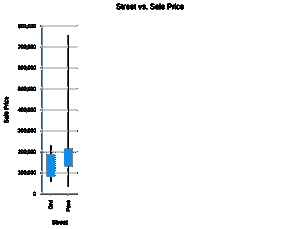

# 使用 Python 中的 Turicreate 进行数据可视化

> 原文:[https://www . geeksforgeeks . org/data-visualization-use-turi create-in-python/](https://www.geeksforgeeks.org/data-visualization-using-turicreate-in-python/)

I n 机器学习中，数据可视化是一个非常重要的阶段。为了正确理解数据的行为和特征，需要将其完美地可视化。因此，我的帖子是关于如何高效地同时轻松地可视化您的数据以从中提取最大价值。

在详细讨论如何可视化数据之前，先了解一些术语。

*   **Turi Create**–Turi Create 是一个用于创建 Core ML 模型的开源工具集，用于图像分类、对象检测、风格转换、推荐等任务。了解如何使用 Turi Create 为您的应用程序构建模型。
*   **SFrame**–SFrame 表示可扩展的数据帧。一个表格、列可变的数据框架对象，可以扩展到大数据。SFrame 中的数据是按列存储的。
*   **Sarray**–SFrame 中的每一列都称为 Sarray。

**为什么是 Turicreate？:**到这个时候，你们应该都在猜测，为什么我会选择 turicreate 进行数据可视化，因为有 Pandas，它非常易于使用。因此，我将强调 turicreate 优于熊猫的几点:

1.  熊猫是一种内存中的数据结构。这意味着你通常不能在你的机器上存储大于主内存(如内存)的数据帧，而 SFrame 是一种核外数据结构。这意味着，只要磁盘空间(如硬盘)和内存(如内存)没有用完，您就可以存储任何大小的数据帧。
2.  在 turicreate 中，您可以利用内置的可视化功能来可视化您的数据，但是在熊猫的情况下，您需要使用其他工具进行数据可视化(例如 matplotlib、seaborn 等)。

让我们从实际内容开始:

在可视化数据之前，我们首先需要安装所需的库:

```py
pip install turicreate
```

所以，我们现在有了完整的设置。让我们从导入数据集开始。

链接到本教程中使用的数据集:[https://www . kaggle . com/c/房价-高级-回归-技术](https://www.kaggle.com/c/house-prices-advanced-regression-techniques)

```py
# importing turicreate
import turicreate

# loading the dataset
training_data = turicreate.SFrame.read_csv("Url of the dataset").

# print the first 10 rows of your training data set
training_data.head()
```

**输出:**



输出

现在是**数据可视化**部分:

**条形图 ：**

```py
# for data plotting
training_data['OverallCond'].plot(title = "Overall Condition of the house", 
                                  xlabel = "Rating", 
                                  ylabel = "No. of Houses")
```

**输出:**



条形图的输出

**散点图:**

```py
# for scatter plot
turicreate.visualization.scatter(training_data["OverallCond"], 
                                 training_data["SalePrice"], 
                                 xlabel = "Overall Condition", 
                                 ylabel = "Sale Price")
```

**输出:**



散点图的输出

**热图:**

```py
# for heatmap
turicreate.visualization.heatmap(training_data["OverallCond"], 
                                 training_data["SalePrice"], 
                                 xlabel = "Overall Condition", 
                                 ylabel = "Sale Price")
```

**输出:**



热图输出

**分类热图:**

```py
# for categorical heatmap
turicreate.visualization.categorical_heatmap(training_data["Street"], 
                                             training_data["LotShape"], 
                                             xlabel = "Street", 
                                             ylabel = "Lot Shape")
```



分类热图的输出

**箱线图:**

```py
# for box plot
turicreate.visualization.box_plot(training_data["Street"], 
                                  training_data["SalePrice"], 
                                  xlabel = "Street", 
                                  ylabel = "Sale Price")
```

**输出:**



箱线图的输出

**直方图:**

```py
# for histogram
turicreate.visualization.histogram(training_data["SalePrice"], 
                                   xlabel ="Sale Price")
```

**输出:**


直方图的输出