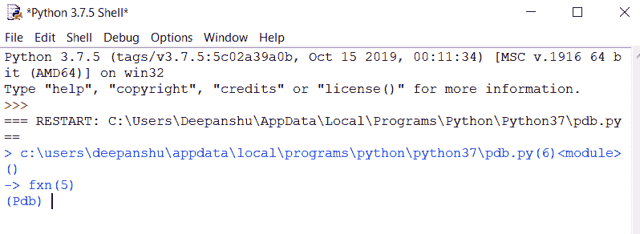
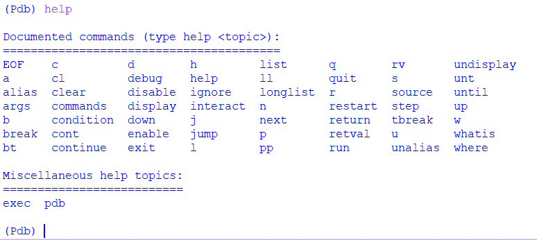
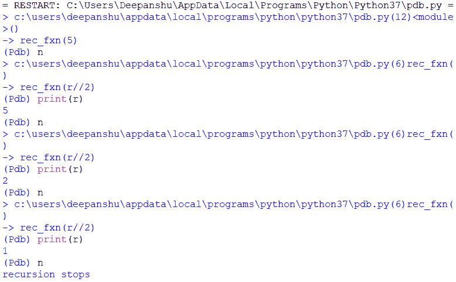
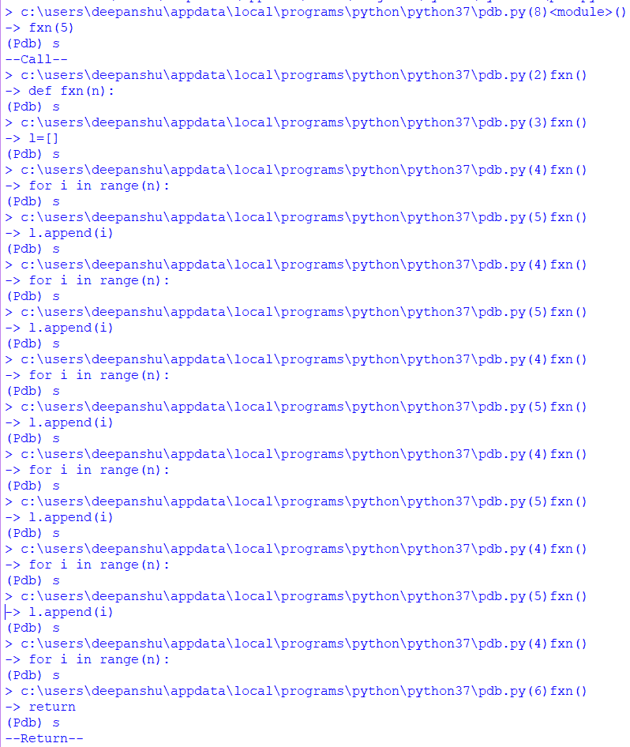
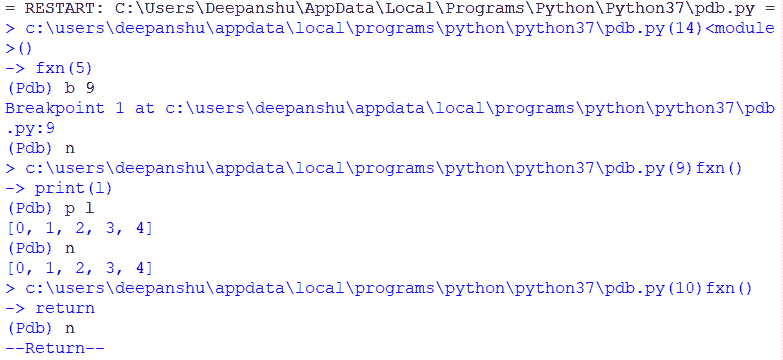
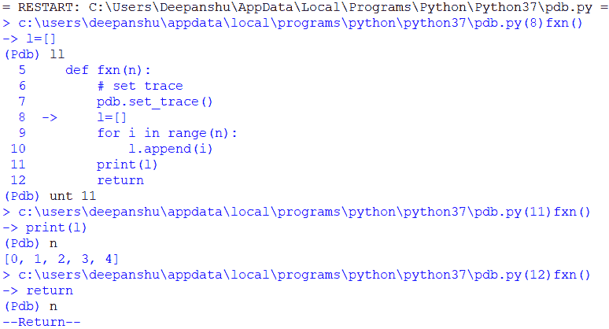
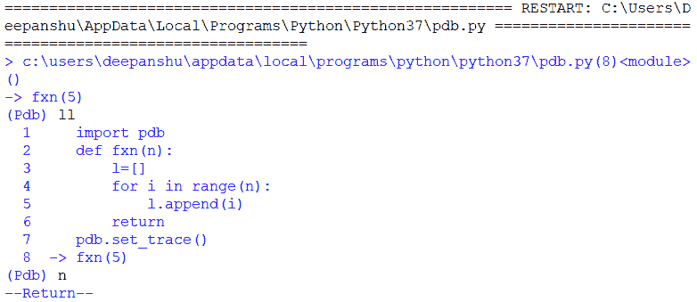
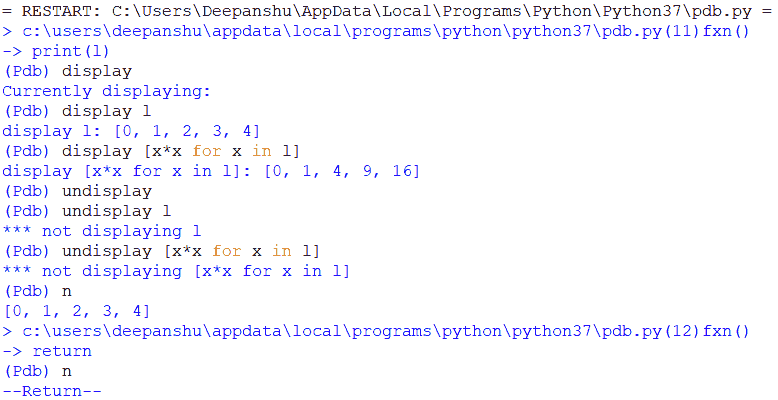
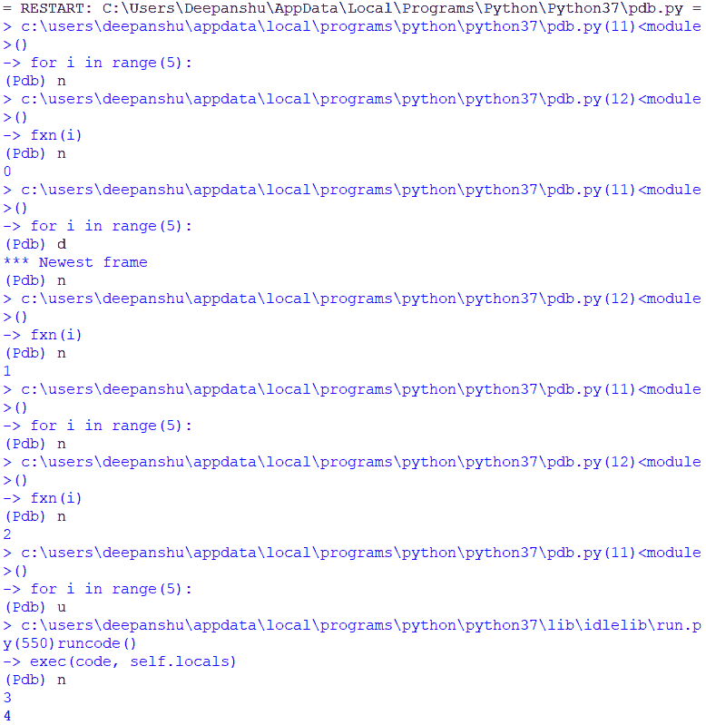

# 用 Pdb 在 Python 中调试

> 原文:[https://www.geeksforgeeks.org/debugging-in-python-with-pdb/](https://www.geeksforgeeks.org/debugging-in-python-with-pdb/)

Python 中的 PDB 模块为我们引人注目的 Python 代码调试提供了巨大的亮点。这包括:

*   节目暂停
*   查看每一行代码的执行情况
*   检查变量值

该模块已经安装了 python。因此，我们只需要将它导入到我们的代码中就可以使用它的功能。在此之前，我们必须了解下面提到的一些概念:

1.  要导入，我们只需在代码中使用**导入 pdb** 。
2.  对于调试，我们将使用 **pdb.set_trace()** 方法。现在，在 Python 3.7 中**断点()**方法也可用于此。
3.  我们在 Python 空闲终端上运行这个(你可以使用任何 ide 终端运行)。

让我们从一个由几行代码组成的简单例子开始。

**示例:**

## 蟒蛇 3

```py
# importing pdb
import pdb

# make a simple function to debugg
def fxn(n):
    for i in range(n):
        print("Hello! ", i+1)

# starting point to debugg
pdb.set_trace()
fxn(5)
```

**输出:**



在这里，我们可以看到，当函数调用完成后，pdb 执行并请求下一个命令。我们可以在这里使用一些命令，比如

> **c - >** 继续执行
> 
> **q - >** 退出调试器/执行
> 
> **n - >** 在相同功能下进入下一行
> 
> **s - >** 步至该函数或被调用函数的下一行

要了解不同命令的更多信息，您可以键入帮助并获取所需信息。



现在，我们将在 n 命令的帮助下进一步执行程序。


类似地，我们可以使用断点()方法(不需要导入 pdb)。

## 蟒蛇 3

```py
# a simple function
def fxn(n):
    for i in range(n):
        print("Hello! ", i+1)

# using breakpoint
breakpoint()
fxn(5)
```

**输出:**


## PDB 调试提供的功能

**1。打印变量或表达式**

当使用打印顺序 p 时，您正在传递一个由 Python 评估的清晰度。万一你传递了一个变量名，pdb 会打印出它现在的价值。尽管如此，您还可以做更多的工作来检查正在运行的应用程序的状况。

**PDB 调试在递归检查变量中的应用**

在这个例子中，我们将定义一个带有 pdb trace 的递归函数，并在每次递归调用时检查变量值。为了打印变量值，我们将使用一个简单的带有变量名的 print 关键字。

## 蟒蛇 3

```py
# importing pdb
import pdb

# define recursive function
def rec_fxn(r):
    if r > 0:

        # set trace
        pdb.set_trace()
        rec_fxn(r//2)
    else:
        print("recursion stops")
    return

# set trace at start
pdb.set_trace()
rec_fxn(5)
```

**输出:**



**检查表达式的示例**

本示例类似于上面的示例，在表达式求值后打印表达式的值。

## 蟒蛇 3

```py
# importing pdb
import pdb

# simple function
def fxn(n):
    l=[]
    for i in range(n):
        l.append(i)

    # set trace
    pdb.set_trace()
    return

fxn(5)
```

**输出:**


**2。分步移入代码**

这是 pdb 提供的最重要的功能。两个主要命令用于此，如下所示:

> **n - >** 在相同功能下进入下一行
> 
> **s - >** 步至该函数或被调用函数的下一行

让我们借助一个例子来理解这些的工作原理。

## 蟒蛇 3

```py
# importing pdb
import pdb

# simple function
def fxn(n):
    l = []
    for i in range(n):
        l.append(i)
    return

# set trace
pdb.set_trace()
fxn(5)
```

**输出使用 n:**


**输出使用 s:**



**3。使用断点**

这个特性帮助我们在源代码的特定行动态创建断点。在本例中，我们使用下面给出的命令 b 创建断点:

```py
b(reak) [ ([filename:]lineno | function) [, condition] ]
        Without argument, list all breaks.
```

使用行号参数，在当前文件的这一行设置一个分隔符。使用函数名，在该函数的第一个可执行行设置一个分隔符。如果存在第二个参数，则它是一个字符串，指定了一个表达式，在使用断点之前，该表达式的计算结果必须为 true。

行号可以以文件名和冒号作为前缀，以指定另一个文件(可能是尚未加载的文件)中的断点。在 sys.path 上搜索该文件；那个。py 后缀可以省略。

## 蟒蛇 3

```py
# importing pdb
import pdb

# simple function
def fxn(n):
    l = []

    for i in range(n):
        l.append(i)
    print(l)
    return

# set trace
pdb.set_trace()
fxn(5)
```

**输出:**



**4。执行代码直到** **指定行**

使用 unt 像 c 一样继续执行，但是，在比当前行更值得注意的下一行停止。偶尔使用 unt 会更有帮助，使用起来也更快，这正是你所需要的。

```py
unt(il) [lineno]
```

如果没有参数，继续执行，直到到达一个大于当前值的行。对于行号，继续执行，直到到达一个大于或等于该行号的行。在这两种情况下，当当前帧返回时也停止。

## 蟒蛇 3

```py
# importing pdb
import pdb

# simple function
def fxn(n):

    # set trace
    pdb.set_trace()
    l = []

    for i in range(n):
        l.append(i)
    print(l)
    return

fxn(5)
```

**输出:**



**5。列出代码**

列出源代码是另一个功能，可以用行号作为列表来跟踪代码。为此使用了 ll 命令。

> longlist | ll ->列出当前函数或框架的整个源代码。

让我们借助一个例子来理解 longlist 的工作原理。

## 蟒蛇 3

```py
# importing pdb
import pdb

# simple function
def fxn(n):
    l=[]

    for i in range(n):
        l.append(i)
    return

# set trace
pdb.set_trace()
fxn(5)
```

**输出:**



**6。显示表达式**

就像用 p 和 pp 打印发音一样，您可以使用 order show [expression]建议 pdb 在执行停止时显示发音的估计值，以避免发音发生变化。利用订单未显示[表达]来明确展示清晰度。

```py
display [expression]
```

每次在当前帧中停止执行时，显示表达式的值(如果已更改)。如果没有表达式，列出当前框架的所有显示表达式。

```py
undisplay [expression]
```

在当前帧中不再显示表达式。如果没有表达式，请清除当前帧的所有显示表达式。

## 蟒蛇 3

```py
# importing pdb
import pdb

# simple function
def fxn(n):
    l = []

    for i in range(n):
        l.append(i)

    # set trace
    pdb.set_trace()
    print(l)
    return

fxn(5)
```

**输出:**



**7。上下框架**

在这里，我们可以将每个轨迹作为一个帧来玩，也可以从一个帧移动到另一个帧。

```py
w(here)
```

打印堆栈跟踪，在底部显示最近的帧。箭头表示“当前帧”，它决定了大多数命令的上下文。“bt”是此命令的别名。

```py
u(p) [count]
```

在堆栈跟踪中将当前帧计数(默认为 1)上移一级(移至较旧的帧)。

```py
d(own) [count]
```

在堆栈跟踪中将当前帧计数(默认为 1)下移一级(至新帧)。

## 蟒蛇 3

```py
# importing pdb
import pdb

# simple function
def fxn(i):
    print(i)
    return

# set trace
pdb.set_trace()
for i in range(5):
    fxn(i)
```

**输出:**

