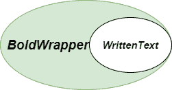
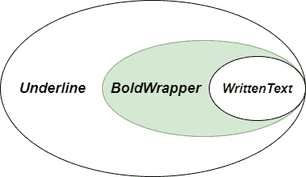
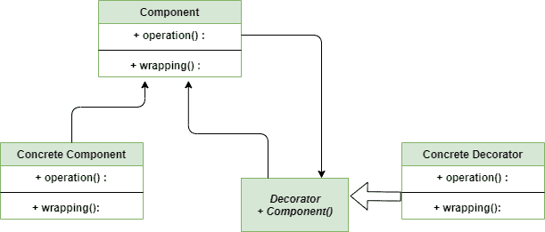

# 装饰器方法–Python 设计模式

> 原文:[https://www . geesforgeks . org/decorator-method-python-design-patterns/](https://www.geeksforgeeks.org/decorator-method-python-design-patterns/)

装饰器方法是一种 **[结构设计模式](https://www.geeksforgeeks.org/design-patterns-set-1-introduction/)** ，通过将对象放在包含行为的包装器对象中，可以动态地将新行为附加到对象上，而不会改变它们的实现。
在 Python 中实现 **[装饰器方法](https://www.geeksforgeeks.org/decorator-pattern/)** 要容易得多，因为它的内置特性。它不等同于 **[继承](https://www.geeksforgeeks.org/inheritance-in-python/)** ，因为新特性只添加到那个特定的对象，而不是整个子类。

### 不使用装饰器方法的问题

想象一下，我们正在使用一个格式化工具，该工具提供了文本加粗和文本下划线等功能。但是过了一段时间，我们的格式化工具在目标受众中出名了，根据我们得到的反馈，我们的受众希望在应用程序中有更多的功能，例如将文本变成斜体和许多其他功能。
看起来简单？实现这个或者扩展我们的类来添加更多的功能而不干扰现有的客户端代码并不是一件容易的事情，因为我们必须维护**单一责任原则**。

### 使用装饰方法的解决方案

现在让我们看看我们必须避免这种情况的解决方案。最初，我们只有**书写文本**，但是我们必须应用像**粗体、斜体、下划线**这样的过滤器。因此，我们将为每个函数创建单独的包装类，如 BoldWrapperClass、ItalicWrapperClass 和 UnderlineWrapperclass。


装饰者-书面-文本

首先，我们将对书面文本调用 BoldWrapperclass，它最终将文本转换为粗体字母



装饰器包装器

然后我们将在粗体文本上应用 ItalicWrapperClass 和下划线 WrapperClass，这将给出我们想要的结果。



装饰器-下划线

以下代码是使用装饰器方法编写的:

```
class WrittenText:

    """Represents a Written text """

    def __init__(self, text):
        self._text = text

    def render(self):
        return self._text

class UnderlineWrapper(WrittenText):

    """Wraps a tag in <u>"""

    def __init__(self, wrapped):
        self._wrapped = wrapped

    def render(self):
        return "<u>{}</u>".format(self._wrapped.render())

class ItalicWrapper(WrittenText):

    """Wraps a tag in <i>"""

    def __init__(self, wrapped):
        self._wrapped = wrapped

    def render(self):
        return "<i>{}</i>".format(self._wrapped.render())

class BoldWrapper(WrittenText):

    """Wraps a tag in <b>"""

    def __init__(self, wrapped):
        self._wrapped = wrapped

    def render(self):
        return "<b>{}</b>".format(self._wrapped.render())

""" main method """

if __name__ == '__main__':

    before_gfg = WrittenText("GeeksforGeeks")
    after_gfg = ItalicWrapper(UnderlineWrapper(BoldWrapper(before_gfg)))

    print("before :", before_gfg.render())
    print("after :", after_gfg.render())
```

### 装饰器方法的类图

下面是装饰器方法的类图:



装饰器-类图

### 优势

*   **单一责任原则:**使用 Decorator 方法很容易将一个实现了许多可能的行为变体的单体类分成几个类。
*   **运行时职责:**我们可以在运行时轻松地在对象中添加或移除响应。
*   **子类化:**装饰器模式是子类化的替代方案。子类化在编译时增加了行为，这个改变影响了原始类的所有实例；装饰可以在运行时为单个对象提供新的行为。

### 不足之处

1.  **移除包装器:**很难从包装器堆栈中移除特定的包装器。
2.  **复杂的装饰者:**让装饰者跟踪其他装饰者可能会很复杂，因为回顾装饰者链的多个层开始推动装饰者模式超出其真实意图。
3.  **丑陋的配置:**大量的层代码可能会使配置变得丑陋。

### 适应性

1.  **无法继承:**一般来说，当无法使用继承来扩展对象的行为时，使用 Decorator 方法。
2.  **运行时分配:**Decorator 方法最重要的一个特性是在**运行时**给对象分配不同且独特的行为。

**进一步阅读–****[Java 中的装饰设计模式](https://www.geeksforgeeks.org/decorator-pattern-set-3-coding-the-design/)**