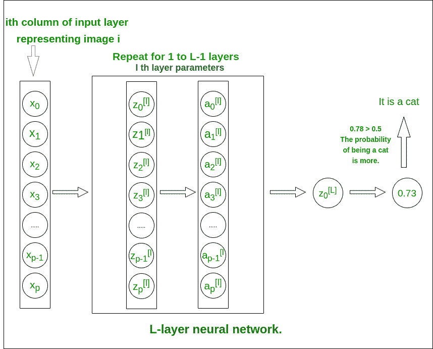

# 具有 L 层的深度神经网络

> 原文:[https://www . geesforgeks . org/deep-neural-network-with-l-layers/](https://www.geeksforgeeks.org/deep-neural-network-with-l-layers/)

本文旨在实现一个深度神经网络，该网络具有任意数量的隐藏层，每个隐藏层包含不同数量的神经元。我们将使用几个辅助函数来实现这个神经网络，最后，我们将组合这些函数来创建 L 层神经网络模型。
**L 层深层神经网络结构**(用于理解)



l 层神经网络

模型的结构是[LINEAR -> tanh](L-1 次)-> LINEAR -> SIGMOID。即，它具有使用双曲正切函数作为激活函数的 L-1 层，随后是具有 sigmoid 激活函数的输出层。
[更多关于激活功能](https://www.geeksforgeeks.org/understanding-activation-functions-in-depth/)
**逐步实现神经网络:**

```
Initialize the parameters for the L layers
Implement the forward propagation module
Compute the loss at the final layer
Implement the backward propagation module
Finally, update the parameters
Train the model using existing training dataset
Use trained parameters to test model
```

**文章中遵循的命名惯例，以防止混淆:**

*   网络中的每一层由一组两个参数 **W** 矩阵(权重矩阵)和 **b** 矩阵(偏差矩阵)表示。对于图层， **i** 这些参数分别表示为 **Wi** 和 **bi** 。
*   图层 I 的线性输出表示为**子**，激活后的输出表示为**艾**。子和艾的维度是一样的。

**权重和偏差矩阵的维度。**
输入图层的大小为(x，m)，其中 m 为图像数量。

<figure class="table">

| 层数 | W 的形状 | b 的形状 | 线性输出 | 激活的形状 |
| --- | --- | --- | --- | --- |
| 第一层 | ![(n[1], x)](img/4ffb02ea458a40d5cf5fece7441cd1f9.png "Rendered by QuickLaTeX.com") | ![(n[1], 1)](img/d7c3055de1f3dc877fc0c4aacb089fc4.png "Rendered by QuickLaTeX.com") | ![Z[1] = W[1]X + b[1]](img/66826440fd391af1db5357a25e19db44.png "Rendered by QuickLaTeX.com") | ![(n[1], m)](img/534f84b2cddb4dd7657e69a4d90c1acb.png "Rendered by QuickLaTeX.com") |
| 第二层 | ![(n[2], n[1])](img/c05fa8d84b10b5c98e6931d769b39e9d.png "Rendered by QuickLaTeX.com") | ![(n[2], 1)](img/5d7797b4e16db12b575fcc96fdac660c.png "Rendered by QuickLaTeX.com") | ![Z[2] = W[2]A[1] + b[2]](img/67d2496ad167b190957b438bcc67a84c.png "Rendered by QuickLaTeX.com") | ![(n[2], m)](img/02c96cf041d72a08088c277281473484.png "Rendered by QuickLaTeX.com") |
| ： |  |  |  |  |
| 第 1 层 | ![(n[L - 1], n[L - 2])](img/f2e566a816bc8d1dac8855cedfc69ca8.png "Rendered by QuickLaTeX.com") | ![(n[L - 1], 1)](img/e2d2939d6cc6474111dc681546b8356a.png "Rendered by QuickLaTeX.com") | ![Z[L - 1] = W[L - 1]A[L - 2] + b[L - 1]](img/6cef7e72b0e4756cbf38ceaaab147a5e.png "Rendered by QuickLaTeX.com") | ![(n[L - 1], m)](img/0abab877e5eca1370c3075dc3d503c1c.png "Rendered by QuickLaTeX.com") |
| L 层 | ![(n[L], n[L - 1])](img/9d6e27c2b0975e88816ed8b920c9b59f.png "Rendered by QuickLaTeX.com") | ![(n[L], 1)](img/79c25a4ff2bd7122b8f5d23e47e855ee.png "Rendered by QuickLaTeX.com") | ![Z[L] = W[L]A[L - 1] + b[L]](img/0e779e707569ae0d2eee25ca99110cbe.png "Rendered by QuickLaTeX.com") | ![(n[L], m)](img/543fa70fc26fbcd98d1c68804ee59e2a.png "Rendered by QuickLaTeX.com") |

</figure>

**代码:导入所有需要的 python 库。**

## 蟒蛇 3

```
import time
import numpy as np
import h5py
import matplotlib.pyplot as plt
import scipy
from PIL import Image
from scipy import ndimage
```

**初始化:**

*   我们将对权重矩阵使用随机初始化(以避免来自同一层中所有神经元的相同输出)。
*   零偏差初始化。
*   每一层中神经元的数量存储在 layer_dims 字典中，关键字作为层数。

**代码:**

## 蟒蛇 3

```
def initialize_parameters_deep(layer_dims):
    # 0th layer is the input layer with number
    # of columns stored in layer_dims.
    parameters = {}

    # number of layers in the network
    L = len(layer_dims)           

    for l in range(1, L):
        parameters['W' + str(l)] = np.random.randn(layer_dims[l],
                                        layer_dims[l - 1])*0.01
        parameters['b' + str(l)] = np.zeros((layer_dims[l], 1))

    return parameters
```

**前向传播模块:**
前向传播模块将分三步完成。我们将按此顺序完成三个功能:

*   线性向前(计算任何层的线性输出 Z)
*   线性激活向前，其中激活将是 tanh 或 Sigmoid。
*   L _ model _ forward[LINEAR-> tanh](L-1 次)-> LINEAR -> SIGMOID(整体模型)

线性正向模块(在所有示例中矢量化)计算以下等式:
Zi = Wi * A(I–1)+艾比= activation_func(Zi)
**代码:**

## 蟒蛇 3

```
def linear_forward(A_prev, W, b):

    # cache is stored to be used in backward propagation module
    Z = np.dot(W, A_prev) + b
    cache = (A, W, b)
    return Z, cache
```

## 蟒蛇 3

```
def sigmoid(Z):

    A = 1/(1 + np.exp(-Z))
    return A, {'Z' : Z}

def tanh(Z):

    A = np.tanh(Z)
    return A, {'Z' : Z}

def linear_activation_forward(A_prev, W, b, activation):

    # cache is stored to be used in backward propagation module
    if activation == "sigmoid":
        Z, linear_cache = linear_forward(A_prev, W, b)
        A, activation_cache = sigmoid(Z)
    elif activation == "tanh":
        Z, linear_cache = linear_forward(A_prev, W, b)
        A, activation_cache = tanh(Z)
    cache = (linear_cache, activation_cache)

    return A, cache
```

## 蟒蛇 3

```
def L_model_forward(X, parameters):
    """
    Arguments:
    X -- data, numpy array of shape (input size, number of examples)
    parameters -- output of initialize_parameters_deep()

    Returns:
    AL -- last post-activation value
    caches -- list of caches containing:
                every cache of linear_activation_forward()
           (there are L-1 of them, indexed from 0 to L-1)
    """

    caches = []
    A = X

    # number of layers in the neural network
    L = len(parameters) // 2                 

    # Implement [LINEAR -> TANH]*(L-1). Add "cache" to the "caches" list.
    for l in range(1, L):
        A_prev = A
        A, cache = linear_activation_forward(A_prev,
                           parameters['W' + str(l)],
                   parameters['b' + str(l)], 'tanh')

        caches.append(cache)

    # Implement LINEAR -> SIGMOID. Add "cache" to the "caches" list.
    AL, cache = linear_activation_forward(A, parameters['W' + str(L)],
                                  parameters['b' + str(L)], 'sigmoid')
    caches.append(cache)

    return AL, caches
```

![\[ {\Huge J = \frac{1}{m}\sum_{i=1}^{\m}y^{(i)}log(a^{[L][i]}) + (1 - y^{(i)})log(1 - a^{[L][i]})} \]  ](img/f4cf67df652d160d2c789b77ff10102b.png "Rendered by QuickLaTeX.com")

我们将使用这个成本函数来衡量所有训练数据的输出层的成本。
**代号:**

## 蟒蛇 3

```
def compute_cost(AL, Y):
    """
    Implement the cost function defined by the equation.
    m = Y.shape[1]
    cost = (-1 / m)*(np.dot(np.log(AL), Y.T)+np.dot(np.log((1-AL)), (1 - Y).T))

    # To make sure your cost's shape is what we
    # expect (e.g. this turns [[20]] into 20).
    cost = np.squeeze(cost)     

    return cost
```

**反向传播模块:**
类似于**正向传播模块**，我们也将在这个模块中实现三个功能。

*   线性 _ 向后(计算任何层的线性输出 Z)
*   线性激活向后，其中激活将是 tanh 或 Sigmoid。
*   L _ model _ backward[LINEAR-> tanh](L-1 次)-> LINEAR -> SIGMOID(全模型反向传播)

对于 I 层，线性部分是:Zi = Wi * A(I–1)+bi
表示 dZi = 我们可以得到 dWi、dbi 和 dA(I–1)为–


这些方程是使用微分学和保持矩阵的维数适合使用 np.dot()函数进行矩阵点乘来制定的。
**代码:Python 代码实现**

## 蟒蛇 3

```
def linear_backward(dZ, cache):

    A_prev, W, b = cache
    m = A_prev.shape[1]
    dW = (1 / m)*np.dot(dZ, A_prev.T)
    db = (1 / m)*np.sum(dZ, axis = 1, keepdims = True)
    dA_prev = np.dot(W.T, dZ)

    return dA_prev, dW, db
```

这里我们将计算 sigmoid 和 tanh 函数的导数。[激活函数](https://medium.com/@omkar.nallagoni/activation-functions-with-derivative-and-python-code-sigmoid-vs-tanh-vs-relu-44d23915c1f4)
**的理解推导代码:**

## 蟒蛇 3

```
def sigmoid_backward(dA, activation_cache):

    Z = activation_cache['Z']
    A = sigmoid(Z)
    return dA * (A*(1 - A))    # A*(1 - A) is the derivative of sigmoid function

def tanh_backward(dA, activation_cache):

    Z = activation_cache['Z']
    A = sigmoid(Z)
    return dA * (1 -np.power(A, 2))  
    # A*(1 -
```

**L-model-backward:**
回想一下，当您实现 L_model_forward 函数时，在每次迭代中，您都存储了一个包含(X、W、b 和 Z)的缓存。在反向传播模块中，您将使用这些变量来计算梯度。

## 蟒蛇 3

```
def L_model_backward(AL, Y, caches):
    """
    AL -- probability vector, output of the forward propagation (L_model_forward())
    Y -- true "label" vector (containing 0 if non-cat, 1 if cat)
    caches -- list of caches containing:
                every cache of linear_activation_forward() with "tanh"
                (it's caches[l], for l in range(L-1) i.e l = 0...L-2)
                the cache of linear_activation_forward() with "sigmoid"
                 (it's caches[L-1])

    Returns:
    grads -- A dictionary with the gradients
             grads["dA" + str(l)] = ...
             grads["dW" + str(l)] = ...
             grads["db" + str(l)] = ...
    """
    grads = {}
    L = len(caches) # the number of layers
    m = AL.shape[1]
    Y = Y.reshape(AL.shape) # after this line, Y is the same shape as AL

    # Initializing the backpropagation
    # derivative of cost with respect to AL

    dAL = - (np.divide(Y, AL) - np.divide(1 - Y, 1 - AL))

    # Lth layer (SIGMOID -> LINEAR) gradients. Inputs: "dAL, current_cache".
    # Outputs: "grads["dAL-1"], grads["dWL"], grads["dbL"]
    current_cache = caches[L - 1]
    grads["dA" + str(L-1)], grads["dW" + str(L)], grads["db" + str(L)] = \
                  linear_activation_backward(dAL, current_cache, 'sigmoid')

    # Loop from l = L-2 to l = 0
    for l in reversed(range(L-1)):
        current_cache = caches[l]
        dA_prev_temp, dW_temp, db_temp = linear_activation_backward(
                    grads['dA' + str(l + 1)], current_cache, 'tanh')
        grads["dA" + str(l)] = dA_prev_temp
        grads["dW" + str(l + 1)] = dW_temp
        grads["db" + str(l + 1)] = db_temp

    return grads
```

**更新参数:**
Wi = Wi–a * dWi
bi = bi–a * DBI
(其中 a 是一个称为学习率的适当常数)

## 蟒蛇 3

```
def update_parameters(parameters, grads, learning_rate):
    L = len(parameters) // 2 # number of layers in the neural network

    # Update rule for each parameter. Use a for loop.
    for l in range(L):
        parameters["W" + str(l + 1)] = parameters["W" + str(l + 1)] - learning_rate * grads['dW' + str(l + 1)]
        parameters["b" + str(l + 1)] = parameters['b' + str(l + 1)] - learning_rate * grads['db' + str(l + 1)]

    return parameters
```

**代码:训练模型**
现在是时候把之前写的所有函数累加起来，形成最终的 L 层神经网络模型了。L_layer_model 中的参数 X 将是训练数据集，Y 是相应的标签。

## 蟒蛇 3

```
def L_layer_model(X, Y, layers_dims, learning_rate = 0.0075, num_iterations = 3000, print_cost = False):
    """
    Arguments:
    X -- data, numpy array of shape (num_px * num_px * 3, number of examples)
    Y -- true "label" vector (containing 0 if cat, 1 if non-cat),
                                 of shape (1, number of examples)
    layers_dims -- list containing the input size and each layer size,
                                      of length (number of layers + 1).
    learning_rate -- learning rate of the gradient descent update rule
    num_iterations -- number of iterations of the optimization loop
    print_cost -- if True, it prints the cost every 100 steps

    Returns:
    parameters -- parameters learned by the model. They can then be used to predict.
    """

    np.random.seed(1)
    costs = []                         # keep track of cost

    parameters = initialize_parameters_deep(layers_dims)

    # Loop (gradient descent)
    for i in range(0, num_iterations):

        # Forward propagation: [LINEAR -> TANH]*(L-1) -> LINEAR -> SIGMOID.
        AL, caches = L_model_forward(X, parameters)

        # Compute cost.
        cost = compute_cost(AL, Y)

        # Backward propagation.
        grads = L_model_backward(AL, Y, caches)

        # Update parameters.
        parameters = update_parameters(parameters, grads, learning_rate)

        # Print the cost every 100 training example
        if print_cost and i % 100 == 0:
            print ("Cost after iteration % i: % f" %(i, cost))
        if print_cost and i % 100 == 0:
            costs.append(cost)

    # plot the cost
    plt.plot(np.squeeze(costs))
    plt.ylabel('cost')
    plt.xlabel('iterations (per hundreds)')
    plt.title("Learning rate =" + str(learning_rate))
    plt.show()

    return parameters
```

**代码:实现预测功能，测试提供的图像。**

## 蟒蛇 3

```
def predict(parameters, path_image):

    my_image = path_image
    image = np.array(ndimage.imread(my_image, flatten = False))
    my_image = scipy.misc.imresize(image,
                  size =(num_px, num_px)).reshape((
                          num_px * num_px * 3, 1))

    my_image = my_image / 255.
    output, cache = L_model_forward(my_image, parameters)
    output = np.squeeze(output)
    prediction = round(output)
    if(prediction == 1):
        label = "Cat picture"
    else:
        label = "Non-Cat picture"   # If the model is trained to recognize a cat image.
    print ("y = " + str(prediction) + ", your L-layer model predicts a \"" + label)
```

只要 layers_dims = [12288，20，7，5，1]当使用适当数量的训练数据集训练该模型时，它在测试数据上的准确性高达 **80%** 。
用适量的训练数据集训练后找到参数。

## 蟒蛇 3

```
{'W1': array([[ 0.01672799, -0.00641608, -0.00338875, ..., -0.00685887,
        -0.00593783,  0.01060475],
       [ 0.01395808,  0.00407498, -0.0049068, ...,  0.01317046,
         0.00221326,  0.00930175],
       [-0.00123843, -0.00597204,  0.00472214, ...,  0.00101904,
        -0.00862638, -0.00505112],
       ...,
       [ 0.00140823, -0.00137711,  0.0163992, ..., -0.00846451,
        -0.00761603, -0.00149162],
       [-0.00168698, -0.00618577, -0.01023935, ...,  0.02050705,
        -0.00428185,  0.00149319],
       [-0.01770891, -0.0067836,  0.00756873, ...,  0.01730701,
         0.01297081, -0.00322241]]), 'b1': array([[  3.85542520e-03],
       [  8.18087056e-03],
       [  6.52138546e-03],
       [  2.85633678e-03],
       [  6.01081275e-03],
       [  8.17122684e-04],
       [  3.72986493e-04],
       [  7.05992009e-04],
       [  4.36344692e-04],
       [  1.90827285e-03],
       [ -6.51686461e-03],
       [  6.97258125e-03],
       [ -1.08988113e-03],
       [  5.40858776e-03],
       [  8.16752511e-03],
       [ -1.05298871e-02],
       [ -9.05267219e-05],
       [ -5.13240993e-04],
       [  1.42355924e-03],
       [ -2.40912130e-03]]), 'W2': array([[  2.02109232e-01,  -3.08645240e-01,  -3.77620591e-01,
         -4.02563039e-02,   5.90753267e-02,   1.23345558e-01,
          3.08047246e-01,   4.71201576e-02,   5.29892230e-02,
          1.34732883e-01,   2.15804697e-01,  -6.34295948e-01,
         -1.56081006e-01,   1.01905466e-01,  -1.50584386e-01,
          5.31219819e-02,   1.14257132e-01,   4.20697960e-01,
          1.08551174e-01,  -2.18735332e-01],
       [  3.57091131e-01,  -1.40997155e-01,   3.70857247e-01,
          2.53207014e-01,  -1.12596978e-01,  -3.15179195e-01,
         -2.48100731e-01,   4.72723584e-01,  -7.71870940e-02,
          5.39834663e-01,  -1.17927181e-02,   6.45463019e-02,
          2.73704423e-02,   4.30157714e-01,   1.59318390e-01,
         -6.48089126e-01,  -1.71894333e-01,   1.77933527e-01,
          1.54736463e-01,  -7.26815274e-02],
       [  2.96501527e-01,   2.43056424e-01,  -1.22400000e-02,
          2.69275366e-02,   3.76041647e-01,  -1.70245407e-01,
         -2.95343754e-02,  -7.35716150e-02,  -1.80179693e-01,
         -5.77515859e-03,  -6.38323383e-01,   6.94950669e-02,
          7.66137263e-02,   3.66599261e-01,   5.40904716e-02,
         -1.51814996e-01,  -2.61672559e-01,   1.35946854e-01,
          4.21086332e-01,  -2.71073484e-01],
       [  1.42186042e-01,  -2.66789439e-01,   4.57188131e-01,
          2.84732743e-02,  -5.49143391e-02,  -3.96786581e-02,
         -1.68668726e-01,  -1.46525541e-01,   3.25325993e-03,
         -1.13045329e-01,   4.03935681e-01,  -3.92214264e-01,
          5.25325051e-04,  -3.69642647e-01,  -1.15812921e-01,
          1.32695899e-01,   3.20810624e-01,   1.88127350e-01,
         -4.82784806e-02,  -1.48816756e-01],
       [ -1.65469406e-01,   4.24741323e-01,  -5.76900900e-01,
          1.58084434e-01,  -2.90965849e-01,   3.40124014e-02,
         -2.62189635e-01,   2.66917709e-01,   4.77530579e-01,
         -1.73491365e-01,  -1.48434710e-01,  -6.91270097e-02,
          5.42923817e-03,  -2.85173244e-01,   6.40701002e-02,
         -7.33126171e-02,   1.43543481e-01,   7.82250247e-02,
         -1.47535352e-01,  -3.99073661e-01],
       [ -2.05468389e-01,   1.66914752e-01,   2.15918881e-01,
          2.21774761e-01,   2.52527888e-01,   2.64464223e-01,
         -3.07796263e-02,  -3.06999665e-01,   3.45835418e-01,
          1.05973413e-01,  -3.47687682e-01,   9.13383273e-02,
          3.97150339e-02,  -3.14285982e-01,   2.22363710e-01,
         -3.93921988e-01,  -9.70224337e-02,  -3.03701358e-01,
          1.40075127e-01,  -4.56621577e-01],
       [  2.06819296e-01,  -2.39537245e-01,  -4.06133490e-01,
          5.92692802e-02,   8.95374287e-02,  -3.27700300e-01,
         -6.89856027e-02,  -6.13447906e-01,   1.89927573e-01,
         -1.42814095e-01,   1.77958823e-03,  -1.34407806e-01,
          9.34036862e-02,  -2.00549616e-02,   9.01789763e-02,
          3.81627943e-01,   3.30416268e-01,  -1.76566228e-02,
          9.28388267e-02,  -1.16167106e-01]]), 'b2': array([[-0.00088887],
       [ 0.02357712],
       [ 0.01858614],
       [-0.00567557],
       [ 0.00636179],
       [ 0.02362429],
       [-0.00173074]]), 'W3': array([[ 0.20939786,  0.21977478,  0.77135171, -1.07520777, -0.64307173,
        -0.24097649, -0.15626735],
       [-0.57997618,  0.30851841, -0.03802324, -0.13489975,  0.23488207,
         0.76248961, -0.34515092],
       [ 0.15990295,  0.5163969,  0.15284381,  0.42790606, -0.05980168,
         0.87865156, -0.01031899],
       [ 0.52908282,  0.93882471,  1.23044256, -0.01481286,  0.41024244,
         0.18731983, -0.01414658],
       [-0.96753783, -0.30492002,  0.54060558, -0.18776932, -0.39245146,
         0.20654634, -0.58863038]]), 'b3': array([[ 0.8623361 ],
       [-0.00826002],
       [-0.01151116],
       [-0.06844291],
       [-0.00833715]]), 'W4': array([[-0.83045967,  0.18418824,  0.85885352,  1.41024115,  0.12713131]]), 'b4': array([[-1.73123633]])}
```

**测试自定义图像**


## 蟒蛇 3

```
my_image = "https://www.pexels.com / photo / adorable-animal-blur-cat-617278/"
predict(parameters, my_image)
```

**输出已学习的参数:**

```
y = 1, your L-layer model predicts a Cat picture.
```