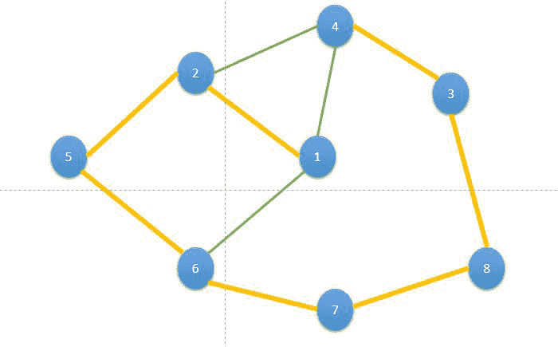
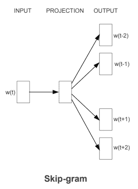
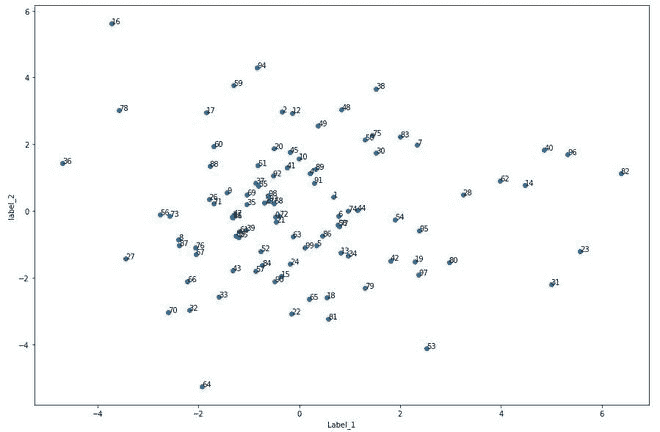

# 深度行走算法

> 原文:[https://www.geeksforgeeks.org/deepwalk-algorithm/](https://www.geeksforgeeks.org/deepwalk-algorithm/)

### 图形数据结构:

在现实世界中，网络只是互联节点的集合。为了表示这种类型的网络，我们需要一个与之类似的数据结构。幸运的是，我们有一个数据结构，那就是图。

该图包含由边(可以表示互连 b/w 节点)连接的顶点(表示网络中的节点)

### 深度行走:

深度行走是为学习网络中顶点的潜在表示而提出的算法。这些潜在表征被用来表示 b/w 两个图的社会表征。 它使用随机路径遍历技术来提供对网络中局部结构的洞察。它通过利用这些随机路径作为序列来实现这一点，然后用它们来训练 Skip-Gram 语言模型。

Skip-Gram 模型用于预测句子中的下一个单词，方法是最大化出现在一个窗口 w 中的单词在句子中的共现概率。对于我们的实现，我们将使用 Word2Vec 实现，它使用余弦距离来计算概率。

Deepwalk 流程分几步运行:

*   随机游走生成器取一个图 G，统一采样一个随机顶点 v <sub>i</sub> 作为随机游走*W<sub>VI</sub>T5】的根。从访问的最后一个顶点的相邻顶点均匀地走一个样本，直到达到最大长度(t)。*
*   Skip-gram 模型在窗口 w 中出现的随机游走中迭代所有可能的搭配。对于每个搭配，我们将每个顶点 *vj* 映射到其当前表示向量*φ(VJ)∈R<sup>d</sup>T5】*
*   给定 *vj* 的表示，我们希望最大化其邻居在行走中的概率(第 3 行)。我们可以使用几种分类器来学习这种后验分布

#### 随机游动

给定一个无向图 *G = (V，E)* ，其中 *n =| V |* 和 *m =| E |，*自然随机游走是一个随机过程，从给定的顶点开始，然后均匀随机地选择它的一个邻居进行访问。

<center>
</center>

*   在上图中，从 1 开始，我们有两个节点 2 和 4。从中，我们选择其中的任何一个，让我们选择 2。
*   现在，从 2 开始，我们有两个选择 4 和 5，我们从它们中随机选择 5。所以我们的随机游走变成了 Node *1 → 2 → 5* 。
*   反复重复上述过程，直到我们覆盖图中的所有节点。这个过程被称为随机漫步。一个这样的随机游走是 1 *→ 2 → 5 → 6 → 7 → 8 → 3 → 4* 。

#### 跳格模型

单词嵌入是一种将单词映射到固定大小的特征向量中的方法，以使单词的处理更加容易。2013 年，谷歌提出了 word2vec，这是一组用于产生单词嵌入的相关模型。在 word2vec 的 skip-gram 架构中，输入是中心词，预测是上下文词。考虑一组单词 W，如果 W(i)是输入(中心单词)，那么 *W(i-2)、W(i-1)、W(i+1)和 W(i+2)* 是上下文单词，如果 *滑动窗口大小* 是 2。

<center>
</center>

以下是 skip-gram 模型的模板架构:

<center>
</center>

#### 优点:

*   Deepwalk 是可伸缩的，因为它可以一次处理整个图形。这使得 deep walk 可以创建大型图的有意义的表示，这些图可能不会在光谱算法上运行。
*   与其他算法相比，Deepwalk 在处理稀疏性时速度更快。
*   深度行走可以用于许多目的，例如异常检测、聚类、链接预测等。

### 履行

*   在这个实现中，我们将使用*网络*和*卡拉特库*应用编程接口。出于我们的目的，我们将使用自聚类图嵌入:脸书数据集。数据集可以从[这里](https://snap.stanford.edu/data/gemsec-Facebook.html)下载

## 蟒蛇 3

```py
# Install karateclub API
! pip install karateclub
# imports

import networkx as nx
import pandas as pd
from sklearn.decomposition import PCA
import matplotlib.pyplot as plt
from karateclub import DeepWalk

# import dataset
df = pd.read_csv("/content/politician_edges.csv")
df.head()

# create Graph
G = nx.from_pandas_edgelist(df, "node_1", "node_2", create_using=nx.Graph())
print(len(G))

# train model and generate embedding
model = DeepWalk(walk_length=100, dimensions=64, window_size=5)
model.fit(G)
embedding = model.get_embedding()

# print Embedding shape
print(embedding.shape)
# take first 100 nodes
nodes =list(range(100))

# plot nodes graph
def plot_nodes(node_no):
    X = embedding[node_no]

    pca = PCA(n_components=2)
    pca_out= pca.fit_transform(X)

    plt.figure(figsize=(15,10))
    plt.scatter(pca_out[:, 0], pca_out[:, 1])
    for i, node in enumerate(node_no):
        plt.annotate(node, (pca_out[i, 0], pca_out[i, 1]))
    plt.xlabel('Label_1')
    plt.ylabel('label_2')
    plt.show()

plot_nodes(nodes)
```

**输出:**

```py
node_1    node_2
0    0    1972
1    0    5111
2    0    138
3    0    3053
4    0    1473
-------------
# length of nodes
5908
-------------
# embedding shape
(5908, 64)
```



节点图

**参考文献:**

*   [**深度行走**](https://arxiv.org/abs/1403.6652)