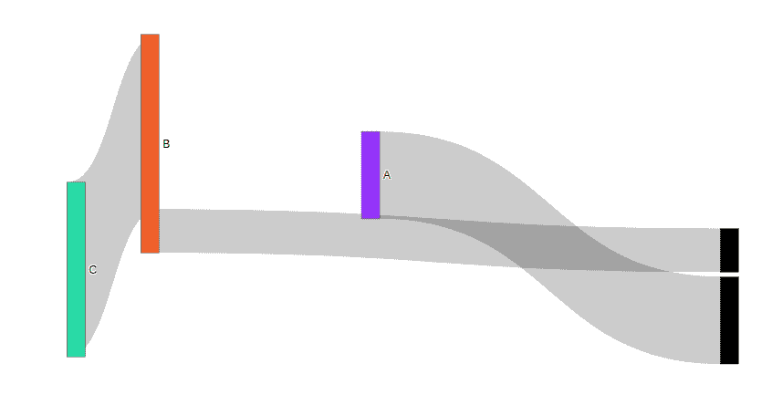
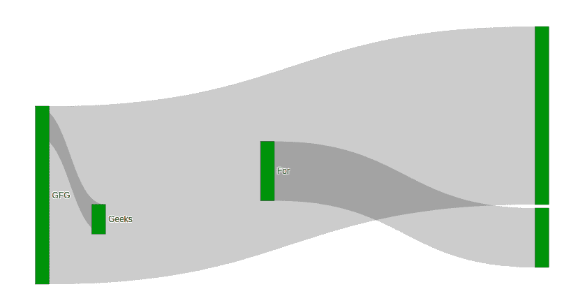

# 在图中定义三键图中的节点位置

> 原文:[https://www . geesforgeks . org/define-node-position-in-sankey-in-plotly 图/](https://www.geeksforgeeks.org/define-node-position-in-sankey-diagram-in-plotly/)

Plotly 是一个 Python 库，用于设计图形，尤其是交互式图形。它可以绘制各种图形和图表，如直方图、条形图、箱线图、展开图等。它主要用于数据分析以及财务分析。plotly 是一个交互式可视化库。

三键图用于通过定义源节点和目标节点来可视化流程。值参数用于设置流量。基本上有用于定义节点位置安排。有–

*   垂直的
*   任意的
*   固定的；不变的

可以通过设置 node.x 和 node.y 值来设置节点位置。让我们看看下面的例子，以便更好地理解。

**例 1:**

## 蟒蛇 3

```
import plotly.graph_objects as go

plot = go.Figure(go.Sankey(
    node = {
        "label": ["A", "B", "C"],
        "x": [0.5, 0.2, 0.1],
        "y": [0.4, 0.3, 0.7],
        'pad':5},
    link = {
        "source": [1, 0, 1],
        "target": [2, 3, 4],
        "value": [4, 2, 1]}))

plot.show()
```

**输出:**



**例 2:**

## 蟒蛇 3

```
import plotly.graph_objects as go

plot = go.Figure(go.Sankey(
    node = {
        "label": ["Geeks", "For", "Geeks", "GFG"],
        "x": [0.5, 0.2, 0.1, 0.9],
        "y": [0.6, 0.8, 0.7],
        "color": "green",
        'pad':5},
    link = {
        "source": [3, 2, 1],
        "target": [5, 3, 7],
        "value": [6, 1, 2]}))

plot.show()
```

**输出:**

