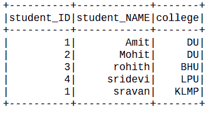
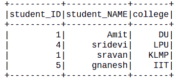
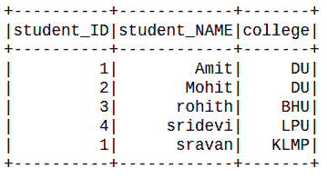

# 基于多个条件删除 PySpark 数据框中的行

> 原文:[https://www . geesforgeks . org/delete-row-in-pyspark-data frame-基于多条件/](https://www.geeksforgeeks.org/delete-rows-in-pyspark-dataframe-based-on-multiple-conditions/)

在本文中，我们将看到如何基于多个条件删除 PySpark dataframe 中的行。

### **方法 1:使用逻辑表达式**

这里我们将使用逻辑表达式来过滤行。Filter()函数用于根据给定的条件或 SQL 表达式过滤 RDD/数据帧中的行。

> **语法:**过滤器(条件)
> 
> **参数:**
> 
> *   **条件:**逻辑条件或 SQL 表达式

**例 1:**

## 蟒蛇 3

```py
# importing module
import pyspark

# importing sparksession from pyspark.sql
# module
from pyspark.sql import SparkSession

# spark library import
import pyspark.sql.functions

# creating sparksession and giving an app name
spark = SparkSession.builder.appName('sparkdf').getOrCreate()

# list  of students  data
data = [["1", "Amit", " DU"],
        ["2", "Mohit", "DU"],
        ["3", "rohith", "BHU"],
        ["4", "sridevi", "LPU"],
        ["1", "sravan", "KLMP"],
        ["5", "gnanesh", "IIT"]]

# specify column names
columns = ['student_ID', 'student_NAME', 'college']

# creating a dataframe from the lists of data
dataframe = spark.createDataFrame(data, columns)

dataframe = dataframe.filter(dataframe.college != "IIT")

dataframe.show()
```

**输出:**



**例 2:**

## 蟒蛇 3

```py
# importing module
import pyspark

# importing sparksession from pyspark.sql
# module
from pyspark.sql import SparkSession

# spark library import
import pyspark.sql.functions

# creating sparksession and giving an app name
spark = SparkSession.builder.appName('sparkdf').getOrCreate()

# list  of students  data
data = [["1", "Amit", " DU"],
        ["2", "Mohit", "DU"],
        ["3", "rohith", "BHU"],
        ["4", "sridevi", "LPU"],
        ["1", "sravan", "KLMP"],
        ["5", "gnanesh", "IIT"]]

# specify column names
columns = ['student_ID', 'student_NAME', 'college']

# creating a dataframe from the lists of data
dataframe = spark.createDataFrame(data, columns)

dataframe = dataframe.filter(
    ((dataframe.college != "DU")
     & (dataframe.student_ID != "3"))
)

dataframe.show()
```

**输出:**



### **方法 2:** 使用 when()方法

它评估一系列条件并返回一个值。因此，传递条件及其要求的值将完成工作。

> **语法:**何时(条件，值)
> 
> **参数:**
> 
> *   **条件:**布尔或列表达式。
> *   **值:**文字值

**示例:**

## 蟒蛇 3

```py
# importing module
import pyspark

# importing sparksession from pyspark.sql 
# module
from pyspark.sql import SparkSession

# spark library import
import pyspark.sql.functions

# spark library import
from pyspark.sql.functions import when

# creating sparksession and giving an app name
spark = SparkSession.builder.appName('sparkdf').getOrCreate()

# list  of students  data
data = [["1", "Amit", " DU"],
        ["2", "Mohit", "DU"],
        ["3", "rohith", "BHU"],
        ["4", "sridevi", "LPU"],
        ["1", "sravan", "KLMP"],
        ["5", "gnanesh", "IIT"]]

# specify column names
columns = ['student_ID', 'student_NAME', 'college']

# creating a dataframe from the lists of data
dataframe = spark.createDataFrame(data, columns)

dataframe.withColumn('New_col',
                     when(dataframe.student_ID != '5', "True")
                     .when(dataframe.student_NAME != 'gnanesh', "True")
                     ).filter("New_col == True").drop("New_col").show()
```

**输出:**

