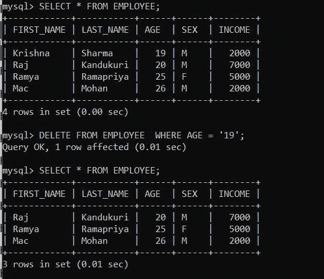
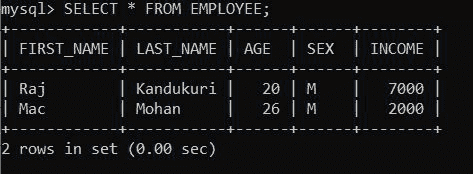
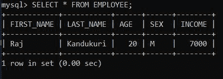

# 使用 Python 从 MySql 的表中删除元素

> 原文:[https://www . geesforgeks . org/deleting-element-from-table-in-MySQL-using-python/](https://www.geeksforgeeks.org/deleting-element-from-table-in-mysql-using-python/)

**先决条件:** [Python: MySQL 创建表](https://www.geeksforgeeks.org/python-mysql-create-table/)

在本文中，我们将看到如何使用 Python 在 MySQL 中获取表的大小。Python 允许广泛的数据库服务器与应用程序的集成。从 Python 访问数据库需要数据库接口。 [**MySQL 连接器**](https://www.geeksforgeeks.org/mysql-connector-python-module-in-python/) -Python 模块是 Python 中的一个 API，用于与 MySQL 数据库进行通信。

**进场:**

*   导入模块。
*   向数据库发出连接请求。
*   为数据库游标创建一个对象。
*   执行以下 MySQL 查询:

```
DELETE FROM TABLE_NAME  WHERE Column Name = 'Value';
```

**例 1:**

在本例中，我们将该数据库表用于以下查询；



**下面是实现:**

## 蟒蛇 3

```
# Establish connection to MySQL database
import mysql.connector

mydb = mysql.connector.connect(
  host="localhost",
  user="root",
  password="root123",
  database = "geeks"
  )
mycursor = mydb.cursor()

query = " DELETE FROM EMPLOYEE  WHERE INCOME = '5000';"
mycursor.execute(query)
mydb.commit()

print(mycursor.rowcount, "record(s) deleted")
mydb.close()
```

**输出:**

```
1 record(s) deleted
```

删除元素后，我们的表如下所示:



**例 2:**

在本例中，我们将删除具有不同列名的同一表:

## 蟒蛇 3

```
# Establish connection to MySQL database
import mysql.connector

mydb = mysql.connector.connect(
  host="localhost",
  user="root",
  password="root123",
  database = "geeks"
  )
mycursor = mydb.cursor()

query = " DELETE FROM EMPLOYEE  WHERE LAST_NAME = 'Mohan';"
mycursor.execute(query)
mydb.commit()

print(mycursor.rowcount, "record(s) deleted")
mydb.close()
```

**输出:**

```
1 record(s) deleted
```

删除元素后，我们的表如下所示:

