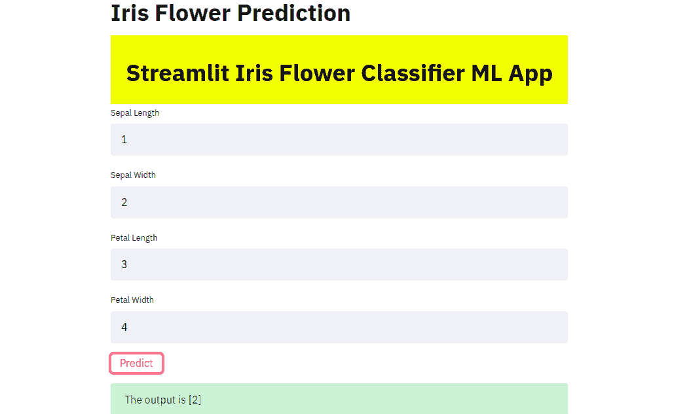

# 使用流线库

部署机器学习模型

> 原文:[https://www . geesforgeks . org/deploy-a-machine-learning-model-use-streamlit-library/](https://www.geeksforgeeks.org/deploy-a-machine-learning-model-using-streamlit-library/)

**机器学习:**
计算机能够从经验中学习，而无需明确编程。机器学习是目前最热门的领域之一，世界各地的顶尖公司都在使用它来改进他们的服务和产品。但是没有使用在你的 Jupyter 笔记本中训练的机器学习模型。因此，我们需要部署这些模型，以便每个人都可以使用它们。在本文中，我们将首先训练一个 Iris Species 分类器，然后使用 Streamlit 部署模型，Streamlit 是一个开源应用程序框架，用于轻松部署 ML 模型。

**细流库:**
细流可以让你使用简单的 python 脚本为机器学习项目创建应用程序。它还支持热重装，这样你的应用程序可以在你编辑和保存文件时实时更新。一个应用程序只能用几行代码构建(正如我们将在下面看到的)，使用 Streamlit API。添加小部件与声明变量相同。不需要编写后端，定义不同的路由或处理 HTTP 请求。它易于部署和管理。更多信息可在他们的网站上找到–[https://www.streamlit.io/](https://www.streamlit.io/)

所以首先我们要训练我们的模型。我们不会做太多的预处理，因为本文的主要目的不是制作一个精确的 ML 模型，而是展示它的部署。

首先，我们需要安装以下–

> pip 安装熊猫
> pip 安装 numpy
> pip 安装 sklearn
> pip 安装流线

数据集可以在这里找到:[https://www.kaggle.com/uciml/iris](https://www.kaggle.com/uciml/iris)

**代码:**

```
import pandas as pd
import numpy as np

df = pd.read_csv('BankNote_Authentication.csv')
df.head()
```

**输出:**

现在我们先去掉 Id 列，因为它对鸢尾的种类分类并不重要。然后我们将数据集分割成训练和测试数据集，并将使用随机森林分类器。您可以使用您选择的任何其他分类器，例如逻辑回归、支持向量机等。

**代码:**

```
# Dropping the Id column
df.drop('Id', axis = 1, inplace = True)

# Renaming the target column into numbers to aid training of the model
df['Species']= df['Species'].map({'Iris-setosa':0, 'Iris-versicolor':1, 'Iris-virginica':2})

# splitting the data into the columns which need to be trained(X) and the target column(y)
X = df.iloc[:, :-1]
y = df.iloc[:, -1]

# splitting data into training and testing data with 30 % of data as testing data respectively
from sklearn.model_selection import train_test_split
X_train, X_test, y_train, y_test = train_test_split(X, y, test_size = 0.3, random_state = 0)

# importing the random forest classifier model and training it on the dataset
from sklearn.ensemble import RandomForestClassifier
classifier = RandomForestClassifier()
classifier.fit(X_train, y_train)

# predicting on the test dataset
y_pred = classifier.predict(X_test)

# finding out the accuracy
from sklearn.metrics import accuracy_score
score = accuracy_score(y_test, y_pred)
```

我们得到了 95.55%的准确率，这是相当不错的。

现在，为了使用这个模型来预测其他未知数据，我们需要保存它。我们可以通过使用 pickle 来保存它，pickle 用于序列化和反序列化 Python 对象结构。

**代码:**

```
# pickling the model
import pickle
pickle_out = open("classifier.pkl", "wb")
pickle.dump(classifier, pickle_out)
pickle_out.close()
```

在同一目录中将创建一个名为“classifier.pkl”的新文件。现在，我们可以开始使用细流来部署模型–

将下面的代码粘贴到另一个 python 文件中。
**代号:**

```
import pandas as pd
import numpy as np
import pickle
import streamlit as st
from PIL import Image

# loading in the model to predict on the data
pickle_in = open('classifier.pkl', 'rb')
classifier = pickle.load(pickle_in)

def welcome():
    return 'welcome all'

# defining the function which will make the prediction using 
# the data which the user inputs
def prediction(sepal_length, sepal_width, petal_length, petal_width):  

    prediction = classifier.predict(
        [[sepal_length, sepal_width, petal_length, petal_width]])
    print(prediction)
    return prediction

# this is the main function in which we define our webpage 
def main():
      # giving the webpage a title
    st.title("Iris Flower Prediction")

    # here we define some of the front end elements of the web page like 
    # the font and background color, the padding and the text to be displayed
    html_temp = """
    <div style ="background-color:yellow;padding:13px">
    <h1 style ="color:black;text-align:center;">Streamlit Iris Flower Classifier ML App </h1>
    </div>
    """

    # this line allows us to display the front end aspects we have 
    # defined in the above code
    st.markdown(html_temp, unsafe_allow_html = True)

    # the following lines create text boxes in which the user can enter 
    # the data required to make the prediction
    sepal_length = st.text_input("Sepal Length", "Type Here")
    sepal_width = st.text_input("Sepal Width", "Type Here")
    petal_length = st.text_input("Petal Length", "Type Here")
    petal_width = st.text_input("Petal Width", "Type Here")
    result =""

    # the below line ensures that when the button called 'Predict' is clicked, 
    # the prediction function defined above is called to make the prediction 
    # and store it in the variable result
    if st.button("Predict"):
        result = prediction(sepal_length, sepal_width, petal_length, petal_width)
    st.success('The output is {}'.format(result))

if __name__=='__main__':
    main()
```

您可以通过在终端中键入以下命令来运行它–

> 简化运行 app.py


app.py 是我们编写 Streamlit 代码的文件的名称。

该网站将在您的浏览器中打开，然后您可以测试它。该方法也可用于部署其他机器和深度学习模型。