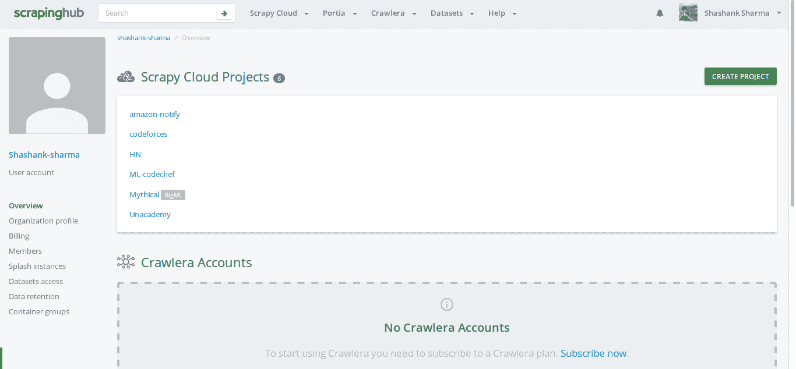
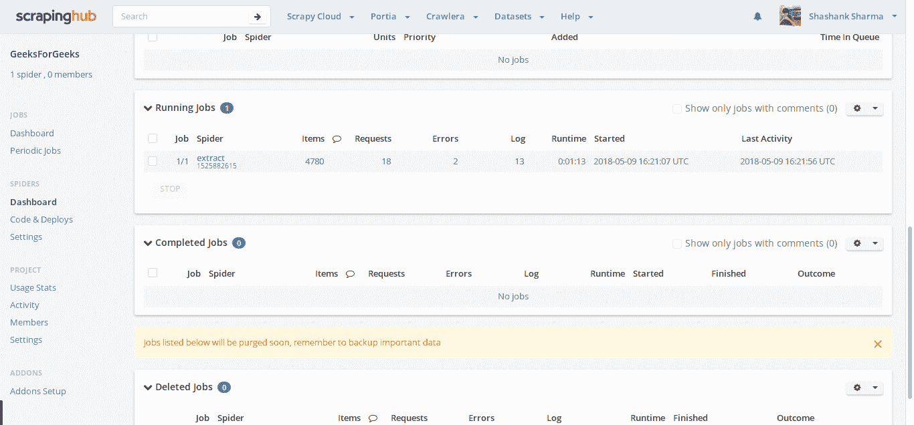
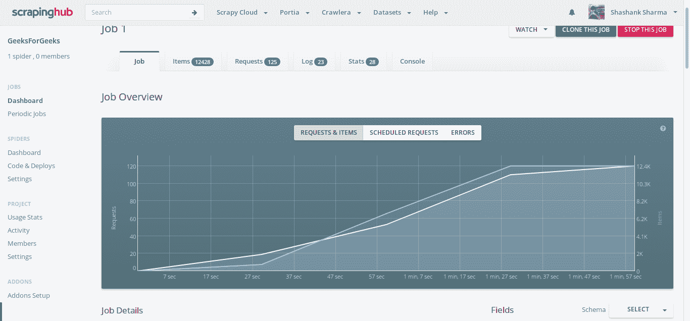
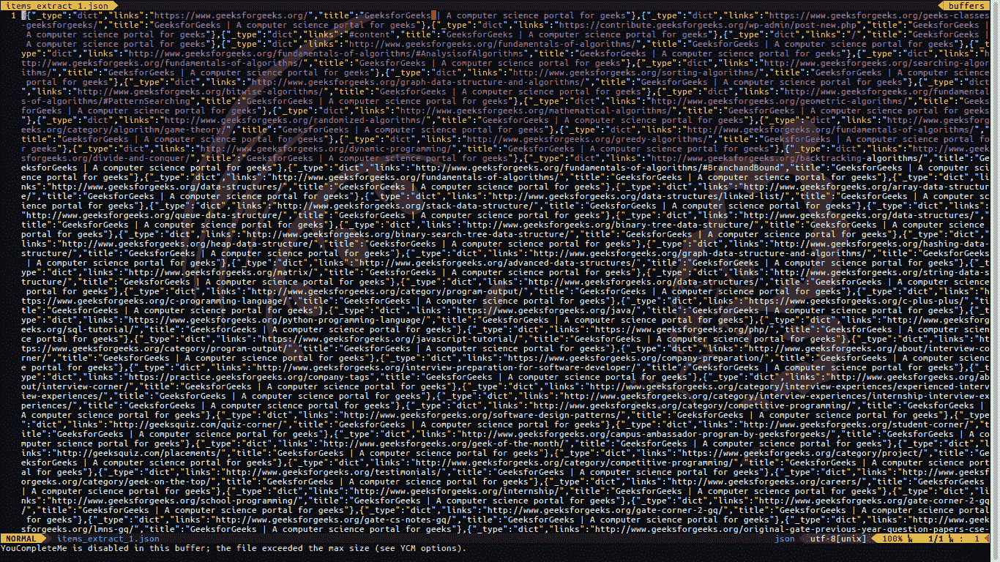

# 在刺痒布上部署刺痒蜘蛛

> 原文:[https://www . geeksforgeeks . org/deployment-scrapy-spider-scraping ub/](https://www.geeksforgeeks.org/deploying-scrapy-spider-scrapinghub/)

**什么是剪贴簿？**

Scrapy 是一个用于网络爬行的开源框架。这个框架是用 python 编写的，最初是为网页抓取而设计的。网页抓取也可以使用 API 提取数据。ScrapingHub 提供了从网页抓取数据的整个服务，即使是复杂的网页。

**为什么是刺儿头？**

假设一个网站给出一个输入字段，作为回报，它会根据搜索查询得到一个响应。动机是通过输入和获得响应来获得所有数据。现在这个输入字段可以有从“0000”字符串到“9999”字符串的数字，所以简而言之，需要给出 10000 个输入，这样就可以从网站获得所有结果。现在，对于每个请求，比如说“0000”，将需要 4-5 分钟，作为响应，您将获得 1000 多个字段的数据。它可能会有所不同，因为最终，网站会返回所有以“0000”结尾的数据，而对于网站来说，查询和返回这些数据需要时间。所以如果我们做一些小的数学运算，那么，10000 * 5 = 50000 分钟，这意味着大约 35 天。

因此，对于初学者来说，可以使用 Python 2.7 的 mechanize 模块进行查询，但最终需要 35 天的时间来不间断地运行 PC/笔记本电脑来完成这项工作。另一种解决方案是可以使用多线程和多处理来避免这种情况，但是以有组织的方式保存数据并克服这种复杂性将花费大量时间。但是使用 **Scrapy** 会节省大量的时间。尽管如此，我们仍然需要运行这个脚本至少 1-3 天，因为我们谈论的是抓取数百万的数据。所以要克服这个问题，最好的选择就是借助**的刺儿头**。

ScrapingHub 提供了在云上部署和执行 Scrapy spider 的功能。作为回报，它将运行我们的蜘蛛 24 小时(免费用户)或 7 天(付费)，这是值得做的。这就是为什么人们可以使用 ScrapingHub 来节省时间和成本。

#### 如何做到这一点:

**步骤 1:在本地机器中创建蜘蛛**

在[之前的文章](https://www.geeksforgeeks.org/implementing-web-scraping-python-scrapy/)中，我们创建了一个简单的蜘蛛来抓取网页，并获取该网站上存在的所有网址。同样，只需添加一个额外的功能，通过在脚本中维护 set 并在添加之前进行交叉检查，可以避免重复的 url。

```py
# importing scrapy module
import scrapy

class ExtractUrls(scrapy.Spider):

    # Name of the spider
    crawled = set()

    # Set to avoiding duplicate url
    name = "extract"

    def start_requests(self):

        # Starting url mentioned
        urls = ['https://www.geeksforgeeks.org', ]
        for url in urls:
            yield scrapy.Request(url = url,
                     callback = self.parse)

    def parse(self, response):
        title = response.css('title::text').extract_first()
        links = response.css('a::attr(href)').extract()
        for link in links:
            yield
        {
            'title': title,
            'links': link
        }

        if ('geeksforgeeks' in link and
               link not in self.crawled):
            self.crawled.update(link)
            yield scrapy.Request(url = link,
                      callback = self.parse)
```

```py
scrapy crawl extract -o links.json

```

运行这个蜘蛛后，应该可以成功刮除并保存在 links.json 里面，但是我们需要节省时间，希望至少运行 24 小时。所以我们将把这只蜘蛛部署在剪贴簿上。

**第二步:在剪贴簿**创建账号

转到 [ScrapingHub 登录页面](https://app.scrapinghub.com/account/login/)使用谷歌或 Github 登录。它将重定向到仪表板。



现在点击创建项目并提及项目名称。点击 Scrapy 按钮，因为我们的蜘蛛是用 Scrapy 框架构建的。

单击后，您将被重定向到项目仪表板，并将看到两个部署选项。
1。使用命令行界面
2 进行部署。使用 Github 部署

用 CLIm 做，因为它更受欢迎。所以让我们切换回本地项目配置一些设置。

**第三步:配置**

*   首先安装 shub CLI，这有助于部署代码。

    ```py
    pip install shub
    ```

    *   现在安装好之后，需要做登录并提到 app 键；这样 ScrapingHub 就会知道您正在进行哪个项目，以及在哪里部署。

    ```py
    shub login
    ```

    *   登录并写入应用程序密钥后，用户将登录。现在下一步就是使用:

    ```py
    shub deploy ID
    ```

    简单地部署它*   Id will be mentioned in code and deploy section which is 6 digits long. After entering, user should get output something like this :
    

    在蜘蛛仪表盘部分，用户可以看到准备好的蜘蛛。只需点击蜘蛛名称和运行按钮。免费用户将获得 1 个单位的免费，即用户最多可以运行一个蜘蛛 24 小时。之后，它会自动停止。用户可以购买该单元以延长时间周期。
    

    通过点击运行作业部分下的项目，它将被重定向到另一个页面，该页面将显示当时被刮擦的所有项目。作业部分将显示图形；显示蜘蛛的统计数据。在运行蜘蛛 5-6 个小时后，这个图表是一个完美的可视化。

    

    要获取本地计算机中的数据，请转到后面的项目部分，在右上角，单击导出按钮。它将显示各种格式，如–CSV、JSON、JSON 行、XML。值得注意的是，这个功能真的很有帮助，真的节省了很多时间。

    

    使用 ScrapingHub，只需部署蜘蛛并以首选格式下载，就可以在几天内刮取大约数百万个数据。

    **注意:**抓取任何网页都不是合法活动。未经允许，不要进行任何刮削操作。