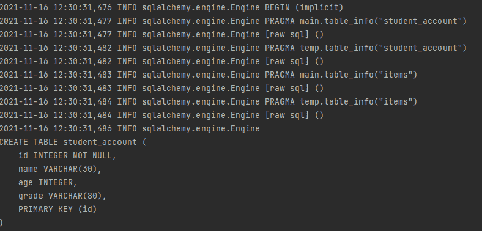
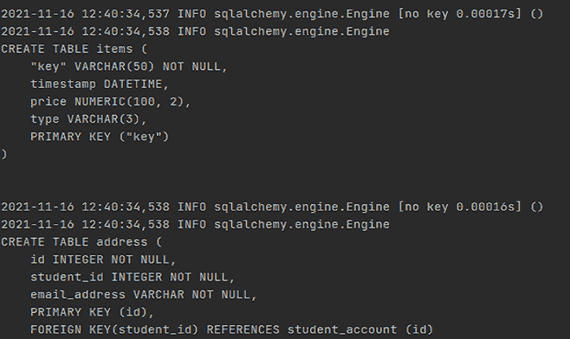
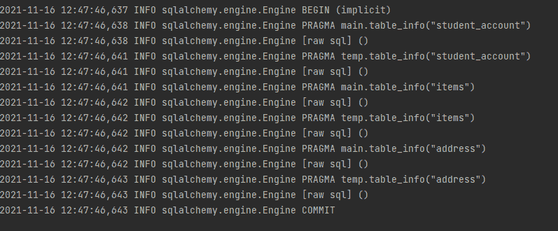
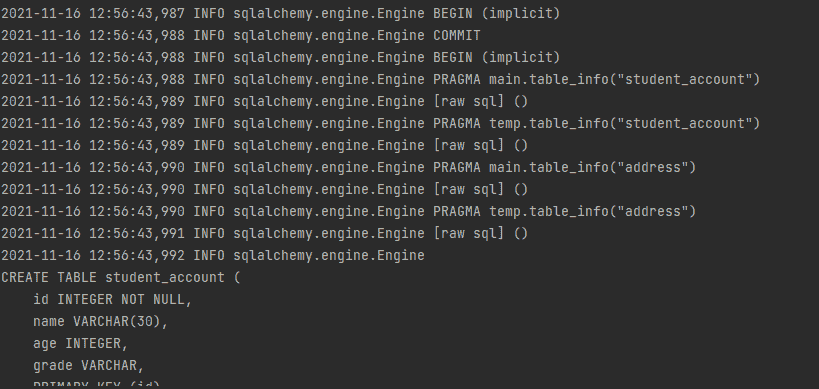
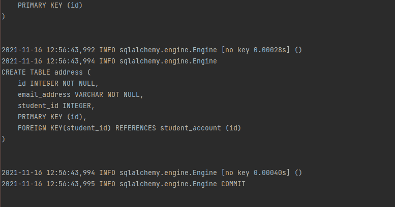
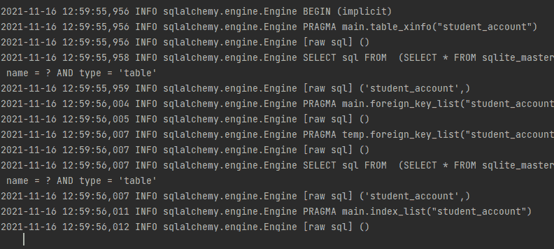

# 用元数据描述数据库–SQLAlchemy

> 原文:[https://www . geesforgeks . org/description-databases-with-metadata-sqlalchemy/](https://www.geeksforgeeks.org/describing-databases-with-metadata-sqlalchemy/)

在本文中，我们将看到如何使用 Python 中的 SQLAlchemy 来描述带有元数据的数据库。

数据库元数据用 Python 数据结构来描述数据库的结构。数据库通常由表和列组成。数据库元数据为我们生成 SQL 查询和对象关系映射提供服务。它帮助我们生成一个模式。数据库元数据最基本的对象是元数据、表和列。

## 用元数据描述数据库:SQLAlchemy 核心

### 使用表对象设置元数据:

关系数据库中的查询通常是在数据库的表上创建的。这些表在名为**表的 Python SQLAlchemy 中表示为 Table 对象。****元数据**是一个对象，它由以字符串名称为键的表对象组成。创建元数据对象的语法如下:

```py
from sqlalchemy import MetaData
metadata_obj=MetaData()
```

对于整个应用程序来说，一个 MetaData 对象就足够了。一旦创建了元数据对象，我们就可以声明表对象。让我们看一个为学生帐户创建一个表的例子，该表由列组成-姓名、年龄和年级，我们还添加一个 id 作为主键。

现在，我们使用 MetaData 对象将上面的表转换为 Schema。

## 蟒蛇 3

```py
from sqlalchemy import MetaData
from sqlalchemy import Integer, String, Column, Table

metadata_object=MetaData()

student_table = Table(
     "student_account",
     metadata_object,
     Column('id', Integer, primary_key=True),
     Column('name', String(30)),
     Column('age',Integer),
     Column('grade', String(80))
)
```

在上面的代码中，一个表代表一个数据库表，它将自己分配给 MetaData 对象

列表示将自身分配给表对象的表的列。该列通常包含一个字符串名称和一个类型对象，如整数、字符串等。

### 创建具有不同数据类型的表

## 蟒蛇 3

```py
from sqlalchemy import create_engine
from sqlalchemy import DateTime, Numeric, Enum

item_detail = Table(
    "items",
    metadata_object,
    Column("key", String(50), primary_key=True),
    Column("timestamp", DateTime),
    Column("price", Numeric(100, 2)),
    Column("type", Enum("dry", "wet")),
)

# creating an engine object
engine = create_engine("sqlite+pysqlite:///:memory:",
                       echo=True, future=True)

# emitting DDL
metadata_object.create_all(engine)
```

## 访问表和列

表的列通常存储在关联数组中，即 **Table.c** ，可以使用“c”进行访问，如下例所示。

**获取表名:**

## 蟒蛇 3

```py
student_table.name
```

**输出:**

```py
'student_account'
```

**使用运算符 c 访问列:**

## 蟒蛇 3

```py
student_table.c.name
```

**输出:**

> 列('名称'，字符串(长度=30)，表= <student_account>)</student_account>

**访问列名(名称):**

## 蟒蛇 3

```py
student_table.c.name.name
```

**输出:**

```py
name
```

**访问列类型:**

## 蟒蛇 3

```py
student_table.c.name.type
```

**输出:**

```py
String(length=30)
```

**获取表的主键:**

## 蟒蛇 3

```py
student_table.primary_key
```

**输出:**

> PrimaryKeyConstraint(列(' id '，Integer()，表= <student_account>，primary_key=True，可空=False))</student_account>

## 使用 MetaData 对象访问表和键

元数据对象可用于访问存储在元数据对象中的所有表，如下例所示:

**访问元数据中的表:**

## 蟒蛇 3

```py
metadata_object.tables
```

**输出:**

> FacadeDict({ ' student _ account ':Table(' student _ account ')、MetaData()、Column('id '、Integer()、table= <student_account>、primary_key=True、可空=False)、Column('name '、String(长度=30)、table= <student_account>)、Column('age '、Integer()、table= <student_account>)、Column('grade '、String(长度=80)、table= <student_account>)、schema=None)、' items': Table('items '、MetaData()、Column('key '、String(长度=50)、Table</student_account></student_account></student_account></student_account>

**表的访问键:**

## 蟒蛇 3

```py
metadata_object.tables.keys()
```

**输出:**

```py
dict_keys(['student_account', 'items'])
```

## 声明约束

如您所见，我们已经在 student_table 中将第一列声明为主键。运行以下命令将显示主键约束的详细信息。

## 蟒蛇 3

```py
student_table.primary_key
```

**输出:**

> PrimaryKeyConstraint(列(' id '，Integer()，表= <student_account>，primary_key=True，可空=False))</student_account>

主键约束通常隐式声明，而外键约束显式声明。如果两个表通过使用对象 foreign key 相互关联，我们就使用外键约束。

让我们创建一个名为 address_table 的新表，它由学生的电子邮件地址组成，我们将有一个引用学生表的外键约束。

## 蟒蛇 3

```py
from sqlalchemy import ForeignKey

address_table = Table(
     "address",
     metadata_object,
     Column('id', Integer, primary_key=True),
     Column('student_id', ForeignKey('student_account.id'), nullable=False),
     Column('email_address', String, nullable=False)
 )
```

## 创建和删除表

### 创建表格:

到目前为止，我们已经创建了两个带有一组列和约束的表。下一件事是我们必须向 SQLite 数据库发出 DDL(在本例中)，这样我们就可以用表进行查询。这可以按如下所示进行:

## 蟒蛇 3

```py
from sqlalchemy import create_engine

# creating an engine object
engine = create_engine("sqlite+pysqlite:///:memory:",
                       echo=True, future=True)
# emitting DDL
metadata_object.create_all(engine)
```

**输出:**

 

### 删除表格

**drop_all()** 方法用于删除元数据对象中的所有表。

## 计算机编程语言

```py
from sqlalchemy import create_engine

# creating an engine object
engine = create_engine("sqlite+pysqlite:///:memory:",
                       echo=True, future=True)

# emitting DDL
metadata_object.drop_all(engine)
```

**输出:**



## 用元数据描述数据库:SQLAlchemy ORM

我们将学习如何创建与我们使用 Core 和 ORM 创建的表相同的表。ORM 由映射的类组成。映射类的声明方式与任何 Python 类的创建方式相同，我们将映射类的属性链接到表的列。

在 ORM 中，MetaData 对象与名为 Registry 的 ORM Only 对象相结合。我们构建如下所示的注册表:

## 蟒蛇 3

```py
from sqlalchemy.orm import registry

mapper_registry = registry()
mapper_registry.metadata
```

**输出:**

```py
MetaData()
```

在 ORM 中，我们不是直接声明 Table 对象，而是通过使用映射类间接声明它们。映射的类从称为声明性基的基目录派生而来。可以使用 registry.generate_base()方法使用注册表创建声明性基。

## 蟒蛇 3

```py
Base = mapper_registry.generate_base()
```

这个基类作为我们声明的 ORM 映射类的基类。学生帐户和地址这两个表可以使用 ORM 创建，如下所示。

## 蟒蛇 3

```py
from sqlalchemy.orm import relationship

class Student(Base):
    __tablename__ = 'student_account'
    id = Column(Integer, primary_key=True)
    name = Column(String(30))
    age = Column(Integer)
    grade = Column(String)

    addresses = relationship("Address", back_populates="student")

    def __repr__(self):
        return f"Student(id={self.id!r}, name={self.name!r},\
        age={self.age!r},grade={self.grade!r})"

class Address(Base):
    __tablename__ = 'address'
    id = Column(Integer, primary_key=True)
    email_address = Column(String, nullable=False)
    student_id = Column(Integer, ForeignKey('student_account.id'))

    student = relationship("Student", back_populates="addresses")

    def __repr__(self):
        return f"Address(id={self.id!r}, email_address={self.email_address!r})"
```

那个。__table__ 属性用于查看从声明性映射类创建的 table 对象，如下所示:

## 蟒蛇 3

```py
Student.__table__
```

**输出:**

```py
Table('student_account', MetaData(), Column('id', Integer(),
 table=<student_account>, primary_key=True, nullable=False),
 Column('name', String(length=30), table=<student_account>),
 Column('age', Integer(), table=<student_account>),
 Column('grade', String(), table=<student_account>), schema=None)
```

## 蟒蛇 3

```py
Address.__table__
```

**输出:**

```py
Table('address', MetaData(), Column('id', Integer(),
 table=<address>, primary_key=True, nullable=False),
  Column('email_address', String(), table=<address>,
   nullable=False), Column('student_id', Integer(), 
   ForeignKey('student_account.id'), table=<address>), schema=None)
```

### 发出 DDL:

在 ORM 中，为了发出 DDL，我们使用与我们的注册表和 ORM 声明性基类相关联的 MetaData 对象。

## 蟒蛇 3

```py
mapper_registry.metadata.create_all(engine)

Base.metadata.create_all(engine)
```

**输出:**

 

## 表反射

“反射”是指基于从现有表中读取来加载表对象。例如，我们将创建一个新的 Table 对象，它代表我们在本文前面部分手动创建的 student_account 对象，如下所示。

## 蟒蛇 3

```py
metadata2=MetaData()
with engine.connect() as conn:
    student_reflected=Table("student_account",
                            metadata2,
                            autoload_with=conn)
```

**输出:**



您现在可以访问我们刚刚创建的反射表的列，如下所示:

## 蟒蛇 3

```py
print(student_reflected.c)
print(student_reflected.primary_key)
```

**输出:**

> immigrateecolumncollection(student _ account . id，student_account.name，student_account.age，student_account.grade)
> 
> PrimaryKeyConstraint(列(' id '，INTEGER()，表= <student_account>，primary_key=True，可空=False))</student_account>