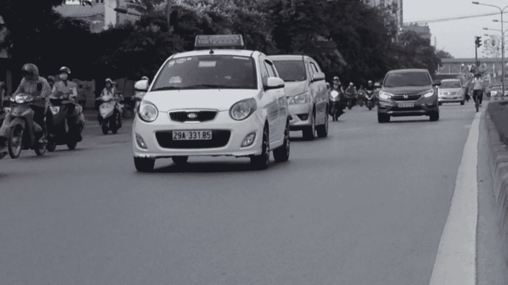
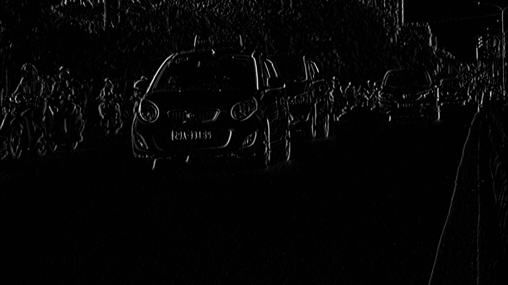
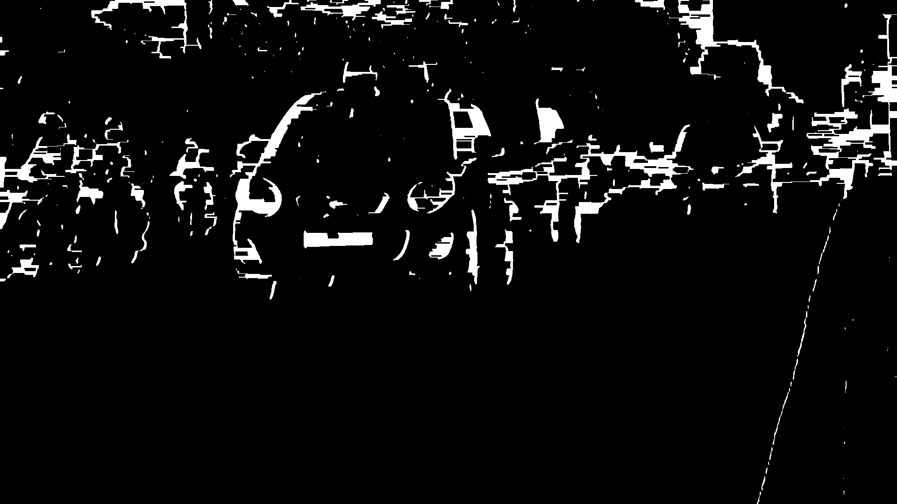
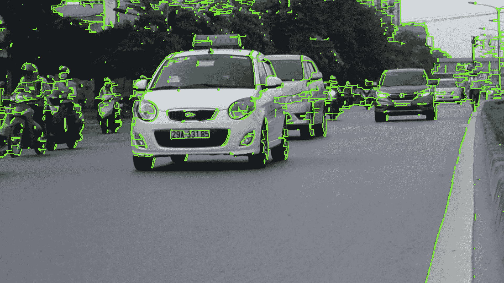

# 从视频中实时检测识别汽车牌照

> 原文:[https://www . geeksforgeeks . org/实时视频检测和识别汽车牌照/](https://www.geeksforgeeks.org/detect-and-recognize-car-license-plate-from-a-video-in-real-time/)

对于基于摄像头监控的安全系统来说，车牌识别是一项非常重要的任务。我们可以使用一些计算机视觉技术从图像中提取车牌，然后我们可以使用光学字符识别来识别车牌号码。在这里，我将指导您完成这项任务的整个过程。
**要求:**

> opencv-python 3 . 4 . 2
> num py 1 . 17 . 2
> skimage 0 . 16 . 2
> tensorlow 1 . 15 . 0
> 免疫样式 0.5.3

**例:**

> **输入:**
> 
> 
> 
> **输出:**T2【29a 33185】T3
> 
> 

**进场:**

*   找到图像中的所有轮廓。
*   找到每个轮廓的边框。
*   用一个平均车牌比较和验证每个边框的边长比和面积。
*   在经过验证的轮廓内的图像中应用图像分割以找到其中的字符。
*   使用光学字符识别识别字符。

**方法论:**

**1** 。为了减少噪声，我们需要用[高斯模糊](https://docs.opencv.org/master/d4/d13/tutorial_py_filtering.html)模糊输入图像，然后将其转换为灰度。


**2** 。查找图像中的垂直边缘。



**3。**为了显示车牌，我们必须对图像进行二值化。为此，在垂直边缘图像上应用大津阈值法。在其他阈值方法中，我们必须选择一个阈值来对图像进行二值化，但是大津阈值会自动确定该值。


**4** 。对阈值图像应用闭合形态变换。闭合对于填充阈值图像中白色区域之间的黑色小区域很有用。它揭示了车牌的矩形白盒。



**5。**为了检测板，我们需要在图像中找到轮廓。重要的是在找到轮廓之前对图像进行二值化和变形，以便它可以在图像中找到更相关和更少数量的轮廓。如果你在原始图像上画出所有提取的轮廓，它会看起来像这样:



**6。**现在找到每个轮廓包围的[最小面积矩形](https://docs.opencv.org/2.4/modules/imgproc/doc/structural_analysis_and_shape_descriptors.html?highlight=minarearect#minarearect)，并验证它们的边比和面积。我们已经将板的最小和最大面积分别定义为 4500 和 30000。

**7。**现在找到验证区域中的轮廓，并验证该区域中最大轮廓的边框的边长比和面积。验证后，你会得到一个完美的车牌轮廓。现在从原始图像中提取轮廓。你会得到盘子的图像:


*   **代码:**此步骤由**清洁 _ 板**和**比率检查**类**检板仪**方法执行。

## 蟒蛇 3

```py
def clean_plate(self, plate):

    gray = cv2.cvtColor(plate, cv2.COLOR_BGR2GRAY)
    thresh = cv2.adaptiveThreshold(gray, 255,
                                   cv2.ADAPTIVE_THRESH_GAUSSIAN_C,
                                   cv2.THRESH_BINARY, 11, 2)

    _, contours, _ = cv2.findContours(thresh.copy(),
                                      cv2.RETR_EXTERNAL,
                                      cv2.CHAIN_APPROX_NONE)

    if contours:

        areas = [cv2.contourArea(c) for c in contours]

        # index of the largest contour in the
        # areas array
        max_index = np.argmax(areas) 

        max_cnt = contours[max_index]
        max_cntArea = areas[max_index]
        x, y, w, h = cv2.boundingRect(max_cnt)

        if not self.ratioCheck(max_cntArea,
                               plate.shape[1],
                               plate.shape[0]):
            return plate, False, None

        return plate, True, [x, y, w, h]

    else:
        return plate, False, None

def ratioCheck(self, area, width, height):

    min = self.min_area
    max = self.max_area

    ratioMin = 3
    ratioMax = 6

    ratio = float(width) / float(height)

    if ratio < 1:
        ratio = 1 / ratio

    if (area < min or area > max) or (ratio < ratioMin or ratio > ratioMax):
        return False

    return True
```

**8。**为了准确识别车牌上的字符，必须进行图像分割。因为第一步是从车牌图像 HSV 格式中提取价值通道。看起来。

**9。**现在对车牌的值通道图像应用自适应阈值处理，对其进行二值化并显示字符。板的图像在不同的区域可以具有不同的闪电条件，在这种情况下，自适应阈值化可以更适合于二值化，因为它基于其周围区域中的像素的亮度对不同的区域使用不同的阈值。

**10。**二值化后对图像进行按位非运算，找到图像中的连通分量，从而提取候选字符。

**11 时。**构造一个遮罩来显示所有的角色组件，然后在遮罩中找到轮廓。提取轮廓后，取最大的一个，找到它的边界矩形，并验证边比。

**12 时。**验证侧比后，找到轮廓的凸包，并将其绘制在字符候选掩码上。面具看起来像-

**13。**现在找到字符候选遮罩中的所有轮廓，并从板的值阈值图像中提取这些轮廓区域，您将分别获得所有字符。


步骤 **8** 到 **13** 由 **segment_chars** 函数执行，您可以在下面的完整源代码中找到该函数。步骤 6 至 13 中使用的功能的驱动程序代码写在类 **PlateFinder** 的方法 **check_plate** 中。

现在使用光学字符识别来逐个识别字符。

**完整源代码及其工作方式:**首先，创建一个 **PlateFinder** 类，用于查找车牌并验证其大小比例和面积。

## 蟒蛇 3

```py
import cv2
import numpy as np
from skimage.filters import threshold_local
import tensorflow as tf
from skimage import measure
import imutils

def sort_cont(character_contours):
    """
    To sort contours
    """
    i = 0
    boundingBoxes = [cv2.boundingRect(c) for c in character_contours]

    (character_contours, boundingBoxes) = zip(*sorted(zip(character_contours,
                                                          boundingBoxes),
                                                      key = lambda b: b[1][i],
                                                      reverse = False))

    return character_contours

def segment_chars(plate_img, fixed_width):

    """
    extract Value channel from the HSV format
    of image and apply adaptive thresholding
    to reveal the characters on the license plate
    """
    V = cv2.split(cv2.cvtColor(plate_img, cv2.COLOR_BGR2HSV))[2]

    thresh = cv2.adaptiveThreshold(value, 255,
                                   cv2.ADAPTIVE_THRESH_GAUSSIAN_C,
                                   cv2.THRESH_BINARY,
                                   11, 2)

    thresh = cv2.bitwise_not(thresh)

    # resize the license plate region to
    # a canoncial size
    plate_img = imutils.resize(plate_img, width = fixed_width)
    thresh = imutils.resize(thresh, width = fixed_width)
    bgr_thresh = cv2.cvtColor(thresh, cv2.COLOR_GRAY2BGR)

    # perform a connected components analysis
    # and initialize the mask to store the locations
    # of the character candidates
    labels = measure.label(thresh, neighbors = 8, background = 0)

    charCandidates = np.zeros(thresh.shape, dtype ='uint8')

    # loop over the unique components
    characters = []
    for label in np.unique(labels):

        # if this is the background label, ignore it
        if label == 0:
            continue
        # otherwise, construct the label mask to display
        # only connected components for the current label,
        # then find contours in the label mask
        labelMask = np.zeros(thresh.shape, dtype ='uint8')
        labelMask[labels == label] = 255

        cnts = cv2.findContours(labelMask,
                     cv2.RETR_EXTERNAL,
                     cv2.CHAIN_APPROX_SIMPLE)

        cnts = cnts[0] if imutils.is_cv2() else cnts[1]

        # ensure at least one contour was found in the mask
        if len(cnts) > 0:

            # grab the largest contour which corresponds
            # to the component in the mask, then grab the
            # bounding box for the contour
            c = max(cnts, key = cv2.contourArea)
            (boxX, boxY, boxW, boxH) = cv2.boundingRect(c)

            # compute the aspect ratio, solodity, and
            # height ration for the component
            aspectRatio = boxW / float(boxH)
            solidity = cv2.contourArea(c) / float(boxW * boxH)
            heightRatio = boxH / float(plate_img.shape[0])

            # determine if the aspect ratio, solidity,
            # and height of the contour pass the rules
            # tests
            keepAspectRatio = aspectRatio < 1.0
            keepSolidity = solidity > 0.15
            keepHeight = heightRatio > 0.5 and heightRatio < 0.95

            # check to see if the component passes
            # all the tests
            if keepAspectRatio and keepSolidity and keepHeight and boxW > 14:

                # compute the convex hull of the contour
                # and draw it on the character candidates
                # mask
                hull = cv2.convexHull(c)

                cv2.drawContours(charCandidates, [hull], -1, 255, -1)

    _, contours, hier = cv2.findContours(charCandidates,
                                         cv2.RETR_EXTERNAL,
                                         cv2.CHAIN_APPROX_SIMPLE)

    if contours:
        contours = sort_cont(contours)

        # value to be added to each dimension
        # of the character
        addPixel = 4 
        for c in contours:
            (x, y, w, h) = cv2.boundingRect(c)
            if y > addPixel:
                y = y - addPixel
            else:
                y = 0
            if x > addPixel:
                x = x - addPixel
            else:
                x = 0
            temp = bgr_thresh[y:y + h + (addPixel * 2),
                              x:x + w + (addPixel * 2)]

            characters.append(temp)

        return characters

    else:
        return None

class PlateFinder:
    def __init__(self):

        # minimum area of the plate
        self.min_area = 4500 

        # maximum area of the plate
        self.max_area = 30000 

        self.element_structure = cv2.getStructuringElement(
                              shape = cv2.MORPH_RECT, ksize =(22, 3))

    def preprocess(self, input_img):

        imgBlurred = cv2.GaussianBlur(input_img, (7, 7), 0)

        # convert to gray
        gray = cv2.cvtColor(imgBlurred, cv2.COLOR_BGR2GRAY)

        # sobelX to get the vertical edges
        sobelx = cv2.Sobel(gray, cv2.CV_8U, 1, 0, ksize = 3) 

        # otsu's thresholding
        ret2, threshold_img = cv2.threshold(sobelx, 0, 255,
                         cv2.THRESH_BINARY + cv2.THRESH_OTSU)

        element = self.element_structure
        morph_n_thresholded_img = threshold_img.copy()
        cv2.morphologyEx(src = threshold_img,
                         op = cv2.MORPH_CLOSE,
                         kernel = element,
                         dst = morph_n_thresholded_img)

        return morph_n_thresholded_img

    def extract_contours(self, after_preprocess):

        _, contours, _ = cv2.findContours(after_preprocess,
                                          mode = cv2.RETR_EXTERNAL,
                                          method = cv2.CHAIN_APPROX_NONE)
        return contours

    def clean_plate(self, plate):

        gray = cv2.cvtColor(plate, cv2.COLOR_BGR2GRAY)
        thresh = cv2.adaptiveThreshold(gray,
                                       255,
                                       cv2.ADAPTIVE_THRESH_GAUSSIAN_C,
                                       cv2.THRESH_BINARY,
                                       11, 2)

        _, contours, _ = cv2.findContours(thresh.copy(),
                                          cv2.RETR_EXTERNAL,
                                          cv2.CHAIN_APPROX_NONE)

        if contours:
            areas = [cv2.contourArea(c) for c in contours]

            # index of the largest contour in the area
            # array
            max_index = np.argmax(areas) 

            max_cnt = contours[max_index]
            max_cntArea = areas[max_index]
            x, y, w, h = cv2.boundingRect(max_cnt)
            rect = cv2.minAreaRect(max_cnt)

            if not self.ratioCheck(max_cntArea, plate.shape[1],
                                                plate.shape[0]):
                return plate, False, None

            return plate, True, [x, y, w, h]

        else:
            return plate, False, None

    def check_plate(self, input_img, contour):

        min_rect = cv2.minAreaRect(contour)

        if self.validateRatio(min_rect):
            x, y, w, h = cv2.boundingRect(contour)
            after_validation_img = input_img[y:y + h, x:x + w]
            after_clean_plate_img, plateFound, coordinates = self.clean_plate(
                                                        after_validation_img)

            if plateFound:
                characters_on_plate = self.find_characters_on_plate(
                                              after_clean_plate_img)

                if (characters_on_plate is not None and len(characters_on_plate) == 8):
                    x1, y1, w1, h1 = coordinates
                    coordinates = x1 + x, y1 + y
                    after_check_plate_img = after_clean_plate_img

                    return after_check_plate_img, characters_on_plate, coordinates

        return None, None, None

    def find_possible_plates(self, input_img):

        """
        Finding all possible contours that can be plates
        """
        plates = []
        self.char_on_plate = []
        self.corresponding_area = []

        self.after_preprocess = self.preprocess(input_img)
        possible_plate_contours = self.extract_contours(self.after_preprocess)

        for cnts in possible_plate_contours:
            plate, characters_on_plate, coordinates = self.check_plate(input_img, cnts)

            if plate is not None:
                plates.append(plate)
                self.char_on_plate.append(characters_on_plate)
                self.corresponding_area.append(coordinates)

        if (len(plates) > 0):
            return plates

        else:
            return None

    def find_characters_on_plate(self, plate):

        charactersFound = segment_chars(plate, 400)
        if charactersFound:
            return charactersFound

    # PLATE FEATURES
    def ratioCheck(self, area, width, height):

        min = self.min_area
        max = self.max_area

        ratioMin = 3
        ratioMax = 6

        ratio = float(width) / float(height)

        if ratio < 1:
            ratio = 1 / ratio

        if (area < min or area > max) or (ratio < ratioMin or ratio > ratioMax):
            return False

        return True

    def preRatioCheck(self, area, width, height):

        min = self.min_area
        max = self.max_area

        ratioMin = 2.5
        ratioMax = 7

        ratio = float(width) / float(height)

        if ratio < 1:
            ratio = 1 / ratio

        if (area < min or area > max) or (ratio < ratioMin or ratio > ratioMax):
            return False

        return True

    def validateRatio(self, rect):
        (x, y), (width, height), rect_angle = rect

        if (width > height):
            angle = -rect_angle
        else:
            angle = 90 + rect_angle

        if angle > 15:
            return False

        if (height == 0 or width == 0):
            return False

        area = width * height

        if not self.preRatioCheck(area, width, height):
            return False
        else:
            return True
```

下面是 **PlateFinder** 类的每一个方法的讲解。
在**预处理**方法中，完成了以下步骤:

*   模糊图像
*   转换为灰度
*   查找垂直边缘
*   设定垂直边缘图像的阈值。
*   关闭变形阈值图像。

方法**提取轮廓**返回预处理图像的所有外部轮廓。
方法**找到可能的模板**用**预处理**方法对图像进行预处理，然后用**提取轮廓**方法提取轮廓，然后检查所有提取轮廓的边比和面积，用**检查模板**和**清洁模板**方法清洁轮廓内的图像。用 **clean_plate** 方法清洗轮廓图像后，用**find _ characters _ on _ plate**方法查找板上的所有字符。
**find _ characters _ on _ plate**方法使用 **segment_chars** 功能查找字符。它通过计算阈值图像轮廓的凸包并将其绘制在字符上以显示字符来找到字符。
**代码:**制作另一个类初始化神经网络，对提取的车牌上的字符进行预测。

## 蟒蛇 3

```py
class OCR:

    def __init__(self):

        self.model_file = "./model / binary_128_0.50_ver3.pb"
        self.label_file = "./model / binary_128_0.50_labels_ver2.txt"
        self.label = self.load_label(self.label_file)
        self.graph = self.load_graph(self.model_file)
        self.sess = tf.Session(graph = self.graph)

    def load_graph(self, modelFile):

        graph = tf.Graph()
        graph_def = tf.GraphDef()

        with open(modelFile, "rb") as f:
            graph_def.ParseFromString(f.read())

        with graph.as_default():
            tf.import_graph_def(graph_def)

        return graph

    def load_label(self, labelFile):
        label = []
        proto_as_ascii_lines = tf.gfile.GFile(labelFile).readlines()

        for l in proto_as_ascii_lines:
            label.append(l.rstrip())

        return label

    def convert_tensor(self, image, imageSizeOuput):
        """
        takes an image and transform it in tensor
        """
        image = cv2.resize(image,
                           dsize =(imageSizeOuput,
                                  imageSizeOuput),
                           interpolation = cv2.INTER_CUBIC)

        np_image_data = np.asarray(image)
        np_image_data = cv2.normalize(np_image_data.astype('float'),
                                      None, -0.5, .5,
                                      cv2.NORM_MINMAX)

        np_final = np.expand_dims(np_image_data, axis = 0)

        return np_final

    def label_image(self, tensor):

        input_name = "import / input"
        output_name = "import / final_result"

        input_operation = self.graph.get_operation_by_name(input_name)
        output_operation = self.graph.get_operation_by_name(output_name)

        results = self.sess.run(output_operation.outputs[0],
                                {input_operation.outputs[0]: tensor})
        results = np.squeeze(results)
        labels = self.label
        top = results.argsort()[-1:][::-1]

        return labels[top[0]]

    def label_image_list(self, listImages, imageSizeOuput):
        plate = ""

        for img in listImages:

            if cv2.waitKey(25) & 0xFF == ord('q'):
                break
            plate = plate + self.label_image(self.convert_tensor(img, imageSizeOuput))

        return plate, len(plate)
```

它在 **load_graph** 和 **load_label** 函数中加载预处理后的 OCR 模型及其标签文件。 **label_image_list** 方法用 **convert_tensor** 方法将图像转换为张量，然后用 **label_image_list** 函数预测张量的标签并返回许可证号。
**代码:**创建一个主函数，按顺序执行整个任务。

## 蟒蛇 3

```py
if __name__ == "__main__":

    findPlate = PlateFinder()
    model = OCR()

    cap = cv2.VideoCapture('test_videos / video.MOV')

    while (cap.isOpened()):
        ret, img = cap.read()

        if ret == True:
            cv2.imshow('original video', img)

            if cv2.waitKey(25) & 0xFF == ord('q'):
                break

            possible_plates = findPlate.find_possible_plates(img)

            if possible_plates is not None:

                for i, p in enumerate(possible_plates):
                    chars_on_plate = findPlate.char_on_plate[i]
                    recognized_plate, _ = model.label_image_list(
                               chars_on_plate, imageSizeOuput = 128)

                    print(recognized_plate)
                    cv2.imshow('plate', p)

                    if cv2.waitKey(25) & 0xFF == ord('q'):
                        break
        else:
            break

    cap.release()
    cv2.destroyAllWindows()
```

可以从我的 [GitHub](https://github.com/hritik7080/Car-License-Plate-Recognition) 下载带有 OCR 模型和测试视频的源代码。
**如何改进车型？**

*   您可以在框架中设置一个特定的小区域来查找其中的板块。(确保所有车辆必须通过该区域)。
*   您可以训练自己的机器学习模型来识别字符，因为给定的模型不能识别所有的字母。

**参考文献:**
[自动车牌识别系统(ANPR):一项调查](https://www.researchgate.net/publication/236888959_Automatic_Number_Plate_Recognition_System_ANPR_A_Survey)作者:Chirag Indravadanbhai Patel。
OpenCV 文档中的图像预处理技术。