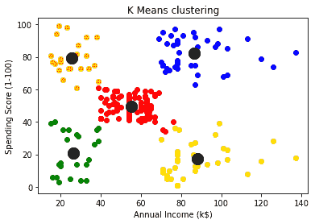

# 确定数据挖掘中的聚类数

> 原文:[https://www . geeksforgeeks . org/确定数据挖掘中的集群数量/](https://www.geeksforgeeks.org/determining-the-number-of-clusters-in-data-mining/)

在像 K-Means 聚类这样的聚类算法中，我们必须为数据集确定正确的聚类数。这确保了数据被正确有效地划分。“k”的适当值，即簇的数量，有助于确保簇的适当粒度，并有助于保持簇的可压缩性和准确性之间的良好平衡。

**我们来考虑两种情况:**

```
Case 1: Treat the entire dataset as one cluster
Case 2: Treat each data point as a cluster
```

这将给出最精确的聚类，因为数据点与其对应的聚类中心之间的距离为零。但是，这无助于预测新的投入。它不会启用任何类型的数据汇总。

因此，我们可以得出结论，为任何数据集确定“正确”的聚类数非常重要。这是一项具有挑战性的任务，但如果我们依赖于数据分布的形状和比例，这是非常容易做到的。计算聚类数的一个简单方法是，对于‘n’个点的数据集，将该值设置为大约 **√(n/2)** 。在本文的剩余部分，已经描述了两种方法，并在 Python 中实现了这两种方法，用于确定数据挖掘中的集群数量。

### **1。肘法:**

这种方法基于这样的观察，即增加聚类的数量有助于减少每个聚类的聚类内方差之和。拥有更多的集群允许人们提取更精细的数据对象组，这些数据对象组彼此更相似。为了选择“正确”的聚类数，使用聚类内方差之和相对于聚类数的曲线的转折点。曲线的第一个转折点表示任何 k > 0 的“k”的正确值。让我们在 Python 中实现肘部方法。

**步骤 1:导入库**

## 蟒蛇 3

```
# importing the libraries
import pandas as pd
import matplotlib.pyplot as plt
from sklearn.cluster import KMeans
```

**第二步:加载数据集**

我们使用了商城客户数据集，可以在这个[链接](https://media.geeksforgeeks.org/wp-content/cdn-uploads/20210628141124/Mall_Customers-2.csv)上找到。

## 蟒蛇 3

```
# loading the dataset
dataset = pd.read_csv('Mall_Customers.csv')

# printing first five rows of the dataset
print(dataset.head(5))
```

**输出:**


数据集的前五行

**步骤 3:检查任何空值**

数据集有 200 行和 5 列。它没有空值。

## 蟒蛇 3

```
# printing the shape of dataset
print(dataset.shape)

# checking for any
# null values present
print(dataset.isnull().sum())
```

**输出:**


数据集的形状以及空值的计数

**第四步:从数据集中提取 2 列进行聚类**

让我们提取两个列，即“年收入(k$)”和“支出分数(1-100)”进行进一步处理。

## 蟒蛇 3

```
# extracting values from two 
# columns for clustering
dataset_new = dataset[['Annual Income (k$)', 
                       'Spending Score (1-100)']].values
```

**第五步:使用** **肘形法确定聚类数并绘制图形**

## 蟒蛇 3

```
# determining the maximum number of clusters 
# using the simple method
limit = int((dataset_new.shape[0]//2)**0.5)

# selecting optimal value of 'k'
# using elbow method

# wcss - within cluster sum of
# squared distances
wcss = {}

for k in range(2,limit+1):
    model = KMeans(n_clusters=k)
    model.fit(dataset_new)
    wcss[k] = model.inertia_

# plotting the wcss values
# to find out the elbow value
plt.plot(wcss.keys(), wcss.values(), 'gs-')
plt.xlabel('Values of "k"')
plt.ylabel('WCSS')
plt.show()
```

**输出:**


弯管法的绘图

通过上面的图，我们可以观察到这条曲线的转折点在 k = 5 的值。因此，我们可以说这个数据的“正确”聚类数是 5。

### 2.轮廓分数:

轮廓分数用于评估使用聚类算法(如 K-Means)创建的聚类的质量，即数据点与彼此相似的其他数据点的聚类程度。这种方法可以用来寻找“k”的最佳值。这个分数在[-1，1]的范围内。轮廓分数接近 1 的“k”值可视为“正确”的聚类数。**sklearn . metrics . skill _ score()**用于在 Python 中查找分数。让我们为肘部方法中使用的相同数据集实现这一点。

**步骤 1:导入库**

## 蟒蛇 3

```
# importing the libraries
import pandas as pd
import numpy as np
import matplotlib.pyplot as plt
from sklearn.cluster import KMeans
from sklearn.metrics import silhouette_score
```

**第二步:加载数据集**

我们使用了商场客户数据集。

## 蟒蛇 3

```
# loading the dataset
dataset = pd.read_csv('Mall_Customers.csv')

# printing first five rows of the dataset
print(dataset.head(5))
```

**输出:**


数据集的前五行

**步骤 3:检查任何空值**

数据集有 200 行和 5 列。它没有空值。

## 蟒蛇 3

```
# printing the shape of dataset
print(dataset.shape)

# checking for any
# null values present
print(dataset.isnull().sum())
```

**输出:**


数据集的形状以及空值的计数

**第四步:从数据集中提取 2 列进行聚类**

让我们提取两个列，即“年收入(k$)”和“支出分数(1-100)”进行进一步处理。

## 蟒蛇 3

```
# extracting values from two 
# columns for clustering
dataset_new = dataset[['Annual Income (k$)', 
                       'Spending Score (1-100)']].values
```

**步骤 5:使用轮廓分数确定聚类的数量**

计算轮廓分数所需的最小聚类数为 2。所以循环从 2 开始。

## 蟒蛇 3

```
# determining the maximum number of clusters 
# using the simple method
limit = int((dataset_new.shape[0]//2)**0.5)

# determing number of clusters
# using silhouette score method
for k in range(2, limit+1):
    model = KMeans(n_clusters=k)
    model.fit(dataset_new)
    pred = model.predict(dataset_new)
    score = silhouette_score(dataset_new, pred)
    print('Silhouette Score for k = {}: {:<.3f}'.format(k, score))
```


k = [2，..,10]

我们可以观察到，k = 5 的值具有最高值，即最接近+1。所以，我们可以说‘k’的最优值是 5。

现在，我们已经使用两种方法正确地确定并验证了商场客户数据集的聚类数量——肘形法和轮廓评分。在这两种情况下，k = 5。现在让我们对数据集执行 KMeans 聚类并绘制聚类图。

## 蟒蛇 3

```
# clustering the data using Kmeans
# using k = 5
model = KMeans(n_clusters=5)

# predicting the clusters
pred = model.fit_predict(dataset_new)

# plotting all the clusters
colours = ['red', 'blue', 'green', 'yellow', 'orange']

for i in np.unique(model.labels_):
    plt.scatter(dataset_new[pred==i, 0],
                dataset_new[pred==i, 1],
                c = colours[i])

# plotting the cluster centroids
plt.scatter(model.cluster_centers_[:, 0], 
            model.cluster_centers_[:, 1], 
            s = 200,  # marker size
            c = 'black')

plt.title('K Means clustering')
plt.xlabel('Annual Income (k$)')
plt.ylabel('Spending Score (1-100)')
plt.show()
```



如此形成的最终团簇

从上面的图中，我们可以看到已经形成了五个有效的集群，它们彼此之间是明显可分的。集群形心也是黑色的。