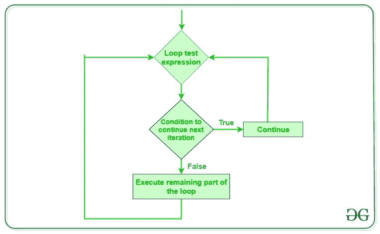

# Python 中继续和传递语句的区别

> 原文:[https://www . geeksforgeeks . org/python 中继续和传递语句的区别/](https://www.geeksforgeeks.org/difference-between-continue-and-pass-statements-in-python/)

在 Python 中使用循环以高效的方式自动化和重复任务。但是有时，可能会出现这样一种情况，您想要完全退出循环，跳过一次迭代或者忽略该情况。这些可以通过循环控制语句来完成。循环控制语句改变其正常顺序的执行。当执行离开一个范围时，在该范围内创建的所有自动对象都将被销毁。Python 支持以下控制语句。

*   [继续陈述](https://www.geeksforgeeks.org/python-continue-statement/)
*   [中断声明](https://www.geeksforgeeks.org/python-break-statement/)
*   传递语句

在本文中，主要重点将放在 **`continue`** 和 **`pass`** 语句的区别上。

#### 连续语句

此语句用于在特定条件下跳过循环的执行部分。之后，它将控制转移到循环的开始。基本上，它跳过下面的语句，继续循环的下一次迭代。



**语法:**

```py
continue

```

#### 传递语句

顾名思义，pass 语句根本不做任何事情。我们使用 pass 语句来编写空循环。Pass 也用于空的控制语句、函数和类。

**语法:**

```py
pass

```

#### 继续和通过的区别

考虑下面的例子，以便更好地理解 continue 和 pass 语句之间的区别。

**示例:**

```py
# Python program to demonstrate
# difference between pass and 
# continue statements

s = "geeks"

# Pass statement
for i in s:
    if i == 'k':
        print('Pass executed')
        pass
    print(i)

print()

# Continue statement
for i in s:
    if i == 'k':
        print('Continue executed')
        continue
    print(i)
```

**输出:**

```py
g
e
e
Pass executed
k
s

g
e
e
Continue executed
s

```

在上面的例子中，当`i`的值等于“`k`”时，pass 语句什么也不做，因此也打印了字母“`k`”。而在 continue 语句的情况下，continue 语句将控制转移到循环的开始，因此不打印字母`k`。