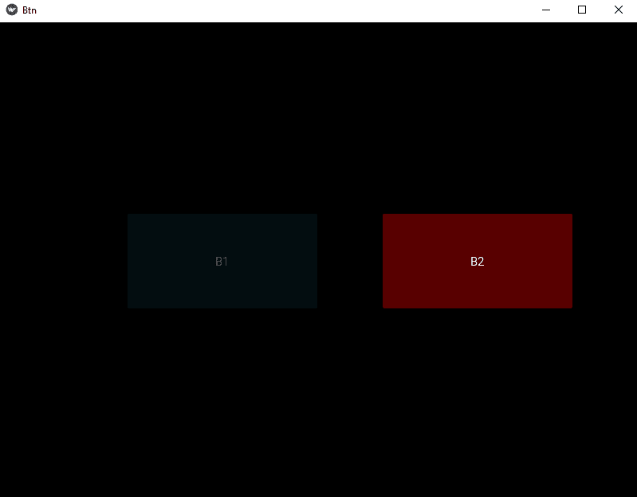

# 禁用 kivy 按钮使用。kv 文件

> 原文:[https://www . geesforgeks . org/disable-kivy-button-using-kv-file/](https://www.geeksforgeeks.org/disable-kivy-button-using-kv-file/)

在本文中，我们将学习如何在 kivy 使用中**禁用按钮**。kv 文件，有些地方我们需要禁用按钮。让我们看看怎么做。

> [Kivy 教程——用例子学习 Kivy。](https://www.geeksforgeeks.org/kivy-tutorial/)

**按钮**是一个带有相关动作的标签，当按钮被按下(或在点击/触摸后被释放)时会被触发。我们可以在按钮后面添加功能，并为按钮设置样式。但是要禁用该按钮，我们有一个属性名:

```py
disabled that must be true
```

该属性将有助于禁用按钮，即按钮将会存在，但没有用，因为它被禁用，按钮的任何功能都将不起作用。

在本文中，我们使用了 [**【相对布局】**](https://www.geeksforgeeks.org/python-relative-layout-in-kivy-using-kv-file/) 来设置工作和禁用按钮的相对位置。

> **注意:** **禁用**属性在 1.8.0 版本中引入。如果你想使用它，你需要实现你的框架。

```py
Basic Approach to disable a button

1) import kivy
2) import kivyApp
3) import Widget
4) import Button
5) Set minimum version(optional)
6) Create widget class:
          1) Arrange a callback
          2) Define Callback function
7) create App class
8) create .kv file (name same as the app class):
        1) create Widget
        2) Create Button
        3) Specify requirements
        4) Disable button true if required
9) return Layout/widget/Class(according to requirement)
10) Run an instance of the class 
```

**Code to implement the Approach to disable button**

```py
## Sample Python application demonstrating the 
## How to disable button in Kivy using .kv file 

################################################### 
# import modules 

import kivy 

# base Class of your App inherits from the App class. 
# app:always refers to the instance of your application 
from kivy.app import App 

# This layout allows you to set relative coordinates for children. 
from kivy.uix.relativelayout import RelativeLayout 

# To change the kivy default settings 
# we use this module config 
from kivy.config import Config 

# 0 being off 1 being on as in true / false 
# you can use 0 or 1 && True or False 
Config.set('graphics', 'resizable', True) 

# creating the root widget used in .kv file 
class RelativeLayout(RelativeLayout): 
    pass

# creating the App class in which name 
#.kv file is to be named Btn.kv 
class BtnApp(App): 
    # defining build() 
    def build(self): 
        # returning the instance of root class 
        return RelativeLayout() 

# run the app 
if __name__ == "__main__": 
    BtnApp().run() 
```

**。kv 文件实施办法**

```py
#.kv file implementation of RelativeLayout 

<RelativeLayout>: 

    # creating the Disabled button 
    Button: 

        text:"B1"

        background_color: 0.1, 0.5, 0.6, 1

        # positioned at 0 % in x axis and 0 % in y axis 
        # from bottom left, i.e x, y = 0, 0 from bottom left: 
        pos_hint: {"x":0.2, "y":.4}
        size_hint: 0.3, 0.2

        # Disabling button
        disabled: True

        # working button
    Button: 
        text:"B2"
        background_color: 1, 0, 0, 1
        pos_hint: {"x":.6, "y":.4}
        size_hint: 0.3, 0.2

```

**输出:**

这里，B1 禁用，B2 工作。