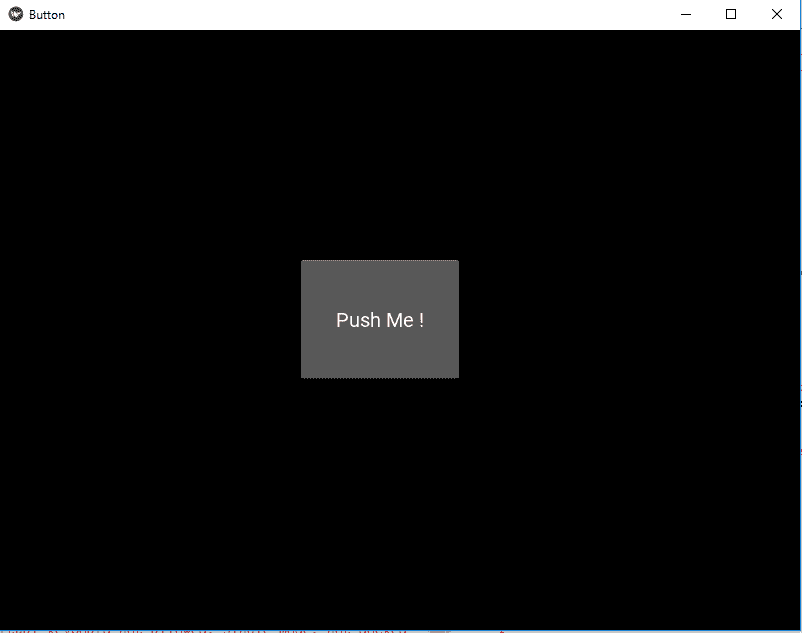

# 禁用 Kivy 按钮

> 原文:[https://www.geeksforgeeks.org/disable-kivy-button/](https://www.geeksforgeeks.org/disable-kivy-button/)

在这篇文章中，我们将学习如何**禁用 kivy 中的一个按钮**，有些地方我们需要禁用按钮，所以在这篇文章中，你将学习如何做到这一点。

> [Kivy 教程——用例子学习 Kivy。](https://www.geeksforgeeks.org/kivy-tutorial/)

**按钮**是一个带有相关动作的标签，当按钮被按下(或在点击/触摸后被释放)时会被触发。我们可以在按钮后面添加功能，并为按钮设置样式。但是要禁用该按钮，我们有一个属性名:

```
disabled that must be true
```

该属性将有助于禁用按钮，即按钮将会存在，但没有用，因为它被禁用，按钮的任何功能都将不起作用。

> **注意:** **禁用**属性在 1.8.0 版本中引入。如果你想使用它，你需要实现你的框架。

> 创建和禁用按钮时要遵循的基本方法:
> 
> ->导入 kivy
> - >导入 kivy App
> - >导入按钮
> - >设置最低版本(可选)
> - >扩展类
> - >添加并返回一个按钮
> - >添加禁用=真禁用按钮
> - >运行类的一个实例

首先，让我们看看如何创建一个完全工作的按钮，然后看看如何禁用它及其功能。

**Code #1: How to create fully working button**

```
def build(self):
    # use a (r, g, b, a) tuple
    btn = Button(text ="Push Me !",
                 font_size ="20sp",
                 background_color =(1, 1, 1, 1),
                 color =(1, 1, 1, 1),
                 size =(32, 32),
                 size_hint =(.2, .2),
                 pos =(300, 250))

    return btn
```

**输出:**


**代码#2:如何禁用按钮**

```
def build(self):
        # use a (r, g, b, a) tuple
        btn = Button(text ="Push Me !",
                     font_size ="20sp",
                     background_color =(1, 4, 6, 1),
                     color =(1, 1, 1, 1),
                     size =(32, 32),
                     size_hint =(.2, .2),
                     pos =(300, 250),

                     # Disabling the button   
                     disabled = True

                     )
```

**输出:**


**代码#3:两个禁用和工作按钮一起**

```
# import kivy module 
import kivy 

# this restrict the kivy version i.e 
# below this kivy version you cannot 
# use the app or software 
kivy.require("1.9.1") 

# base Class of your App inherits from the App class. 
# app:always refers to the instance of your application 
from kivy.app import App 

# creates the button in kivy 
# if not imported shows the error 
from kivy.uix.button import Button 

# This layout allows you to set relative coordinates for children. 
from kivy.uix.relativelayout import RelativeLayout 

# class in which we are creating the button 
class ButtonApp(App): 

    def build(self):

        r1 = RelativeLayout()

        # working button
        btn1 = Button(text ="Push Me !", 
                   font_size ="20sp", 
                   background_color =(1, 1, 1, 1), 
                   color =(1, 1, 1, 1), 
                   size =(32, 32), 
                   size_hint =(.2, .2), 
                   pos =(200, 250)) 

        # disabled button
        btn2 = Button(text ="Disabled:(:( !", 
                   font_size ="20sp", 
                   background_color =(1, 1, 1, 1), 
                   color =(1, 1, 1, 1), 
                   size =(32, 32), 
                   size_hint =(.2, .2), 
                   pos =(500, 250),

                   # Add disabled property true to disabled button
                   disabled = True)

        r1.add_widget(btn1)
        r1.add_widget(btn2)

        # bind() use to bind the button to function callback 
        btn1.bind(on_press = self.callback)
        return r1 

    # callback function tells when button pressed 
    def callback(self, event): 
        print("button pressed") 
        print('Yoooo !!!!!!!!!!!') 

# creating the object root for ButtonApp() class  
root = ButtonApp() 

# run function runs the whole program 
# i.e run() method which calls the target 
# function passed to the constructor. 
root.run() 
```

**输出:**
