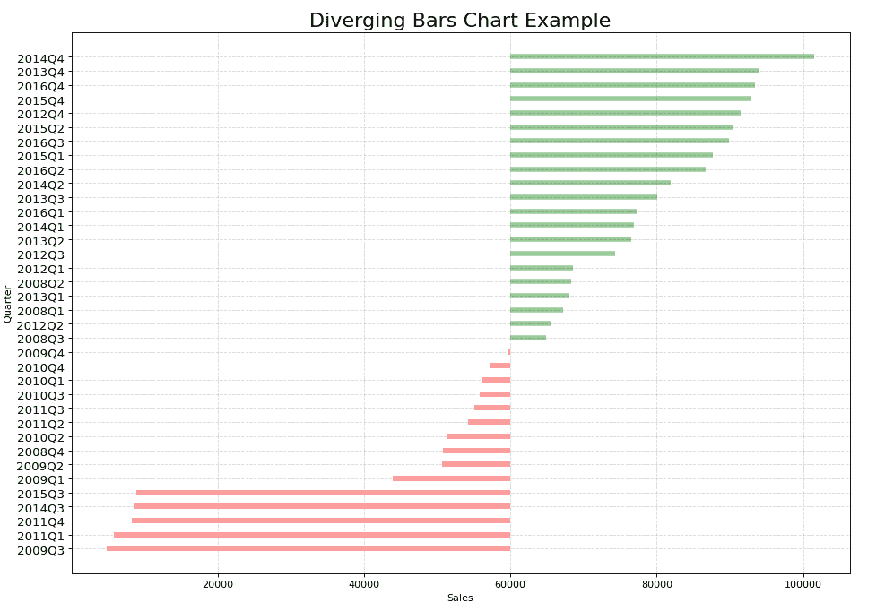
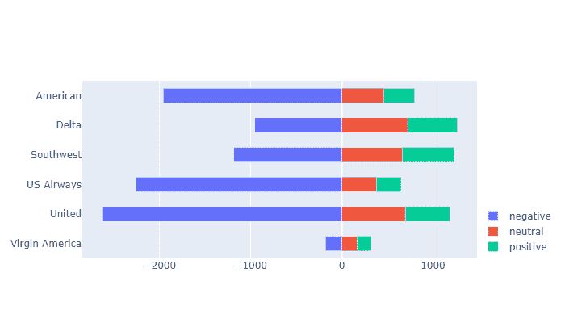

# 使用 Python 的发散条形图

> 原文:[https://www . geesforgeks . org/diverging-bar-chart-use-python/](https://www.geeksforgeeks.org/diverging-bar-chart-using-python/)

发散条形图用于简化多个组的比较。它的设计允许我们比较不同组的数值。这也有助于我们快速想象有利和不利或积极和消极的反应。条形图由两条从中间开始的横条组合而成，一条从右向左延伸，另一条从左向右延伸。条形的长度对应于它所代表的数值。

通常，两个分叉条用不同的颜色表示。左边的值通常是，但不一定是否定的或不令人满意的回答。

Python 没有绘制分叉条形图的特定功能。另一种方法是使用 hlines 函数绘制具有一定线宽值的水平线，将其表示为水平条。

**正在使用的数据集:**

*   [奔驰汽车销售数据](https://www.kaggle.com/luigimersico/mercedes-benz-car-sales-data)
*   [推特航空公司情绪](https://www.kaggle.com/crowdflower/twitter-airline-sentiment)

### 方法一:使用 [Matplotlib](https://www.geeksforgeeks.org/python-matplotlib-an-overview/)

**进场:**

*   导入模块
*   导入或创建数据
*   预处理数据集，清除不必要的噪声
*   指定用于表示水平条的颜色
*   按升序对值进行排序
*   设置 x 轴和 y 轴的标签以及图表标题
*   显示分叉条形图

**例 1:**

## 计算机编程语言

```py
import pandas as pd
import matplotlib.pyplot as plt
import string as str

# Creating a DataFrame from the CSV Dataset
df = pd.read_csv("car_sales.csv", sep=';')

# Separating the Date and Mercedes-Benz Cars unit sales (USA)
df['car_sales_z'] = df.loc[:, ['Mercedes-Benz Cars unit sales (USA)']]
df['car_sales_z'] = df['car_sales_z'] .str.replace(
    ',', '').astype(float)

# Removing null value
df.drop(df.tail(1).index, inplace=True)

for i in range(35):
    # Colour of bar chart is set to red if the sales 
    # is < 60000 and green otherwise
    df['colors'] = ['red' if float(
        x) < 60000 else 'green' for x in df['car_sales_z']]

# Sort values from lowest to highest
df.sort_values('car_sales_z', inplace=True)

# Resets initial index in Dataframe to None
df.reset_index(inplace=True)

# Draw plot
plt.figure(figsize=(14, 10), dpi=80)

# Plotting the horizontal lines
plt.hlines(y=df.index, xmin=60000, xmax=df.car_sales_z,
           color=df.colors, alpha=0.4, linewidth=5)

# Decorations
# Setting the labels of x-axis and y-axis
plt.gca().set(ylabel='Quarter', xlabel='Sales')

# Setting Date to y-axis
plt.yticks(df.index, df.Date, fontsize=12)

# Title of Bar Chart
plt.title('Diverging Bars Chart Example', fontdict={
          'size': 20})

# Optional grid layout
plt.grid(linestyle='--', alpha=0.5)

# Displaying the Diverging Bar Chart
plt.show()
```

**输出:**



### 方法 2:使用[绘制](https://www.geeksforgeeks.org/getting-started-with-plotly-python/)

**进场:**

*   导入所需的库
*   创建或导入数据
*   预处理数据集并清除不必要的噪声
*   使用 plotly.graph_objects 绘制图形
*   设置 x 轴、y 轴以及图例的标签
*   显示分叉条形图

**示例:**

## 计算机编程语言

```py
import pandas as pd
import plotly.graph_objects as go

df = pd.read_csv("Tweets.csv")
df.head()

# Preprocessing the dataset to extract only
# the necessary columns
categories = [
    'negative',
    'neutral',
    'positive'
]

# Construct a pivot table with the column
# 'airline' as the index and the sentiments
# as the columns
gfg = pd.pivot_table(
    df,
    index='airline',
    columns='airline_sentiment',
    values='tweet_id',
    aggfunc='count'
)

# Include the sentiments - negative, neutral
# and positive
gfg = gfg[categories]

# Representing negative sentiment with negative
# numbers
gfg.negative = gfg.negative * -1

df = gfg

# Creating a Figure
Diverging = go.Figure()

# Iterating over the columns
for col in df.columns[4:]:

    # Adding a trace and specifying the parameters
    # for negative sentiment
    Diverging.add_trace(go.Bar(x=-df[col].values,
                               y=df.index,
                               orientation='h',
                               name=col,
                               customdata=df[col],
                               hovertemplate="%{y}: %{customdata}"))
for col in df.columns:

    # Adding a trace and specifying the parameters
    # for positive and neutral sentiment
    Diverging.add_trace(go.Bar(x=df[col],
                               y=df.index,
                               orientation='h',
                               name=col,
                               hovertemplate="%{y}: %{x}"))

# Specifying the layout of the plot
Diverging.update_layout(barmode='relative',
                        height=400,
                        width=700,
                        yaxis_autorange='reversed',
                        bargap=0.5,
                        legend_orientation='v',
                        legend_x=1, legend_y=0
                        )
Diverging
```

**输出:**

