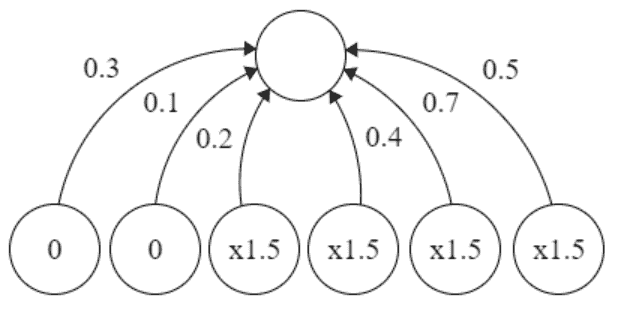
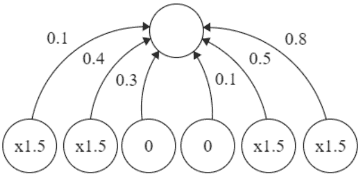

# 神经网络中的缺失

> 原文:[https://www.geeksforgeeks.org/dropout-in-neural-networks/](https://www.geeksforgeeks.org/dropout-in-neural-networks/)

神经网络的概念是受人脑中神经元的启发，科学家希望机器能复制同样的过程。这渴望一条通向人工智能最重要主题之一的道路。神经网络是基于被称为人工神经元的连接单元或节点的集合，它松散地模拟生物大脑中的神经元。由于这种网络是在机器中人工创建的，我们称之为人工神经网络。这篇文章假设你对人工神经网络有相当的了解。关于 ANN 的更多信息可以在[这里](https://www.geeksforgeeks.org/neural-networks-a-beginners-guide/)找到。
现在，让我们更深入地了解 ANN 中**辍学**的细节。

**问题:**

当全连接层有大量神经元时，更容易发生协同适应。共同适应是指当一个层中的多个神经元从输入数据中提取相同或非常相似的隐藏特征时。当两个不同神经元的连接权重几乎相同时，就会发生这种情况。

<center>
</center>

这给我们的模型带来了两个不同的问题:

*   计算同样的输出时机器资源的浪费。
*   如果许多神经元提取相同的特征，这将为我们的模型增加更多的特征意义。如果重复提取的特征仅特定于训练集，这将导致过度拟合。

**问题解决方案:**

正如标题所暗示的，我们在训练神经网络时使用了退网来最小化自适应。
在 dropout 中，我们通过将神经元值归零，在每个训练步骤中随机关闭一层神经元的一部分。要清零的神经元部分称为失败率。剩余神经元的值乘以，这样神经元值的总和保持不变。





这两幅图像表示应用于 6 个单元的层的脱落，显示在多个训练步骤中。辍学率为 1/3，每个训练步骤中剩余的 4 个神经元的值按 x1.5 缩放。因此，我们选择神经元的随机样本，而不是一次训练整个网络。这确保了共同适应被解决，并且他们更好地学习隐藏的特征。
 **Dropout 可以应用于使用 TensorFlow APIs 作为、**的网络

```py
tf.keras.layers.Dropout(
    rate
)

# rate: Float between 0 and 1. 
# The fraction of the input units to drop.
```