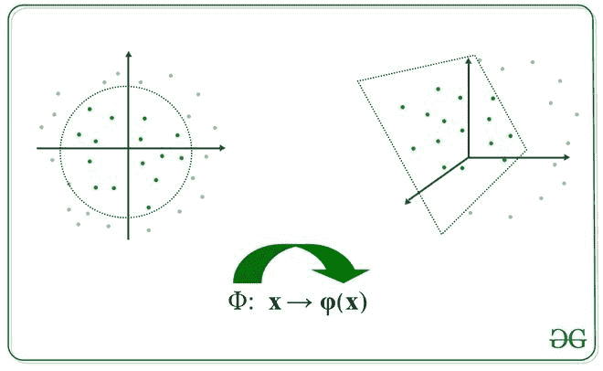
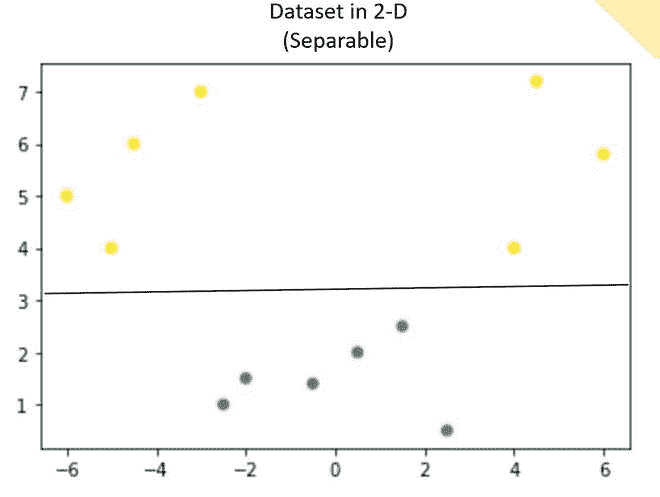
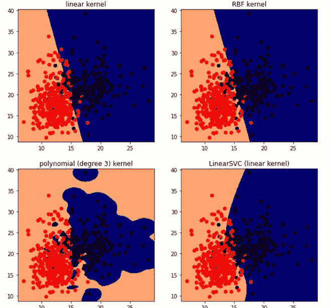

# 双支持向量机

> 原文:[https://www.geeksforgeeks.org/dual-support-vector-machine/](https://www.geeksforgeeks.org/dual-support-vector-machine/)

**先决条件:** [分离 SVM 的超平面](https://www.geeksforgeeks.org/separating-hyperplanes-in-svm/)

支持向量机的拉格朗日乘子方程。该方程可由下式给出:

<center>![\underset{\vec{w},b}{min} \underset{\vec{a}\geq 0}{max} \frac{1}{2}\left \| w \right \|^{2} - \sum_{j}a_j\left [ \left ( \vec{w} \cdot \vec{x}_{j} \right )y_j - 1 \right ]](img/7944d8c6bc6d34c26d73cf2eb21550b3.png "Rendered by QuickLaTeX.com")</center>

现在，根据对偶原理，上述优化问题既可以看作是原始的(最小化超过 w 和 *b)* 也可以看作是对偶的(最大化超过 *a* )。

<center>![\underset{\vec{a}\geq 0}{max}\underset{\vec{w},b}{min} \frac{1}{2}\left \| w \right \|^{2} - \sum_{j}a_j\left [ \left ( \vec{w} \cdot \vec{x}_{j} \right )y_j - 1 \right ]](img/03f72e53bf384ed9831be48769082444.png "Rendered by QuickLaTeX.com")</center>

凸优化的斯莱特条件保证了这两个问题是等价的。

为了获得最小 wrt w 和 b，这些变量的一阶偏导数 wrt 必须为 0:

<center></center>

现在，把上面的方程放在拉格朗日乘数方程中，并简化它。

<center></center>

在上式中，术语

<center></center>

 because, *b* is just a constant and the rest is from the above equation”

<center></center>

为了找到 b，我们也可以使用上面的等式和约束

<center></center>

 :

<center></center>

现在，决策规则可以由下式给出:

<center></center>

注意，从上面的规则我们可以观察到，拉格朗日乘数只是依赖于 x <sub>i</sub> 与未知变量 x 的点积，这个点积定义为核函数，用 K 表示

<center></center>

现在，对于线性不可分的情况，对偶方程变成:

<center></center>

这里，我们添加了一个常数 C，之所以需要它是因为以下原因:

*   它阻止

    <center></center>

    的值来自

    <center></center>

    。
*   它还防止模型过度拟合，这意味着一些错误分类是可以接受的。



图像描绘变换

我们将变换应用到另一个空间，如下所示。注意，我们不需要专门计算变换函数，我们只需要找到那些得到核函数的点积，然而，这个变换函数可以很容易地建立起来。

<center></center>

哪里，

<center></center>

 is the transformation function.

直觉告诉我们，很多时候，一个数据可以被一个更高维度的超平面分割开来。让我们更详细地看看这个:

假设我们有一个数据集，它只包含 1 个自变量和 1 个因变量。下图显示了数据:


现在，在上面的图中，很难分离清楚地分离不同类的数据点的 1D-超平面(点)。但是当通过使用某种转换转换到 2d 时，它提供了分离类的选项。



在上面的例子中，我们可以看到 SVM 线可以清楚地将数据集的两个类别分开。

有一些非常常用的著名内核:

*   n 次多项式

<center></center>

*   n 次以下的多项式

<center></center>

*   高斯/径向基函数核

<center></center>

### 履行

## 蟒蛇 3

```py
# code
import numpy as np
import matplotlib.pyplot as plt
from sklearn import svm, datasets

# import some data
cancer = datasets.load_breast_cancer()
X = cancer.data[:,:2]
Y = cancer.target

X.shape, Y.shape

# perform svm with different kernel, here c is the regularizer
h = .02
C=100
lin_svc = svm.LinearSVC(C=C)
svc = svm.SVC(kernel='linear', C=C)
rbf_svc = svm.SVC(kernel='rbf', gamma=0.7, C=C)
poly_svc = svm.SVC(kernel='poly', degree=3, C=C)

# Fit the training dataset.
lin_svc.fit(X, Y)
svc.fit(X, Y)
rbf_svc.fit(X, Y)
poly_svc.fit(X, Y)

# plot the results
x_min, x_max = X[:, 0].min() - 1, X[:, 0].max() + 1
y_min, y_max = X[:, 1].min() - 1, X[:, 1].max() + 1
xx, yy = np.meshgrid(np.arange(x_min, x_max, h),np.arange(y_min, y_max, h))

titles = ['linear kernel',
          'LinearSVC (linear kernel)',
          'RBF kernel',
          'polynomial (degree 3) kernel']

plt.figure(figsize=(10,10))

for i, clf in enumerate((svc, lin_svc,rbf_svc, poly_svc )):
    # Plot the decision boundary using the above meshgrid we generated
    plt.subplot(2, 2, i + 1)
    Z = clf.predict(np.c_[xx.ravel(), yy.ravel()])

    # Put the result into a color plot
    Z = Z.reshape(xx.shape)
    plt.set_cmap(plt.cm.flag_r)
    plt.contourf(xx, yy, Z)

    # Plot also the training points
    plt.scatter(X[:, 0], X[:, 1], c=Y)

    plt.title(titles[i])

plt.show()
```

```py
((569, 2), (569,))
```



SVM 使用不同的内核。

### **参考文献:**

*   [**麻省理工开放式课程幻灯片 SVM**](http://people.csail.mit.edu/dsontag/courses/ml13/slides/lecture6.pdf)