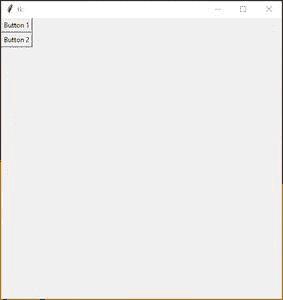

# 使用 Tkinter

调整窗口大小时动态调整按钮大小

> 原文:[https://www . geesforgeks . org/dynamic-resize-buttons-when-resize-a-window-using-tkinter/](https://www.geeksforgeeks.org/dynamically-resize-buttons-when-resizing-a-window-using-tkinter/)

**先决条件:** [Python 图形用户界面–tkinter](https://www.geeksforgeeks.org/python-gui-tkinter/)

按钮大小是静态的，这意味着按钮的大小一旦被用户定义就不能改变。这里的问题是在调整窗口大小时，它会影响按钮的大小问题。因此，这里的解决方案是，制作一个动态按钮，这意味着按钮大小将根据窗口大小而变化。

**让我们用分步实现来理解:**

**步骤 1#:** 创建正常的 Tkinter 窗口

## 蟒蛇 3

```py
# Import module
from tkinter import *

# Create object
root = Tk()

# Adjust size
root.geometry("400x400")

# Execute tkinter
root.mainloop()
```

**输出:-**


**步骤 2#:** 添加按钮并设置网格。

**语法:**

```py
Button(Object Name,text="Enter Text")
```

**什么是网格？**

grid()几何管理器在父小部件中以类似表格的结构组织小部件。主小部件被分成行和列，表格的每个部分可以容纳一个小部件。它使用列、列跨度、ipadx、ipady、padx、pady、行、行跨度和粘性。

**语法:**

```py
Object_name.grid(row=row value,column=column value,**attributes)
```

## 蟒蛇 3

```py
# Import module
from tkinter import *

# Create object
root = Tk()

# Adjust size
root.geometry("500x500")

# Create Buttons
button_1 = Button(root,text="Button 1")
button_2 = Button(root,text="Button 2")

# Set grid
button_1.grid(row=0,column=0)
button_2.grid(row=1,column=0)

# Execute tkinter
root.mainloop()
```

**输出:**



**增加两个按钮**

**步骤 3#:** 设置列配置&行配置调整大小。

为了调整用户界面的大小，我们需要为想要扩展的列指定一个正权重。这是使用网格的列配置和行配置方法完成的。这个重量是相对的。如果两列有相同的重量，它们将以相同的速度膨胀。

如果单元格比 widget 大怎么办？默认情况下，使用 sticky= "，小部件位于其单元格的中心。sticky 可能是零个或多个 N、E、S、W、NE、NW、SE 和 SW 的字符串连接，指南针方向指示 widget 粘附到的单元格的边和角。

> “NSEW”的意思是 N+S+E+W

**代码:-**

## 蟒蛇 3

```py
# Import module
from tkinter import *

# Create object
root = Tk()

# Adjust size
root.geometry("500x500")

# Specify Grid
Grid.rowconfigure(root,0,weight=1)
Grid.columnconfigure(root,0,weight=1)

Grid.rowconfigure(root,1,weight=1)

# Create Buttons
button_1 = Button(root,text="Button 1")
button_2 = Button(root,text="Button 2")

# Set grid
button_1.grid(row=0,column=0,sticky="NSEW")
button_2.grid(row=1,column=0,sticky="NSEW")

# Execute tkinter
root.mainloop()
```

**输出:**

<video class="wp-video-shortcode" id="video-515389-1" width="640" height="360" preload="metadata" controls=""><source type="video/webm" src="https://media.geeksforgeeks.org/wp-content/cdn-uploads/20201119223400/dynamic-rezise-button.webm?_=1">[https://media.geeksforgeeks.org/wp-content/cdn-uploads/20201119223400/dynamic-rezise-button.webm](https://media.geeksforgeeks.org/wp-content/cdn-uploads/20201119223400/dynamic-rezise-button.webm)</video>