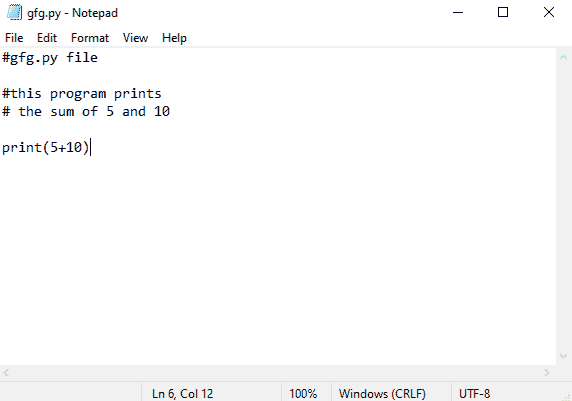
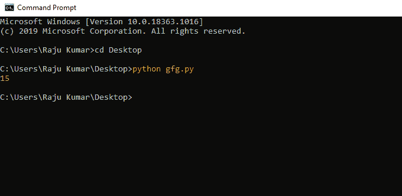

# Python 中的环境变量

> 原文:[https://www . geesforgeks . org/environment-变量-in-python/](https://www.geeksforgeeks.org/environment-variables-in-python/)

在 Python 中，它的行为受到环境变量设置的很大影响。Python 可以识别固定数量的环境变量，这些变量通常在命令行切换之前进行处理。每当环境变量和命令行开关之间出现冲突时，环境变量就会被覆盖。

## 不同的环境变量

在本文中，我们将探讨 Python 中一些最突出的环境变量。

### [PYTHONPATH](https://www.geeksforgeeks.org/pythonpath-environment-variable-in-python/)

它用于设置用户定义模块的路径，以便可以直接导入到 Python 程序中。它还负责处理 Python 模块的默认搜索路径。PythonPATH 变量保存一个字符串，该字符串包含需要由 PYTHON 添加到 sys.path 目录列表中的各种目录的名称。该变量的主要用途是允许用户导入尚未安装的模块。

### PYTHONHOME

该变量用于设置标准 Python 库的默认位置。默认情况下，Python 在*前缀* /lib/python *版本* 和*exec _ prefix/lib/Python 版本中搜索其库。此处前缀**exec _ prefix*为安装相关目录， 均默认为*/usr/local**。*T21】

### PYTHONSTARTUP

每当解释的 python 第一次初始化时，Python 都会在 Unix 中寻找一个名为***的可读文件，并执行其中的命令。同一文件的路径存储在 PYTHONSTARTUP 变量中。这些文件负责设置 PYTHONPATH。***

### PYTHONINSPECT

如果 PYTHONINSPECT 变量是一个空字符串，它会迫使 python 进入交互式 python 模式，并忽略 PYTONISTUP 文件。还可以对 Python 代码进行更改，并在程序终止时强制其进入检查模式。这相当于使用-i 命令行选项。

### pytoncaseok

这个环境变量用于在调用 Python 解释器时忽略所有导入语句。在窗口机器、中，它用于在导入语句中查找第一个不区分大小写的匹配。

### python 动词

如果该变量设置为空字符串，则每当模块初始化时，它都会打印一条消息，显示文件的位置或模块的加载位置。 它还会在 python 程序终止时生成模块清理的信息。

以上变量是常用的主要环境变量。

## Python 中执行代码的方式

Python 有 3 种标准使用方式，即:

1.  使用交互模式
2.  使用命令行
3.  使用和集成开发环境(IDE)

我们来详细探讨一下。

### 使用交互模式:

在这种模式下、你基本上是调用 Python 解释器，抛出一堆命令给它执行。要进入 Python 的交互模式，请使用以下命令:

```
$python # Unix/Linux
or
python% # Unix/Linux
or
C:> python # Windows/DOS

```

**示例:**

在这里我们将进入交互模式，并要求 Python 解决一个简单的计算。请看下图:


### 使用命令行:

在这种使用 python 的方法中，您需要首先调用 python 解释器，然后让它运行一个 python 文件。

**示例:**

让我们制作一个 python 文件，简单地计算 5 和 10 的和并返回结果，然后将其保存为 *gfg.py 文件*。这看起来有点像下面:



现在使用以下命令执行文件:

```
python gfg.py

```

这将导致以下结果:



### 使用集成开发环境

网上有很多 IDEs，比如 VScode、崇高编辑器、pycharm 等。这里我们将使用 Jupyter Notebook 演示 python 的使用，这是一个来自 Anaconda 的 python IDE。

**示例:**

这里我们将编写一个简单的 python 代码，并要求 IDE 用 Python 执行它。


现在，如果您点击集成开发环境上的运行按钮，它将自动调用解释器并执行程序。如下所示:

