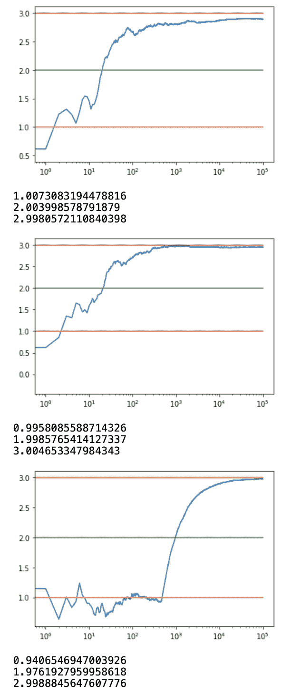
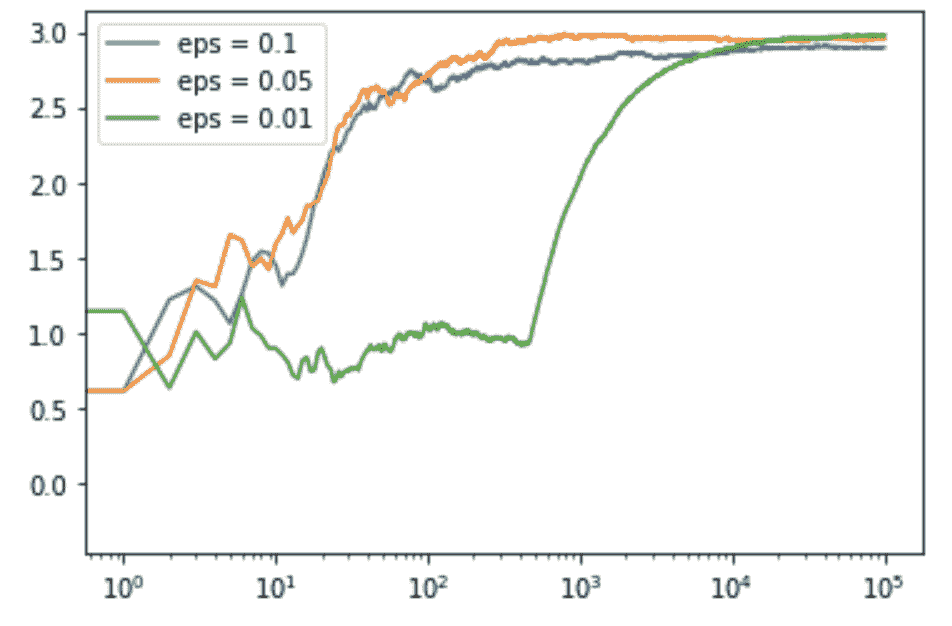
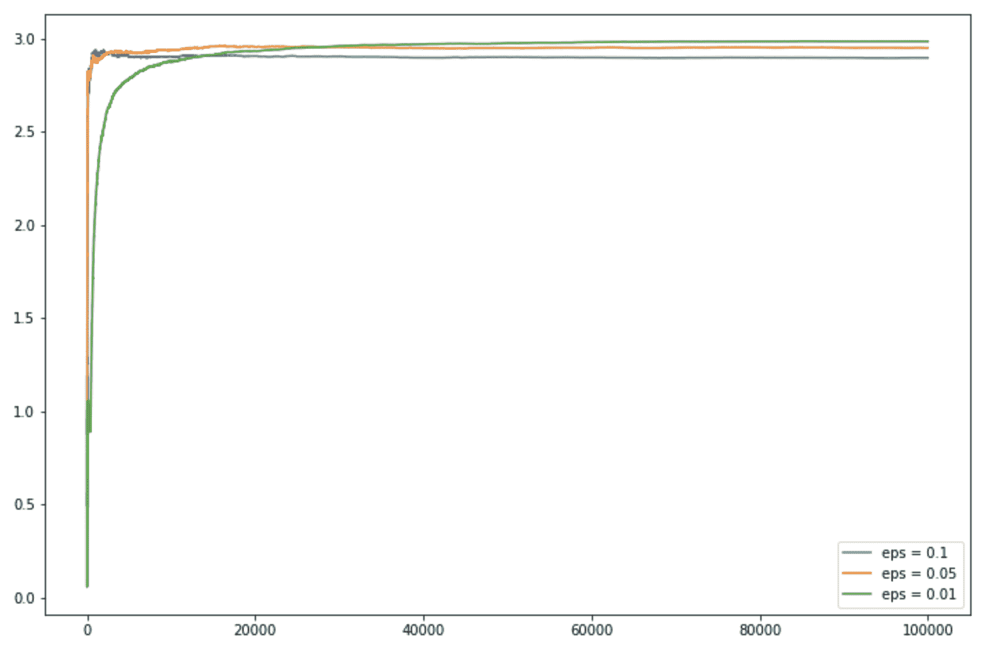

# 强化学习中的ε-贪婪算法

> 原文:[https://www . geesforgeks . org/epsilon-greedy-算法在强化学习中/](https://www.geeksforgeeks.org/epsilon-greedy-algorithm-in-reinforcement-learning/)

在强化学习中，代理或决策者学习做什么——如何将情境映射到行动——以便最大化数字奖励信号。代理人没有被明确告知要采取哪些行动，而是必须通过反复试验来发现哪个行动产生的回报最大。

**多武装土匪问题**

在强化学习中使用多武装强盗问题来形式化不确定性下的决策概念。在一个多武装强盗问题中，一个代理(学习者)在 *k* 个不同的动作之间进行选择，并根据选择的动作获得奖励。
多武装匪徒也用于描述强化学习中的基本概念，如*奖励*、*时间步长*、*值*。
对于代理选择动作，我们假设每个动作都有单独的*奖励分配*，并且至少有一个动作产生最大的数字奖励。因此，对应于每个动作的奖励的概率分布是不同的，并且对于代理(决策者)是未知的。因此，代理的目标是确定在给定的一组试验后选择哪一个动作来获得最大的回报。

**行动-价值和行动-价值评估**
对于决定哪一个行动产生最大回报的代理人来说，我们必须定义采取每个行动的价值。我们用概率的概念，用作用值函数来定义这些值。
选择一个动作的价值定义为从一组所有可能的动作中选择该动作时获得的预期奖励。由于代理不知道选择动作的价值，所以我们使用“样本平均”方法来估计采取动作的价值。


**勘探 vs 开采**

*探索*可以让一个代理提高其当前对每一个动作的了解，有希望带来长期利益。提高估计的行动值的准确性，使代理能够在未来做出更明智的决策。

*剥削*另一方面，通过剥削代理当前的行动价值估计，选择贪婪的行动来获得最多的奖励。但是，由于对行动价值估计的贪婪，实际上可能不会得到最多的回报，并导致次优行为。
当一个代理进行探索时，它会获得对行动价值更准确的估计。当它利用时，它可能会得到更多的奖励。然而，它不能选择同时做这两件事，这也被称为勘探-开采困境。

**ε-贪婪行动选择**
ε-贪婪是一种通过在勘探和开采之间随机选择来平衡勘探和开采的简单方法。
epsilon-greedy，这里的 epsilon 指的是选择探索的概率，利用大部分时间，探索的机会很小。


**代码:ε-Greedy 的 Python 代码**

```py
# Import required libraries
import numpy as np
import matplotlib.pyplot as plt

# Define Action class
class Actions:
  def __init__(self, m):
    self.m = m
    self.mean = 0
    self.N = 0

  # Choose a random action
  def choose(self): 
    return np.random.randn() + self.m

  # Update the action-value estimate
  def update(self, x):
    self.N += 1
    self.mean = (1 - 1.0 / self.N)*self.mean + 1.0 / self.N * x

def run_experiment(m1, m2, m3, eps, N):

  actions = [Actions(m1), Actions(m2), Actions(m3)]

  data = np.empty(N)

  for i in range(N):
    # epsilon greedy
    p = np.random.random()
    if p < eps:
      j = np.random.choice(3)
    else:
      j = np.argmax([a.mean for a in actions])
    x = actions[j].choose()
    actions[j].update(x)

    # for the plot
    data[i] = x
  cumulative_average = np.cumsum(data) / (np.arange(N) + 1)

  # plot moving average ctr
  plt.plot(cumulative_average)
  plt.plot(np.ones(N)*m1)
  plt.plot(np.ones(N)*m2)
  plt.plot(np.ones(N)*m3)
  plt.xscale('log')
  plt.show()

  for a in actions:
    print(a.mean)

  return cumulative_average

if __name__ == '__main__':

  c_1 = run_experiment(1.0, 2.0, 3.0, 0.1, 100000)
  c_05 = run_experiment(1.0, 2.0, 3.0, 0.05, 100000)
  c_01 = run_experiment(1.0, 2.0, 3.0, 0.01, 100000)
```

**输出:**


**代码:获取日志输出图的 Python 代码**

```py
# log scale plot
plt.plot(c_1, label ='eps = 0.1')
plt.plot(c_05, label ='eps = 0.05')
plt.plot(c_01, label ='eps = 0.01')
plt.legend()
plt.xscale('log')
plt.show()
```

**输出:**



**代码:获取线性输出图的 Python 代码**

```py
# linear plot
plt.figure(figsize = (12, 8))
plt.plot(c_1, label ='eps = 0.1')
plt.plot(c_05, label ='eps = 0.05')
plt.plot(c_01, label ='eps = 0.01')
plt.legend()
plt.show()
```

**输出:**
