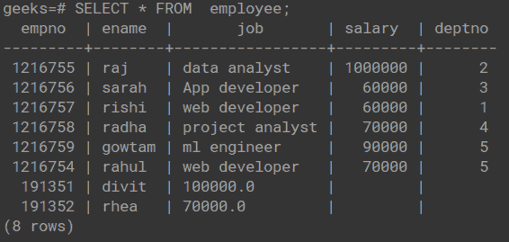

# 用 Python 中的 Psycopg2 执行 SQL 查询

> 原文:[https://www . geeksforgeeks . org/executing-SQL-query-with-psycopg2-in-python/](https://www.geeksforgeeks.org/executing-sql-query-with-psycopg2-in-python/)

在本文中，我们将看到如何使用 Python 中的 Psycopg2 在 PostgreSQL 中执行 SQL 查询。

Psycopg2 是一个 PostgreSQL 数据库驱动程序，它用于使用 python 对 PostgreSQL 执行操作，它是为多线程应用程序设计的。在 execute()方法的帮助下，使用 psycopg2 执行 SQL 查询。它用于执行数据库操作查询或命令。

参数可以以序列或映射的形式提供，并且它们将与操作中的变量相关联。位置(% s)或命名(% s)占位符用于指定变量。如果查询执行正确(没有错误)，execute()方法返回“none”。

### 示例 1:执行“创建表”命令。

## 蟒蛇 3

```py
import psycopg2

conn = psycopg2.connect(
    database="geeks", user='postgres', 
  password='root', host='localhost', port='5432'
)

conn.autocommit = True
cursor = conn.cursor()

sql = '''CREATE TABLE employees(emp_id int,emp_name varchar, \
salary decimal); '''

cursor.execute(sql)

conn.commit()
conn.close()
```

**输出:**


### 示例 2:执行“插入命令”

## 蟒蛇 3

```py
import psycopg2

conn = psycopg2.connect(
    database="geeks", user='postgres',
    password='root', host='localhost', port='5432'
)

conn.autocommit = True
cursor = conn.cursor()

sql = '''insert into employee values('191351','divit','100000.0'),
                                     ('191352','rhea','70000.0');
 '''

cursor.execute(sql)

conn.commit()
conn.close()
```

**输出:**



### 示例 3:执行“选择”命令。

## 蟒蛇 3

```py
import psycopg2

conn = psycopg2.connect(
    database="geeks", user='postgres',
    password='root', host='localhost', port='5432'
)

conn.autocommit = True
cursor = conn.cursor()

sql = '''SELECT * FROM employee;'''

cursor.execute(sql)
results = cursor.fetchall()
print(results)

conn.commit()
conn.close()
```

**输出:**

> [(1216755，‘Raj’，‘数据分析师’，1000000，2)，(1216756，‘Sarah’，‘App developer’，60000，3)，(1216757，‘rishi’，‘web developer’，60000，1)，(1216758，‘radha’，‘项目分析师’，70000，4)，(1216759，‘gowtam’，‘ml engineer’，90000，5)，(1216754，‘Rahul’，‘web developer’