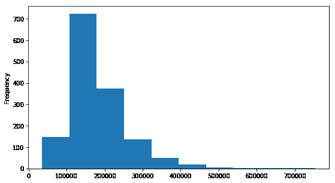
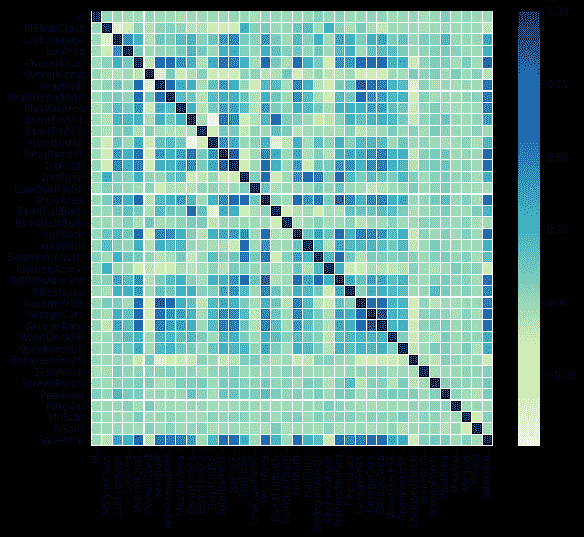
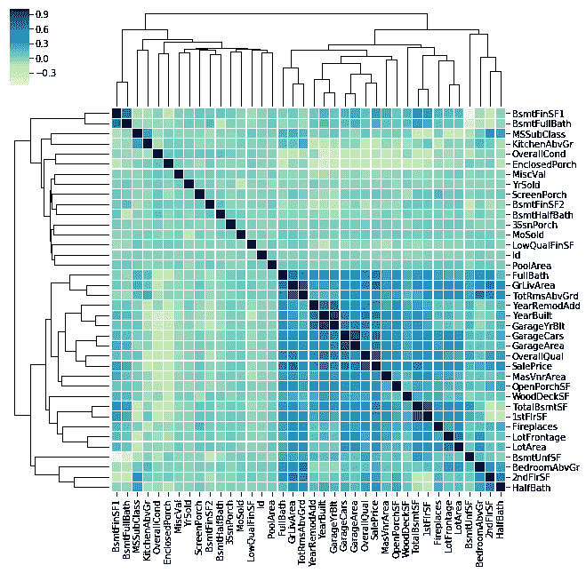

# 探索 Python 中的相关性

> 原文:[https://www . geeksforgeeks . org/exploring-相关性 in-python/](https://www.geeksforgeeks.org/exploring-correlation-in-python/)

本文旨在更好地理解多元勘探的一项非常重要的技术。

**相关矩阵**基本上是一个协方差矩阵。也称为自协方差矩阵、离差矩阵、方差矩阵或方差-协方差矩阵。它是一个矩阵，其中 i-j 位置定义了给定数据集的*I<sup>th</sup>T5】和*j<sup>th</sup>T9】参数之间的相关性。**

当数据点遵循大致直线的趋势时，变量被称为具有近似线性的关系。在某些情况下，数据点接近直线，但更多时候，直线趋势周围的点有相当多的可变性。称为相关性的汇总度量描述了线性关联的强度。相关性总结了两个定量变量之间线性(直线)关联的强度和方向。用 *r* 表示，取-1 到+1 之间的值。 *r* 的正值表示正关联， *r* 的负值表示负关联。
越靠近 *r* 到 *1* 数据点越接近直线，这样线性关联越强。 *r* 越接近 0，线性关联越弱。

要获得房价数据的链接，请点击这里的。

**加载库**

```py
import numpy as np
import pandas as pd
import seaborn as sns
import matplotlib.pyplot as plt
from scipy.stats import norm
```

**加载数据**

```py
data = pd.read_csv("House Price.csv")
data.shape
```

**输出:**

```py
(1460, 81)
```

**【销售价格】说明**

```py
data['SalePrice'].describe()
```

**输出:**

```py
count      1460.000000
mean     180921.195890
std       79442.502883
min       34900.000000
25%      129975.000000
50%      163000.000000
75%      214000.000000
max      755000.000000
Name: SalePrice, dtype: float64
```

**直方图**

```py
plt.figure(figsize = (9, 5))
data['SalePrice'].plot(kind ="hist")
```

**输出:**


**代码#1:** 相关矩阵

```py
corrmat = data.corr()

f, ax = plt.subplots(figsize =(9, 8))
sns.heatmap(corrmat, ax = ax, cmap ="YlGnBu", linewidths = 0.1)
```

**输出:**


**代码#2:** 网格相关矩阵

```py
corrmat = data.corr()

cg = sns.clustermap(corrmat, cmap ="YlGnBu", linewidths = 0.1);
plt.setp(cg.ax_heatmap.yaxis.get_majorticklabels(), rotation = 0)

cg
```

**输出:**


**代码#3:** 销售价格的相关性

```py
# saleprice correlation matrix
# k : number of variables for heatmap
k = 15 

cols = corrmat.nlargest(k, 'SalePrice')['SalePrice'].index

cm = np.corrcoef(data[cols].values.T)
f, ax = plt.subplots(figsize =(12, 10))

sns.heatmap(cm, ax = ax, cmap ="YlGnBu",
            linewidths = 0.1, yticklabels = cols.values, 
                              xticklabels = cols.values)
```

**输出:**
