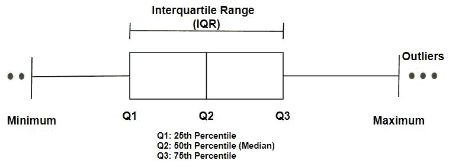
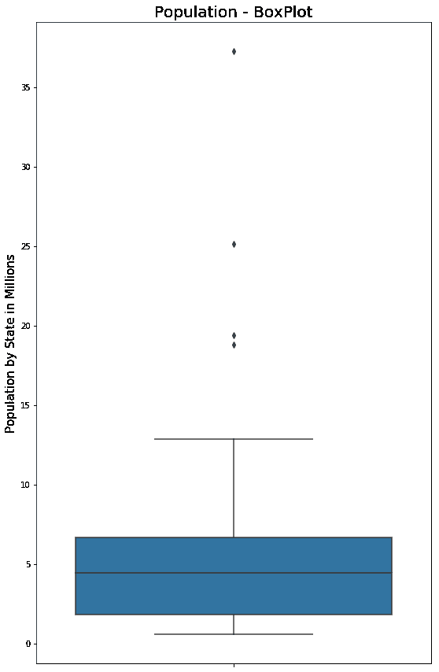
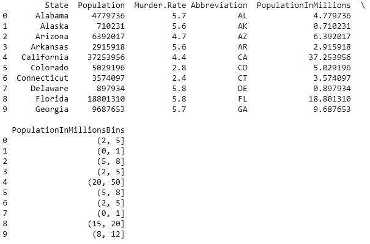
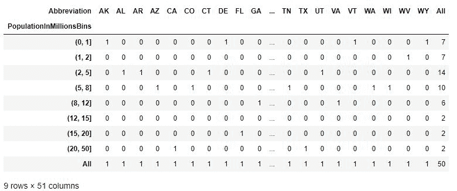
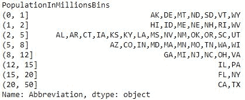

# 探索数据分布|第 1 集

> 原文:[https://www . geesforgeks . org/exploring-data-distribution-set-1/](https://www.geeksforgeeks.org/exploring-data-distribution-set-1/)

每当我们从事数据科学和机器学习时，我们处理数据并从中发现有用信息的方法都是基于数据的分布。
分布意味着数据如何以不同的可能方式呈现，特定数据的百分比，识别异常值。所以，数据分发就是用图形化的方式来组织和显示有用的信息。

**数据分布探索相关术语**

```py
-> Boxplot
-> Frequency Table
-> Histogram 
-> Density Plot

```

*   **箱线图:**基于数据的百分位数，如下图所示。箱线图的顶部和底部是数据的第 75 个<sup>和第 25 个<sup>百分位数。延长线被称为胡须，包括其余数据的范围。
    </sup></sup>

**要获得所用`csv` 文件的链接，请点击此处**。

**代码#1 :** 加载库

```py
import numpy as np
import pandas as pd
import seaborn as sns
import matplotlib.pyplot as plt
```

**代码#2:** 加载数据

```py
data = pd.read_csv("../data/state.csv")

# Adding a new column with derived data 
data['PopulationInMillions'] = data['Population']/1000000

print (data.head(10))
```

**输出:**


**代码 3 :** 拳击图

```py
# BoxPlot Population In Millions
fig, ax1 = plt.subplots()
fig.set_size_inches(9,  15)

ax1 = sns.boxplot(x = data.PopulationInMillions, orient ="v")
ax1.set_ylabel("Population by State in Millions", fontsize = 15)
ax1.set_title("Population - BoxPlot", fontsize = 20)
```

**输出:**


*   **Frequency Table :** It is a tool to distribute the data into equally spaced ranges, segments and tells us how many values fall in each segment.

    **代码#1:** 添加一列执行交叉表和分组功能。

    ```py
    # Perform the binning action, the bins have been
    # chosen to accentuate the output for the Frequency Table

    data['PopulationInMillionsBins'] = pd.cut(
        data.PopulationInMillions, bins =[0, 1, 2, 5, 8, 12, 15, 20, 50])

    print (data.head(10))
    ```

    **输出:**
    

    **代码#2:** 交叉标签–一种频率表

    ```py
    # Cross Tab - a type of Frequency Table

    pd.crosstab(data.PopulationInMillionsBins, data.Abbreviation, margins = True)
    ```

    **输出:**
    

    **代码# 3:**group by–一种频率表

    ```py
    # Groupby - a type of Frequency Table

    data.groupby(data.PopulationInMillionsBins)['Abbreviation'].apply(', '.join)
    ```

    **输出:**
    