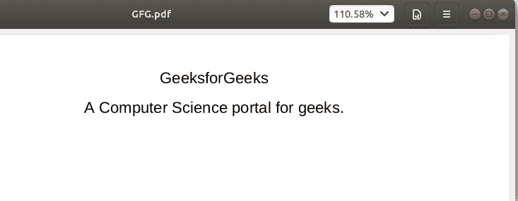

# 使用 Python 导出 PDF 数据

> 原文:[https://www . geesforgeks . org/export-pdf-data-use-python/](https://www.geeksforgeeks.org/exporting-pdf-data-using-python/)

有时候，我们必须从 PDF 中提取数据。我们必须从 PDF 中复制并粘贴数据。很费时间。在 Python 中，我们可以使用一些包从 PDF 中提取数据，并使用 Python 以不同的格式导出。我们将学习如何从 pdf 中提取数据。

## 用 PDFMiner 提取文本

**PDFMiner** 是 PDF 文档的文本提取工具。您可以尝试使用 pip 在系统中安装 PDFminer，如下所示:

```py
pip install pdfminer
```

让我们开始一页一页地提取 PDF 的所有文本。提取页面数据需要以下步骤

*   创建资源管理器实例。
*   通过 Python 的 io 模块创建一个类似文件的对象。
*   创建转换器。
*   创建一个 PDF 解释器对象，它将获取我们的资源管理器和转换器对象，并提取文本。
*   打开 PDF，循环浏览每一页。

下面是实现。

**使用的 PDF 文件:**



```py
import io
from pdfminer.converter import TextConverter
from pdfminer.pdfinterp import PDFPageInterpreter
from pdfminer.pdfinterp import PDFResourceManager
from pdfminer.pdfpage import PDFPage

def extract_text_by_page(pdf_path):

    with open(pdf_path, 'rb') as fh:

        for page in PDFPage.get_pages(fh, 
                                      caching=True,
                                      check_extractable=True):

            resource_manager = PDFResourceManager()
            fake_file_handle = io.StringIO()

            converter = TextConverter(resource_manager, 
                                      fake_file_handle)

            page_interpreter = PDFPageInterpreter(resource_manager,
                                                  converter)

            page_interpreter.process_page(page)
            text = fake_file_handle.getvalue()

            yield text

            # close open handles
            converter.close()
            fake_file_handle.close()

def extract_text(pdf_path):
    for page in extract_text_by_page(pdf_path):
        print(page)
        print()

# Driver code
if __name__ == '__main__':
    print(extract_text('GFG.pdf'))
```

**输出:**


在这个例子中，我们创建了一个函数，为每个页面生成文本。extract_text 函数打印出每页的文本。