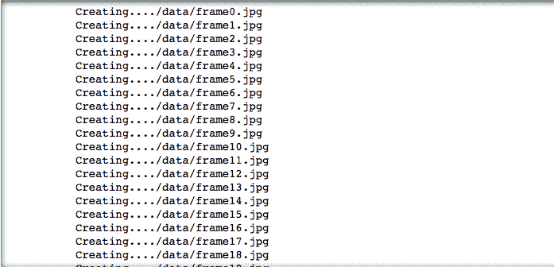

# 用 Python 从视频中提取图像

> 原文:[https://www . geesforgeks . org/extract-images-from-video-in-python/](https://www.geeksforgeeks.org/extract-images-from-video-in-python/)

[OpenCV](https://www.geeksforgeeks.org/tag/opencv/) 自带很多强大的视频编辑功能。在目前的场景下，图像扫描、人脸识别等技术都可以使用 OpenCV 来完成。

图像分析是计算机视觉领域中一个非常常见的领域。它是从视频或图像中提取有意义的信息。OpenCv 库可以用来对视频进行多种操作。

**所需模块:**

```py
import cv2
import os

```

使用的功能:

> **`VideoCapture(File_path) : Read the video(.mp4 format)`**
> 
> **`read() : Read data depending upon the type of object that calls`**
> 
> **`imwrite(filename, img[, params]) : Saves an image to a specified file.`**

下面是实现:

```py
# Importing all necessary libraries
import cv2
import os

# Read the video from specified path
cam = cv2.VideoCapture("C:\\Users\\Admin\\PycharmProjects\\project_1\\openCV.mp4")

try:

    # creating a folder named data
    if not os.path.exists('data'):
        os.makedirs('data')

# if not created then raise error
except OSError:
    print ('Error: Creating directory of data')

# frame
currentframe = 0

while(True):

    # reading from frame
    ret,frame = cam.read()

    if ret:
        # if video is still left continue creating images
        name = './data/frame' + str(currentframe) + '.jpg'
        print ('Creating...' + name)

        # writing the extracted images
        cv2.imwrite(name, frame)

        # increasing counter so that it will
        # show how many frames are created
        currentframe += 1
    else:
        break

# Release all space and windows once done
cam.release()
cv2.destroyAllWindows()
```

**输出:**


所有提取的图像将保存在系统上名为“数据”的文件夹中。
