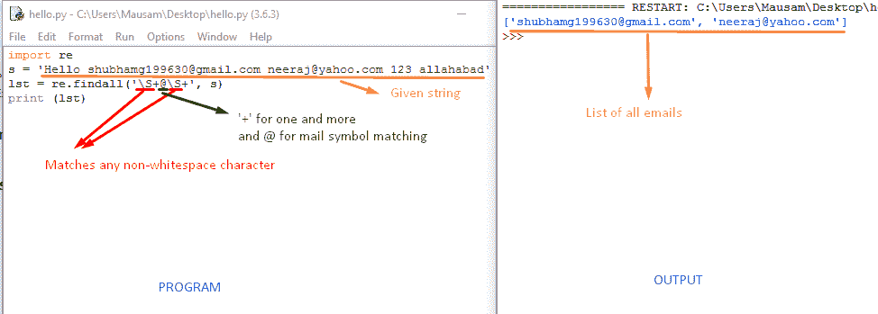
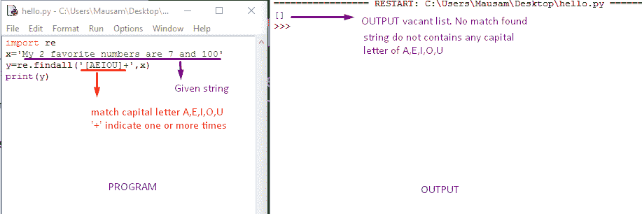
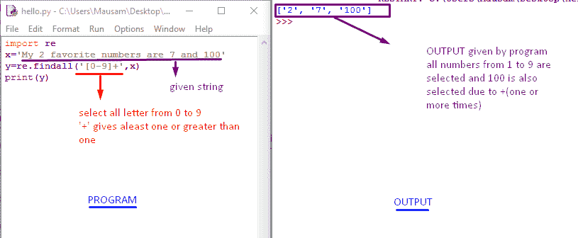

# 使用 Python 中的正则表达式提取电子邮件地址

> 原文:[https://www . geesforgeks . org/extracting-email-address-use-正则表达式-python/](https://www.geeksforgeeks.org/extracting-email-addresses-using-regular-expressions-python/)

假设有一种情况，你必须阅读一些特定的数据，比如电话号码、电子邮件地址、日期、单词集合等。你如何以非常有效的方式做到这一点？实现这一点的最佳方法是正则表达式。

举个例子，我们必须从正则表达式给定的输入中找出唯一的电子邮件。
示例:

```
Input  : Hello shubhamg199630@gmail.com Rohit neeraj@gmail.com
Output : shubhamg199630@gmail.com neeraj@gmail.com
Here we have only selected email from the given input string.

Input : My 2 favourite numbers are 7 and 10
Output :2 7 10
Here we have selected only digits.

```

**正则表达式**–
正则表达式是一个字符序列，主要用于查找和替换字符串或文件中的模式。
所以我们可以说搜索和提取的任务是如此普遍，以至于 Python 有一个非常强大的名为正则表达式的库，可以非常优雅地处理其中的许多任务。

| 标志 | 使用 |
| $ | 匹配行尾 |
| \s | 匹配空白 |
| **\S** | 匹配任何非空白字符 |
| ***** | 零次或多次重复一个字符 |
| **\S** | 匹配任何非空白字符 |
| ***？** | 重复字符零次或多次(非贪婪) |
| **+** | 重复一个字符一次或多次 |
| **+？** | 重复一个字符一次或多次(非贪婪) |
| **【aeiou】t1** | 匹配所列集合中的单个字符 |
| **【^xyz】** | 匹配不在所列集合中的单个字符 |
| **【a-z0-9】** | 这组字符可以包括一个范围 |
| **(** | 指示字符串提取的开始位置 |
| **)** | 指示字符串提取的结束位置 |

```
# Python program to extract numeric digit 
# from A string by regular expression...

# Importing module required for regular
# expressions
import re  

# Example String 
s = 'My 2 favourite numbers are 7 and 10'

# find all function to select all digit from 0   
# to 9 [0-9] for numeric Letter in the String
# + for repeats a character one or more times
lst = re.findall('[0-9]+', s)    

# Printing of List
print(lst)
```

**Output:**

```
['2', '7', '10']

```

```
# Python program to extract emails From 
# the String By Regular Expression. 

# Importing module required for regular 
# expressions 
import re 

# Example string 
s = """Hello from shubhamg199630@gmail.com
        to priya@yahoo.com about the meeting @2PM"""

# \S matches any non-whitespace character 
# @ for as in the Email 
# + for Repeats a character one or more times 
lst = re.findall('\S+@\S+', s)     

# Printing of List 
print(lst) 
```

**Output:**

```
['shubhamg199630@gmail.com', 'priya@yahoo.com']

```







**更多详情:**

*   [Python 中的正则表达式示例|集合 1](https://www.geeksforgeeks.org/regular-expression-python-examples-set-1/)
*   [Python 中的正则表达式|集合 2(搜索、匹配和全部查找)](https://www.geeksforgeeks.org/regular-expressions-python-set-1-search-match-find/)
*   [正则表达式 Python 文档](http://docs.python.org/3/howto/regex.html)