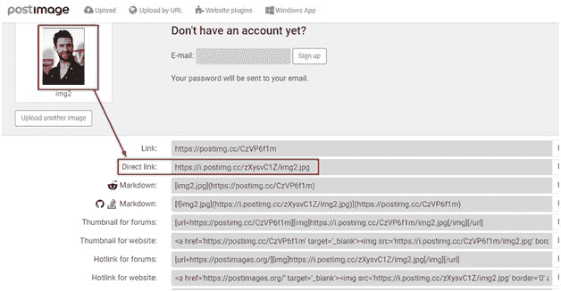

# 使用 Face++和 Python 进行人脸比较

> 原文:[https://www . geesforgeks . org/face-comparison-use-face-and-python/](https://www.geeksforgeeks.org/face-comparision-using-face-and-python/)

**先决条件:** [Python 编程语言](https://www.geeksforgeeks.org/python-programming-language/)

Python 是一种高级通用语言。它有多种用途，如人工智能、网页开发、网页抓取等。Python 的一个这样的用途可以是面部比较。一个模块名 **python-facepp** 可以用来做同样的事情。该模块用于与 Face++面部识别服务进行通信。

#### 所需模块

*   **python-facepp–**要安装该模块，请在终端中键入以下命令。

    ```
    pip install python-facepp
    ```

*   **表情符号–**要安装该模块，请在终端中键入以下命令。

    ```
    pip install emoji
    ```

#### 应用详情

该应用将同一个人或两个不同的人的两张照片与他/她的面部特征进行比较，如面部标志、美容评分、面部情绪等。如果两张照片都匹配，app 结果为**“两张照片都是同一个人”**，否则 app 结果为**“两张照片都是两个不同的人”。**

这个 app 主要用于一个类似“给你送一些机密
文件，快递员小子先验证你的脸再送快递员”这样的人脸验证流程

**注意:** A `facepp` API 只允许比较两张照片的图片 URL 链接。

**使用`postimages.org`将图像转换为网址。**

在本网站中，通过点击“选择图片”按钮从本地驱动器中选择您的照片，然后本网站将在处理您的照片后创建不同的网址链接。
(见下图)




我们将使用两对照片进行比较。

**第一对:**


**第二对:**


下面是实现。

```
# Python program for face
# comparison

from __future__ import print_function, unicode_literals
from facepplib import FacePP, exceptions
import emoji

# define global variables
face_detection = ""
faceset_initialize = ""
face_search = ""
face_landmarks = ""
dense_facial_landmarks = ""
face_attributes = ""
beauty_score_and_emotion_recognition = ""

# define face comparing function
def face_comparing(app, Image1, Image2):

    print()
    print('-'*30)
    print('Comparing Photographs......')
    print('-'*30)

    cmp_ = app.compare.get(image_url1 = Image1,
                           image_url2 = Image2)

    print('Photo1', '=', cmp_.image1)
    print('Photo2', '=', cmp_.image2)

    # Comparing Photos
    if cmp_.confidence > 70:
        print('Both photographs are of same person......')
    else:
        print('Both photographs are of two different persons......')

# Driver Code 
if __name__ == '__main__':

    # api details
    api_key ='xQLsTmMyqp1L2MIt7M3l0h-cQiy0Dwhl'
    api_secret ='TyBSGw8NBEP9Tbhv_JbQM18mIlorY6-D'

    try:

        # create a logo of app by using iteration,
        # unicode and emoji module-------------
        for i in range(1,6):

            for j in range(6,-i):
                print(" " , end = " ")

            for j in range(1,i):
                print('\U0001F600', end =" ")

            for j in range(i,0,-1):
                print('\U0001F6A3', end= " ")

            for j in range(i,1,-2):
                print('\U0001F62B', end= " ")

            print()

        print()

        #print name of the app--------
        print("\t\t\t"+"Photo Comparing App\n")

        for i in range(1,6):

            for j in range(6,-i):
                print(" " , end = " ")

            for j in range(1,i):
                print(emoji.emojize(":princess:"), end =" ")

            for j in range(i,0,-1):
                print('\U0001F610', end= " ")

            for j in range(i,1,-2):
                print(emoji.emojize(":baby:"), end= " ")

            print()

        # call api
        app_ = FacePP(api_key = api_key, 
                      api_secret = api_secret)
        funcs = [
            face_detection,
            face_comparing_localphoto,
            face_comparing_websitephoto,
            faceset_initialize,
            face_search,
            face_landmarks,
            dense_facial_landmarks,
            face_attributes,
            beauty_score_and_emotion_recognition
        ]

        # Pair 1
        image1 = 'Image 1 link'
        image2 = 'Image 2 link'
        face_comparing(app_, image1, image2)

        # Pair2
        image1 = 'Image 1 link'
        image2 = 'Image 2 link'
        face_comparing(app_, image1, image2)        

    except exceptions.BaseFacePPError as e:
        print('Error:', e)
```

**输出:**

