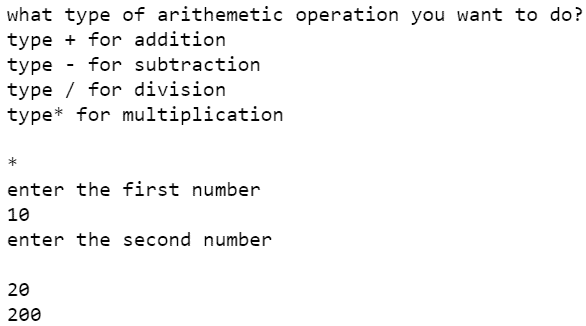
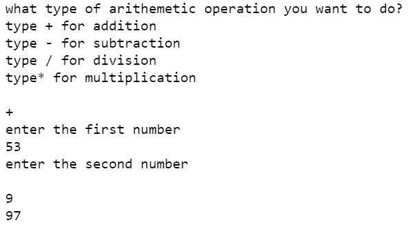

# 使用 Python 的错误计算器

> 原文:[https://www . geesforgeks . org/fault-calculator-use-python/](https://www.geeksforgeeks.org/faulty-calculator-using-python/)

有故障的计算器只是一个操作简单任务的计算器，但在某些情况下(由程序员设置)，它会给出错误的输出。你们一定想知道为什么我们需要一个有缺陷的计算器？这种类型的计算器是不需要的，除非你想恶作剧某人，或者在遇到数学问题时证明他们是错的。

**进场:**

*   首先，我们从用户那里获取他/她想要做什么的输入
*   然后我们写加法、减法、乘法和除法的代码
*   最后，我们插入那些我们想要错误结果的案例。

**实施:**

## 计算机编程语言

```py
print("what type of arithmetic operation you want to do?\n"
      "type + for addition\n"
      "type - for subtraction\n"
      "type / for division\n"
      "type* for multiplication\n")

# taking input
type_of_calculation = input()

print("enter the first number")
A = int(input())

print("enter the second number\n")
B = int(input())

b = "+"
c = "-"
d = "*"
e = "/"

# setting normal and false condition for calculator
if type_of_calculation == b:
    # for addition
    if (A == 53 and B == 9) or (A == 90 and B == 52):
        print(97)
    else:
        print(A+B)
elif type_of_calculation == c:

    # for subtraction
    print(A-B)
elif type_of_calculation == d:

    # for multiplication
    if A == 45 and B == 3 or A == 4 and B == 67:
        print(575)
    else:
        print(A*B)
elif type_of_calculation == e:

    # for division
    if A == 5 and B == 63:
        print(40)
    else:
        print(A/B)
```

**输出:**

正常情况下



假条件

