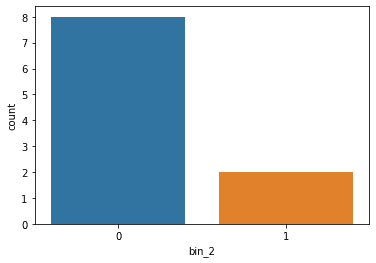
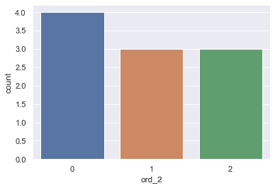
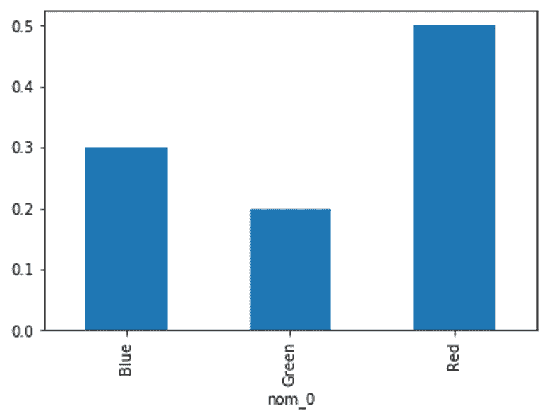
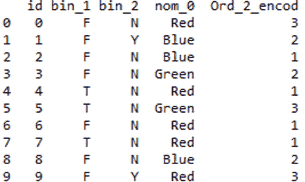
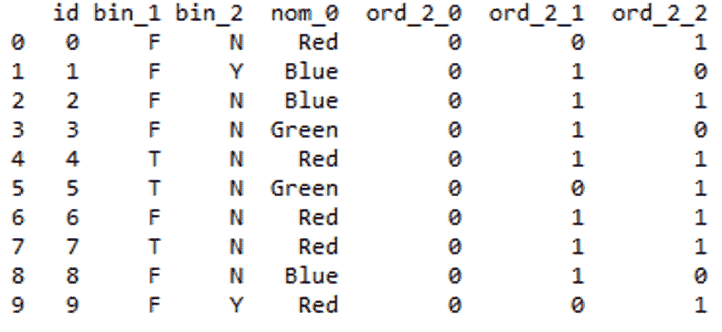

# 特征编码技术–机器学习

> 原文:[https://www . geesforgeks . org/feature-encoding-technologies-machine-learning/](https://www.geeksforgeeks.org/feature-encoding-techniques-machine-learning/)

众所周知，更好的编码导致更好的模型，并且大多数算法不能处理分类变量，除非它们被转换成数值。
**分类特征一般分为 3 种:**

1.  **二进制:**非此即彼
    T3】示例:
    *   是，不是
    *   真，假
2.  **序数:**特定有序群。
    *例:*
    *   低、中、高
    *   冷，热，熔岩热
3.  **名义:**无序组。
    *示例*
    *   猫、狗、老虎
    *   披萨，汉堡，可乐

**数据集:**点击链接下载文件。
[编码数据集](https://github.com/strquark/Dataset)
**编码:**

## 蟒蛇 3

```py
# data preprocessing
import pandas as pd  
# for linear calculations
import numpy as np    
# Plotting Graphs
import seaborn as sns 
df = pd.read_csv("Encoding Data.csv")
# displaying top 10 results
df.head(10)   
```

**输出:**


资料组

让我们用不同类型的编码技术来检查数据集的列。
**代码:映射数据集中存在的二进制要素。**T3】

## 蟒蛇 3

```py
# you can always use simple mapping on binary features.
df['bin_1'] = df['bin_1'].apply(lambda x: 1 if x =='T' else (0 if x =='F' else None)) 
df['bin_2'] = df['bin_2'].apply(lambda x: 1 if x =='Y' else (0 if x =='N' else None))
sns.countplot(df['bin_1'])
sns.countplot(df['bin_2'])
```

**输出:**


应用映射后的 Bin_1



应用映射后的 bin_2

**标签编码:**标签编码算法相当简单，它考虑了编码的顺序，因此可以用来编码序数数据。
**代号:**

## 蟒蛇 3

```py
# labelEncoder present in scikitlearn library
from sklearn.preprocessing import LabelEncoder  
le = LabelEncoder()
df['ord_2'] = le.fit_transform(df['ord_2'])
sns.set(style ="darkgrid")
sns.countplot(df['ord_2'])
```

**输出:**



标签编码后的 ord _ 2 图

**一键编码:**克服标签编码的缺点，因为它考虑了列中的一些层次结构，这些层次结构可能会误导数据中存在的标称特征。我们可以使用 One-Hot 编码策略。
**一键编码分两步处理:**

1.  将类别拆分到不同的列。
2.  将“0”用于其他列，将“1”作为相应列的指示器。

**代码:Sklearn 库**
一键编码

## 蟒蛇 3

```py
from sklearn.preprocessing import OneHotEncoder
enc = OneHotEncoder()
# transforming the column after fitting
enc = enc.fit_transform(df[['nom_0']]).toarray()
# converting arrays to a dataframe
encoded_colm = pd.DataFrame(enc)
# concating dataframes 
df = pd.concat([df, encoded_colm], axis = 1) 
# removing the encoded column.
df = df.drop(['nom_0'], axis = 1) 
df.head(10)
```

**输出:**


输出

**代码:熊猫一键式编码**

## 蟒蛇 3

```py
df = pd.get_dummies(df, prefix = ['nom_0'], columns = ['nom_0'])
df.head(10)
```

**输出:**


输出

这种方法更可取，因为它给出了好的标签。
**注:**一键编码方式取消了顺序，但却导致列数大幅增加。因此，对于具有更多唯一值的列，请尝试使用其他技术。
**频率编码:**我们也可以考虑频率分布进行编码。这种方法有时对名义特征有效。
**代码:**

## 蟒蛇 3

```py
# grouping by frequency
fq = df.groupby('nom_0').size()/len(df)   
# mapping values to dataframe
df.loc[:, "{}_freq_encode".format('nom_0')] = df['nom_0'].map(fq)  
# drop original column.
df = df.drop(['nom_0'], axis = 1) 
fq.plot.bar(stacked = True)  
df.head(10)
```

**输出:**



频率分布(fq)


输出

**序数编码:**我们可以使用 Scikit learn 类中提供的序数编码对序数特征进行编码。它确保变量的有序性得以保持。
**代码:使用 Scikit 学习。**

## 蟒蛇 3

```py
from sklearn.preprocessing import OrdinalEncoder
ord1 = OrdinalEncoder()
# fitting encoder
ord1.fit([df['ord_2']])
# transforming the column after fitting
df["ord_2"]= ord1.fit_transform(df[["ord_2"]]) 
df.head(10)
```

**输出:**


输出

**代码:使用字典**
手动分配排名

## 蟒蛇 3

```py
# creating a dictionary
temp_dict ={'Cold':1, 'Warm':2, 'Hot':3} 
# mapping values in column from dictionary
df['Ord_2_encod']= df.ord_2.map(temp_dict)
df = df.drop(['ord_2'], axis = 1)
<strong>Output: </strong>
```



输出

**二进制编码:**
最初类别被编码为整数，然后转换为二进制代码，然后该二进制字符串的数字被放入单独的列中。
为例:为 7 : 1 1 1
当类别数量较多时，此方法较为可取。想象一下，如果你有 100 个不同的类别。一个热编码将创建 100 个不同的列，但二进制编码只需要 7 列。
**代码:**

## 蟒蛇 3

```py
from category_encoders import BinaryEncoder 
encoder = BinaryEncoder(cols =['ord_2']) 
# transforming the column after fitting
newdata = encoder.fit_transform(df['ord_2'])
# concating dataframe
df = pd.concat([df, newdata], axis = 1) 
# dropping old column 
df = df.drop(['ord_2'], axis = 1)
df.head(10)
```

**输出:**



输出

**哈希编码:**哈希是应用哈希函数将字符串转换为唯一哈希值的过程。这个过程非常有用，因为它可以处理大量的分类数据和低内存使用。
[关于哈希的文章](https://dzone.com/articles/feature-hashing-for-scalable-machine-learning)
**代码:**

## 蟒蛇 3

```py
from sklearn.feature_extraction import FeatureHasher
# n_features contains the number of bits you want in your hash value.
h = FeatureHasher(n_features = 3, input_type ='string') 
# transforming the column after fitting
hashed_Feature = h.fit_transform(df['nom_0'])
hashed_Feature = hashed_Feature.toarray()
df = pd.concat([df, pd.DataFrame(hashed_Feature)], axis = 1)
df.head(10)
```

**输出:**


输出

您可以进一步将转换后的特征从数据框中删除。
**均值/目标编码:**目标编码很好，因为它拾取了可以解释目标的值。它被大多数高尔夫球手在比赛中使用。用目标变量的平均值替换分类值的基本思想。
**代码:**

## 蟒蛇 3

```py
# inserting Target column in the dataset since it needs a target
df.insert(5, "Target", [0, 1, 1, 0, 0, 1, 0, 0, 0, 1], True) 
# importing TargetEncoder
from category_encoders import TargetEncoder
Targetenc = TargetEncoder()
# transforming the column after fitting
values = Targetenc.fit_transform(X = df.nom_0, y = df.Target)
# concating values with dataframe
df = pd.concat([df, values], axis = 1)
df.head(10)
```

您可以进一步将转换后的特征从数据框中删除。
**输出:**


输出