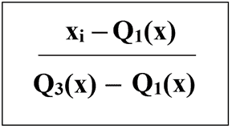
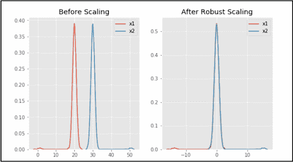

# 特征缩放–第 3 部分

> 原文:[https://www.geeksforgeeks.org/feature-scaling-part-3/](https://www.geeksforgeeks.org/feature-scaling-part-3/)

先决条件–[特征缩放|设置-1](https://www.geeksforgeeks.org/ml-feature-scaling-part-1/) 、[设置-2](https://www.geeksforgeeks.org/ml-feature-scaling-part-2/)

**特征缩放**是数据预处理最重要的步骤之一。它适用于独立变量或数据特征。数据有时包含不同大小的特征，如果我们不处理它们，算法只考虑这些特征的大小，而忽略单位。它有助于在特定范围内标准化数据，有时也有助于加快算法的计算速度。
 **鲁棒定标器:**
这使用了与最小-最大定标器相似的方法，但是它使用了四分位数范围，而不是最小-最大，因此它对异常值是鲁棒的。此缩放器移除中间值，并根据分位数范围缩放数据(默认为 IQR:四分位数范围)。IQR 是第一个四分位数(第 25 分位数)和第三个四分位数(第 75 分位数)之间的范围。
使用以下公式:


鲁棒定标器的其他一些特性是:

*   作为 0 均值和单位方差的鲁棒定标器
*   鲁棒定标器没有预定范围，不像最小-最大定标器
*   健壮的 Scaler 使用四分位数范围，这使得它对异常值不太敏感

 **代号:**

```
# Python code for Feature Scaling using Robust Scaling

""" PART 1:  Importing Libraries """
import pandas as pd
import numpy as np
from sklearn import preprocessing
import matplotlib
import matplotlib.pyplot as plt
import seaborn as sns % matplotlib inline
matplotlib.style.use('ggplot')

""" PART 2:  Making the data distributions """
x = pd.DataFrame({
    # Distribution with lower outliers
    'x1': np.concatenate([np.random.normal(20, 1, 2000), np.random.normal(1, 1, 20)]),
    # Distribution with higher outliers
    'x2': np.concatenate([np.random.normal(30, 1, 2000), np.random.normal(50, 1, 20)]),
})

""" PART 3:  Scaling the Data """
scaler = preprocessing.RobustScaler()
robust_scaled_df = scaler.fit_transform(x)
robust_scaled_df = pd.DataFrame(robust_scaled_df, columns =['x1', 'x2'])

""" PART 4:  Visualizing the impact of scaling """
fig, (ax1, ax2, ax3) = plt.subplots(ncols = 3, figsize =(9, 5))
ax1.set_title('Before Scaling')
sns.kdeplot(x['x1'], ax = ax1)
sns.kdeplot(x['x2'], ax = ax1)
ax2.set_title('After Robust Scaling')
sns.kdeplot(robust_scaled_df['x1'], ax = ax2)
sns.kdeplot(robust_scaled_df['x2'], ax = ax2)
```

**输出:**

在输出中可以看到，在 Robust 缩放后，分布被带入相同的比例并重叠，但离群值仍保留在大部分新分布之外。因此，稳健缩放是缩放数据的有效方法。