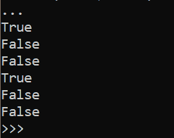

# fileinput.isfirstline（） in Python

> 原文:[https://www . geesforgeks . org/file input-is irstline-in-python/](https://www.geeksforgeeks.org/fileinput-isfirstline-in-python/)

借助`**fileinput.isfirstline()**`方法，如果从文件中读取的行是第一行，我们可以将布尔值设置为真，否则使用`fileinput.isfirstline()`方法设置为假。

> **语法:** `fileinput.isfirstline()`
> 
> **返回:**如果读取的行是该文件的第一行，则返回真。

**示例#1 :**
在本例中，我们可以看到，通过使用`fileinput.isfirstline()`方法，如果使用该方法从输入文件中读取的第一行是第一行，我们可以将布尔值设置为真。

输入文件–


```py
# import fileinput
import fileinput

# Using fileinput.isfirstline() method
for line in fileinput.input(files ='gfg.txt'):
    print(fileinput.isfirstline())
```

**输出:**


**例 2 :**

输入文件–


```py
# import fileinput
import fileinput

# Using fileinput.isfirstline() method
for line in fileinput.input(files =('gfg.txt', 'gfg1.txt')):
    print(fileinput.isfirstline())
```

**输出:**
