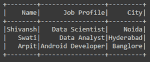
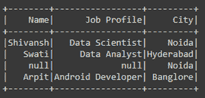

# 用无或空值过滤 PySpark 数据框列

> 原文:[https://www . geesforgeks . org/filter-py spark-data frame-columns-with-none-or-null-values/](https://www.geeksforgeeks.org/filter-pyspark-dataframe-columns-with-none-or-null-values/)

很多时候，在处理 PySpark SQL 数据框时，数据框在列中包含许多空/无值，在许多情况下，在执行数据框的任何操作之前，我们首先必须处理空/无值。为了获得所需的结果或输出，我们必须从数据框中过滤这些空值。

在本文中，我们将学习如何用空值/无值过滤 PySpark 数据框列。

为了过滤空值/无值，我们在 PySpark API 中有一个名为**过滤器()**的函数，通过这个函数，我们使用了 **isNotNull()** 函数。

> **语法:**
> 
> *   df.filter(条件) :该函数返回满足给定条件的值的新数据帧。
> *   df.column_name.isNotNull():此函数用于筛选 dataframe 列中不为 NULL/None 的行。

**示例 1:用无值过滤 PySpark 数据框列**

在下面的代码中，我们创建了火花会话，然后我们创建了数据框架，它在每一列中都包含一些无值。现在，我们已经使用过滤器()过滤了名称列中的无值，在过滤器()中，我们已经通过了条件 *df。Name.isNotNull()* 筛选“名称”列的“无”值。

## 计算机编程语言

```py
# importing necessary libraries
from pyspark.sql import SparkSession

# function to create SparkSession
def create_session():
    spk = SparkSession.builder \
        .master("local") \
        .appName("Filter_values.com") \
        .getOrCreate()
    return spk

# function to create dataframe
def create_df(spark, data, schema):
    df1 = spark.createDataFrame(data, schema)
    return df1

if __name__ == "__main__":

    # calling function to create SparkSession
    spark = create_session()

    input_data = [("Shivansh", "Data Scientist", "Noida"),
                  (None, "Software Developer", None),
                  ("Swati", "Data Analyst", "Hyderabad"),
                  (None, None, "Noida"),
                  ("Arpit", "Android Developer", "Banglore"),
                  (None, None, None)]

    schema = ["Name", "Job Profile", "City"]

    # calling function to create dataframe
    df = create_df(spark, input_data, schema)

    # filtering the columns with None values
    df = df.filter(df.Name.isNotNull())

    # visulizing the dataframe
    df.show()
```

**输出:**


原始数据帧



过滤空值/无值后的数据框

**示例 2:使用 filter()函数过滤具有空值/无值的 PySpark 数据框列**

在下面的代码中，我们创建了火花会话，然后我们创建了数据框架，它在每一列中都包含一些无值。现在，我们已经使用 filter()过滤了“城市”列中的“无”值，其中我们以英语形式传递了条件，即“城市不为空”。这是过滤“城市”列的“无”值的条件。

**注意:**条件必须用双引号引起来。

## 计算机编程语言

```py
# importing necessary libraries
from pyspark.sql import SparkSession

# function to create new SparkSession
def create_session():
    spk = SparkSession.builder \
        .master("local") \
        .appName("Filter_values.com") \
        .getOrCreate()
    return spk

def create_df(spark, data, schema):
    df1 = spark.createDataFrame(data, schema)
    return df1

if __name__ == "__main__":

    # calling function to create SparkSession
    spark = create_session()

    input_data = [("Shivansh", "Data Scientist", "Noida"),
                  (None, "Software Developer", None),
                  ("Swati", "Data Analyst", "Hyderabad"),
                  (None, None, "Noida"),
                  ("Arpit", "Android Developer", "Banglore"),
                  (None, None, None)]

    schema = ["Name", "Job Profile", "City"]

    # calling function to create dataframe
    df = create_df(spark, input_data, schema)

    # filtering the columns with None values
    df = df.filter("City is Not NULL")

    # visulizing the dataframe
    df.show()
```

**输出:**


原始数据帧



从城市列中筛选出空值/无值后

**示例 3:当列名有空格时使用 Filter()过滤无值的列**

在下面的代码中，我们创建了 Spark Session，然后创建了 Dataframe，它在每一列中都包含一些 None 值。我们使用 filter()函数过滤了“作业配置文件”列中的无值，在该函数中，我们传递了条件 *df[“作业配置文件”]。isNotNull()* 过滤作业配置文件列的无值。

**注意:**为了访问字与字之间有空格的列名，使用方括号[]访问意味着参考数据帧，我们必须使用方括号给出名称。

## 计算机编程语言

```py
# importing necessary libraries
from pyspark.sql import SparkSession

# function to create SparkSession
def create_session():
    spk = SparkSession.builder \
        .master("local") \
        .appName("Filter_values.com") \
        .getOrCreate()
    return spk

def create_df(spark, data, schema):
    df1 = spark.createDataFrame(data, schema)
    return df1

if __name__ == "__main__":

    # calling function to create SparkSession
    spark = create_session()

    input_data = [("Shivansh", "Data Scientist", "Noida"),
                  (None, "Software Developer", None),
                  ("Swati", "Data Analyst", "Hyderabad"),
                  (None, None, "Noida"),
                  ("Arpit", "Android Developer", "Banglore"),
                  (None, None, None)]

    schema = ["Name", "Job Profile", "City"]

    # calling function to create dataframe
    df = create_df(spark, input_data, schema)

    # filtering the Job Profile with None values
    df = df.filter(df["Job Profile"].isNotNull())

    # visulizing the dataframe
    df.show()
```

**输出:**


原始数据帧


从“职务概要”列中筛选出空值/无值后