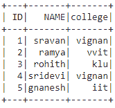
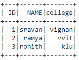
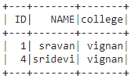
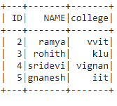

# 通过排除使用 isin 过滤 PySpark 数据帧

> 原文:[https://www . geesforgeks . org/filling-a-py spark-data frame-using-isin by exclusion/](https://www.geeksforgeeks.org/filtering-a-pyspark-dataframe-using-isin-by-exclusion/)

在本文中，我们将讨论如何通过排除使用 isin 过滤 pyspark 数据帧。

**isin():** 这是用来查找给定数据帧中包含的元素，它取元素并获取元素来匹配数据。

> **语法** : isin([element1，element2，。，元素 n)

**创建用于演示的数据框:**

## 蟒蛇 3

```py
# importing module
import pyspark

# importing sparksession from pyspark.sql module
from pyspark.sql import SparkSession

# creating sparksession and giving an app name
spark = SparkSession.builder.appName('sparkdf').getOrCreate()

# list  of students  data  with null values
# we can define null values with none
data = [[1, "sravan", "vignan"],
        [2, "ramya", "vvit"],
        [3, "rohith", "klu"],
        [4, "sridevi", "vignan"],
        [5, "gnanesh", "iit"]]

# specify column names
columns = ['ID', 'NAME', 'college']

# creating a dataframe from the lists of data
dataframe = spark.createDataFrame(data, columns)
dataframe.show()
```

**输出:**



**方法 1:使用滤镜()**

**filter():** 该子句用于检查条件并给出结果，两者相似

> **语法:**数据帧过滤器(条件)

**示例 1:** 使用 filter()子句获取特定的 ID

## 蟒蛇 3

```py
# get the ID : 1,2,3 from dataframe
dataframe.filter((dataframe.ID).isin([1,2,3])).show()
```

**输出:**



**示例 2:** 从数据框列中获取名称。

## 蟒蛇 3

```py
# get name as sravan
dataframe.filter((dataframe.NAME).isin(['sravan'])).show()
```

**输出:**


**方法 2:使用 Where()**

**其中():**本条款用于检查条件并给出结果

> **语法:** dataframe.where(条件)

**例 1:** 获取带有 where()子句的特定学院。

## 蟒蛇 3

```py
# get college as vignan
dataframe.where((dataframe.college).isin(['vignan'])).show()
```

**输出:**



**示例 2:** 从数据框中获取除 5 以外的标识。

## 蟒蛇 3

```py
# get ID except 1
dataframe.where(~(dataframe.ID).isin([1])).show()
```

**输出:**

