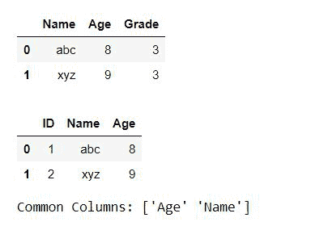
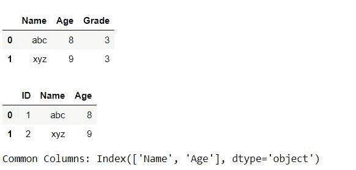
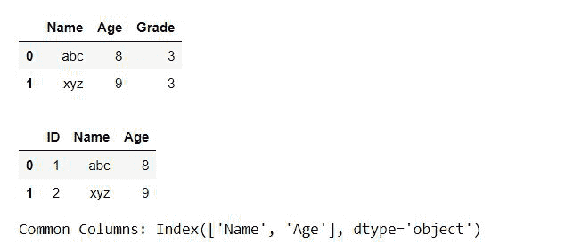

# 查找两个数据框共享的列

> 原文:[https://www . geesforgeks . org/find-columns-由两个数据框共享/](https://www.geeksforgeeks.org/find-columns-shared-by-two-data-frames/)

Pandas 是用于数据分析和操作的开源 Python 库。它快速、强大、灵活且易于使用。在本文中，我们将讨论如何找到两个数据框之间的公共列。下面是可用于查找公共列的不同方法。

**方法 1:** 采用 Numpy 交叉 1d 法

在本例中，我们将从列表中创建熊猫数据框，然后我们将使用 Numpy 的 intersect1d()方法，该方法将返回两个数据框之间常见的列。

## 蟒蛇 3

```
# Importing libraries
import pandas as pd
import numpy as np

# Creating Dataframes
a = [{'Name': 'abc', 'Age': 8, 'Grade': 3},{'Name': 'xyz', 'Age': 9, 'Grade': 3}]
df1 = pd.DataFrame(a)
b = [{'ID': 1,'Name': 'abc', 'Age': 8},{'ID': 2,'Name': 'xyz', 'Age': 9}]
df2 = pd.DataFrame(b)

# Printing Dataframes
display(df1)
display(df2)

# Finding Common columns
a = np.intersect1d(df2.columns, df1.columns)

# Printing common columns
print ("Common Columns:",a)
```

**输出:**



**方法二:**采用熊猫交会法

在本例中，我们将从列表中创建熊猫数据框，然后我们将使用熊猫的交集()方法，该方法将返回两个数据框之间常见的列。

## 蟒蛇 3

```
# Importing libraries
import pandas as pd

# Creating Dataframes
a = [{'Name': 'abc', 'Age': 8, 'Grade': 3},
     {'Name': 'xyz', 'Age': 9, 'Grade': 3}]

df1 = pd.DataFrame(a)
b = [{'ID': 1,'Name': 'abc', 'Age': 8},
     {'ID': 2,'Name': 'xyz', 'Age': 9}]

df2 = pd.DataFrame(b)

# Printing Dataframes
display(df1)
display(df2)

# Finding Common columns
a = df2.columns.intersection(df1.columns)

# Printing common columns
print ("Common Columns:",a)
```

**输出:**



**方法 3:** 在本例中，我们将使用&运算符来查找公共列。

## 蟒蛇 3

```
# Importing libraries
import pandas as pd

# Creating Dataframes
a = [{'Name': 'abc', 'Age': 8, 'Grade': 3},
     {'Name': 'xyz', 'Age': 9, 'Grade': 3}]

df1 = pd.DataFrame(a)
b = [{'ID': 1,'Name': 'abc', 'Age': 8},
     {'ID': 2,'Name': 'xyz', 'Age': 9}]

df2 = pd.DataFrame(b)

# printing Dataframes
display(df1)
display(df2)

# Finding Common columns
a = df1.columns & df2.columns

# Printing common columns
print ("Common Columns:",a)
```

**输出:**

